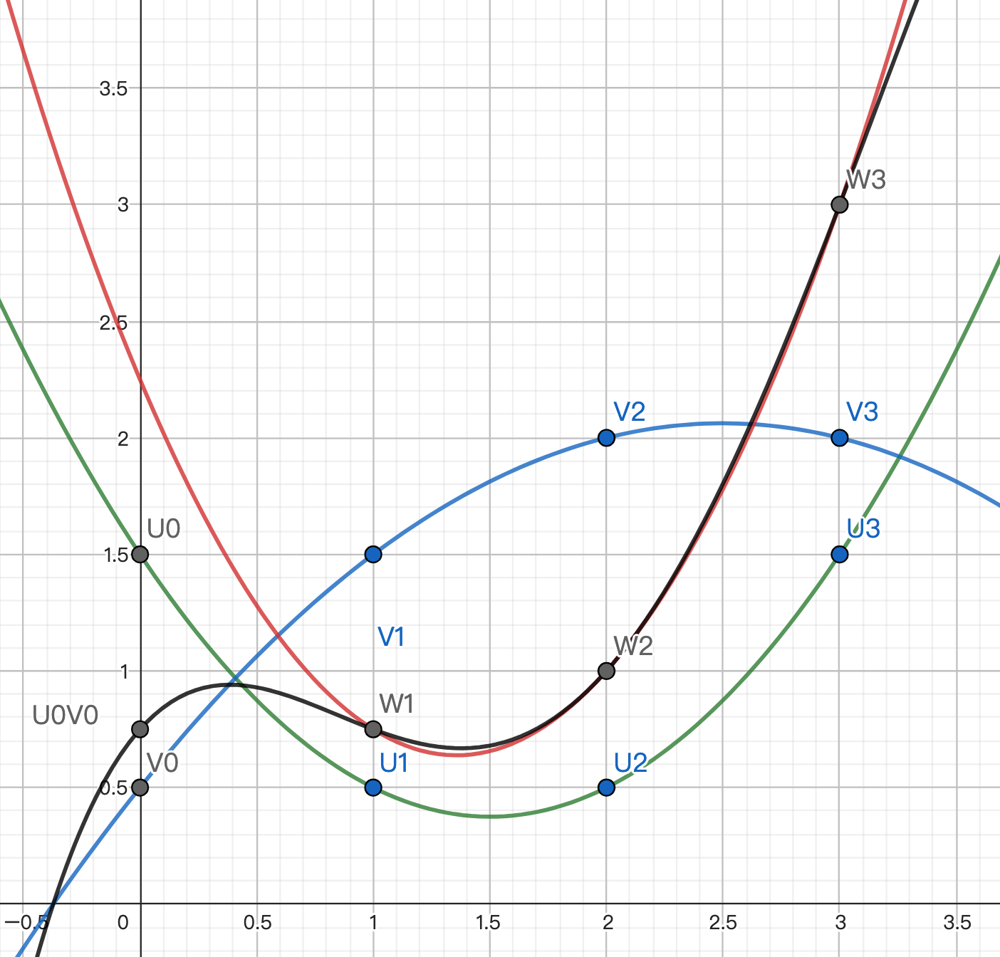

# BGW

In the previous GMW, we saw the approach of using XOR for additive sharing on boolean circuits.

The BGW protocol we're about to introduce was proposed by Ben-Or, Goldwasser, and Wigderson in 1988. 
BGW uses arithmetic circuits composed of + and * operations. 
BGW utilizes polynomial-based Shamir's secret sharing. 
BGW doesn't use oblivious transfer. 
[(For Shamir's secret sharing, please refer to this article first)](./Shamir-Secret-Sharing-en.md)

From an external perspective, the three main steps of "splitting input into shares / calculating new shares gate by gate / combining output shares" remain the same. We'll focus directly on how to calculate new shares gate by gate.

## "+" Gate

Let's first look at the simpler "+" gate. Assume the relationship of the three wires of the gate is u + v = w.

Three parties, A, B, and C, arrive at the "+" gate. They collectively hold [u] = (u1, u2, u3) and [v] = (v1, v2, v3).
We want them to have [u+v] after the calculation.

According to the properties of Shamir's secret sharing, this step doesn't require communication. They can directly calculate (u1+v1, u2+v2, u3+v3) individually.
[[link]](./Shamir-Secret-Sharing-en.md#from-p-q-to-p--q)

## "*" Gate

The complexity lies in the "*" gate.

We have 3 parties. 3 points can determine a quadratic curve at most. However, we can't use quadratic curves to generate regular shares; we must keep them as linear lines.

Why is that?

If the inputs before multiplication are already two quadratic curves, the resulting curve after multiplication would be a quartic curve. 
During the multiplication process, we would have A, B, and C calculate u1 * v1, u2 * v2, u3 * v3 respectively. 
If we only use a quadratic curve to pass through these three points, the reconstructed secret won't be u * v. We would need a quartic curve. 
But we only have 3 parties, which is not enough to determine a quartic curve.

For example, in the above image: 
The green polynomial U represents a secret of 1.5. 
The blue polynomial V represents a secret of 0.5. 
We want to find a polynomial that represents 1.5 * 0.5 = 0.75. 
A, B, and C will each multiply their shares of U and V to get W1, W2, W3. 
If we only use a quadratic curve to interpolate, we'll get the incorrect red curve that doesn't pass through 0.75. 
The black polynomial U * V does pass through 0.75. However, U * V is a quartic curve. It can't be determined by the points from 3 parties.

<mark>Therefore, before multiplication, we must have two linear lines, so that the resulting quadratic curve after multiplication won't have a degree that's too high. (degree * 2 + 1 <= number of parties)</mark>

But what if the next gate is also a "*" gate? Wouldn't it become 2 + 2 = 4 again?

Thus, we need to perform <mark>"degree reduction"</mark> on U * V. 
<mark>That is, we first calculate the U * V curve and its y-intercept from two linear lines, then use a linear line passing through this intercept to replace it.</mark> 
This way, our output can remain a linear line. More multiplications won't be a problem. 

## Degree Reduction

Assume polynomials U, V are two lines. Let W = U * V be a quadratic curve. 
We want to find a linear line passing through (0, W(0)) to replace W, and use the shares of this line as the result.

The steps are as follows:

A independently calculates W(1) = U(1) * V(1) 
B independently calculates W(2) = U(2) * V(2) 
C independently calculates W(3) = U(3) * V(3)

Due to the properties of Shamir's secret sharing, W(0) can be simply expressed as a weighted sum of W(1), W(2), W(3), with weights (3, -3, 1). 
That is, W(0) = 3 W(1) + (-3) W(2) + 1 W(3) [[link]](./Shamir-Secret-Sharing-en.md#combining)

<mark>We try to replace W(1), W(2), W(3) in the above equation with lower-degree shares, so we can obtain a set of lower-degree shares of W(0).</mark> The method is as follows:

A chooses a random linear line passing through (0, W(1)), splits W1 into shares and distributes them to B and C. 
B chooses a random linear line passing through (0, W(2)), splits W2 into shares and distributes them to C and A. 
C chooses a random linear line passing through (0, W(3)), splits W3 into shares and distributes them to A and B.

Now A, B, and C collectively hold [W(1)], [W(2)], [W(3)], and they all know the weights (3, -3, 1), 
so they can each calculate the weighted sum, resulting in a new set of shares `3 [W(1)] + (-3) [W(2)] + 1 [W(3)]`. [[link]](./Shamir-Secret-Sharing-en.md#from-a-b-c-d-p-q-r-s-to-ap--bq--cr--ds) 
The secret represented by this set of shares is W(0) = U(0) * V(0) = u * v. 

The degree of the polynomial passing through this set of shares is the same as the input, only requiring a linear line. [[link]](./Shamir-Secret-Sharing-en.md#combining)

## Summary

In BGW, we use Shamir's secret sharing to split/combine shares.

Addition doesn't require communication and can be calculated individually.

For multiplication, after individual multiplication, communication is still needed to reduce the degree. The method is to express the intersection point as a weighted sum, then use lower-degree polynomial shares to compose the shares of the intersection point.

This article uses 3 parties as an example, where the degree of all polynomials in the process cannot exceed 2. For cases with more parties, please generalize on your own.

----
## Postscript

- The original paper is [BGW](https://dl.acm.org/doi/pdf/10.1145/62212.62213). The degree reduction method is different from what's introduced here. The degree reduction introduced here and in the book comes from [GRR](https://dl.acm.org/doi/10.1145/277697.277716). The formula in the book is more concise than the one in GRR.

- The book doesn't mention, but both BGW and GRR papers mention that U * V is not random enough and needs randomization. This is addressed when randomly selecting three lines.

