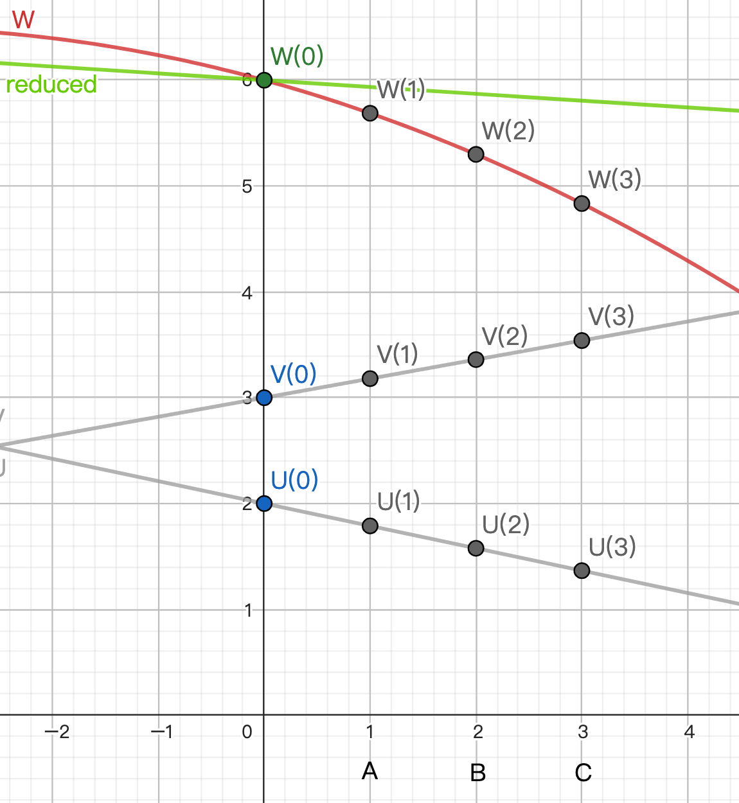
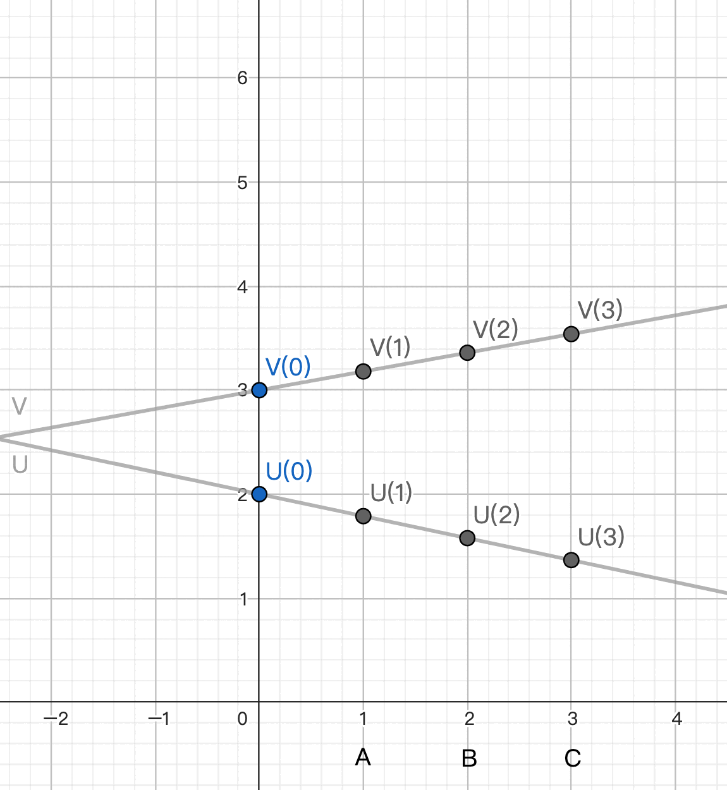

# BGW

在前面的 GMW 中, 我們看到在 boolean circuit 上, 用 XOR 做 additive sharing 拆分的作法.

而在 1988 由 Ben-Or - Goldwasser - Wigderson 提出的作法中, 用的是由 + 和 * 所組成的 arithmetic circuit, 用的是多項式拆分的 Shamir's secret sharing. 另外也不用 oblivious transfer. 
[(Shamir's secret sharing 請先看這篇)](./Shamir-Secret-Sharing-zh-TW.md)

不過從最外面看, 拆分 input 成 shares / 逐 gate 計算新 shares / 合併 output shares 的步驟還是一樣的. 我們直接聚焦在如何逐 gate 計算新的 shares.

## "+" Gate

先看比較簡單的 "+" gate. 假設 gate 的三條 wire 的關係是 u + v = w .

現有 A B C 三個 party 來到了 "+" gate 前. 三人手上共同持有著 [u] ＝ (u1, u2, u3) 和 [v] = (v1, v2, v3).
我們希望經過計算後, 他們手上能有 [u+v] .

根據 Shamir secert sharing 的性質, 這步不用互相溝通. 直接各自計算得 (u1+v1, u2+v2, u3+v3) 就好了.
[[link]](./Shamir-Secret-Sharing-zh-TW.md#from-p-q-to-p--q)

## "*" Gate

複雜的地方在 "*" gate.

我們有 3 個 party. 3 點最高可以決定 2 次曲線. 但平常的 shares 我們不能用 2 次曲線產生, 必須保持在 1 次的直線.

為什麼呢?

如果乘法前 input 就已經是 2 條 2 次曲線, 相乘後的曲線會是 4 次曲線. 
乘法的過程中, 我們會讓 A B C 各自算出 u1 * v1, u2 * v2, u3 * v3 . 
過這三點只用 2 次曲線重建出的 secret 不會是 u * v , 必須用 4 次曲線. 
而我們只有 3 個 party, 無法決定 4 次曲線.

以上圖為例:
綠色 polynomial U 代表的 secret 是 1.5 . 
藍色 polynomial V 代表的 secret 是 0.5 . 
我們希望找到一條 polynomial 代表 1.5 * 0.5 = 0.75 . 
如果用各自相乘得到的 W1 W2 W3 去 interpolate, 會得到沒有通過 0.75 的, 不正確的紅色 2 次曲線. 
而黑色的 polynomial U * V 有通過 0.75, 可是是 4 次的, 用 3 個 party 的點無法決定.

<mark>所以乘法前必須是 2 條 1 次的直線, 相乘出來的 2 次曲線才不會 degree 過高. (degree * 2 + 1 <= 人數)</mark>

但如果下一個 gate 又是 "*" gate 呢? 不就又 2 + 2 = 4 了嗎?

因此我們在 "*" gate 需要做 <mark>"degree reduction"</mark>. 
<mark>也就是先從 2 條 1 次直線算出 2 次曲線和其 y 軸交點, 再用一條通過這個交點的 1 次直線來取代它.</mark> 
這樣我們的 output 就能仍然維持在 1 次直線. 做更多乘法也沒有問題. 

## Degree Reduction

假設 polynomials U, V 為兩直線. Let W = U * V 為二次曲線.
<mark>我們想找一條過 (0, W(0)) 的一次直線取代 W, 取這條直線的 shares 作為結果.</mark>

步驟如下:

A 獨自算出 W(1) = U(1) * V(1) 
B 獨自算出 W(2) = U(2) * V(2) 
C 獨自算出 W(3) = U(3) * V(3)

由於 Shamir's secret sharing 的特性, W(0) 可以簡單表達成 W(1) W(2) W(3) 的 weighted sum, 其 weight 為 (3, -3, 1). 
也就是 W(0) = 3 W(1) + (-3) W(2) + 1 W(3) [[link]](./Shamir-Secret-Sharing-zh-TW.md#combining)

我們想辦法把上面式子中的 W(1) W(2) W(3) 換成 shares, 則可得到一組 W(0) 的 shares. 作法如下:

A 選一條 random 的 1 次直線經過 (0, W(1)), 把 W1 分成 shares 分給 B C. 
B 選一條 random 的 1 次直線經過 (0, W(2)), 把 W2 分成 shares 分給 C A. 
C 選一條 random 的 1 次直線經過 (0, W(3)), 把 W3 分成 shares 分給 A B.

現在 A B C 共同持有 [W(1)] [W(2)] [W(3)], 也都知道 weight (3, -3, 1), 
所以可以各自計算 weighted sum, 讓三人手上有一組新的 shares `3 [W(1)] + (-3) [W(2)] + 1 [W(3)]`. [[link]](./Shamir-Secret-Sharing-zh-TW.md#from-a-b-c-d-p-q-r-s-to-ap--bq--cr--ds) 
而這組 shares 代表的 secret 就是 W(0) = U(0) * V(0) = u * v. 

穿過這組 shares 的多項式的 degree 和 input 一樣, 只需要 1 次直線. [[link]](./Shamir-Secret-Sharing-zh-TW.md#combining)

## 總結

在 BGW 中, 我們用 Sharmir secret sharing 來拆分/合併 shares.

加法不需要溝通, 可以各自計算.

乘法在各自乘完後, 還要互相溝通才能降低 degree. 作法是把交點用 weighted sum 表示, 再用低次多項式的 shares 組成交點的 shares.

這篇用 3 個人為例, 過程中所有多項式的 degree 都不能超過 2. 更多人的 case 還請自行 generalize.

----
## 後記

- 原始的 paper 是 [BGW](https://dl.acm.org/doi/pdf/10.1145/62212.62213) 這篇. Degree reduction 作法和這裡介紹的不一樣. 書中和這裡介紹的 degree reduction 來自 [GRR](https://dl.acm.org/doi/10.1145/277697.277716). 書中的算式的又比 GRR 中的更精練.

- 書中沒有提, 但 BGW GRR papers 都有提到 U * V 不夠 random, 還需要做 randomization. 這在 randomly 挑選三條直線的時候處理掉了.

