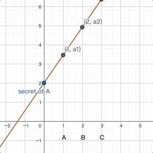
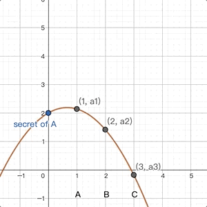
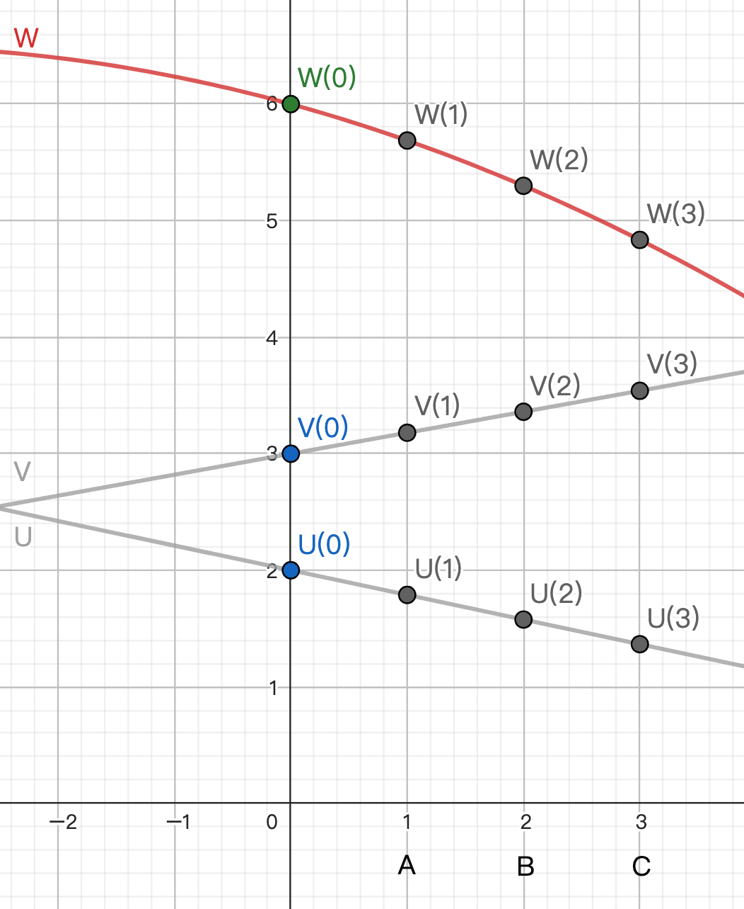
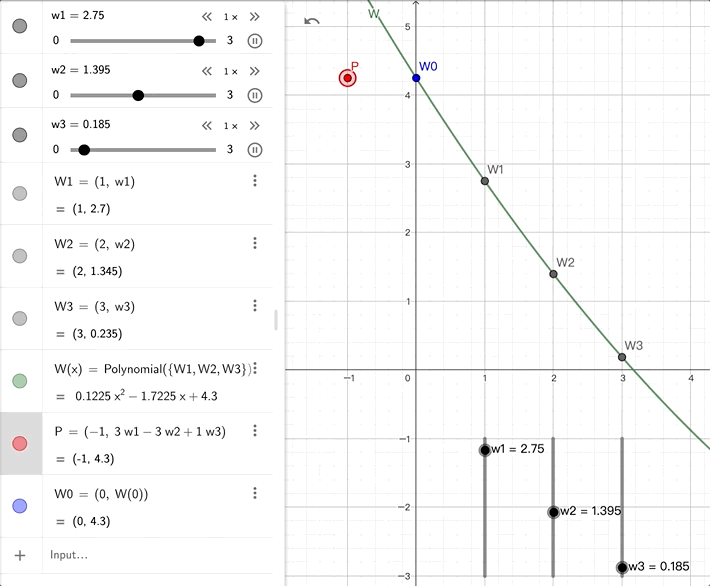
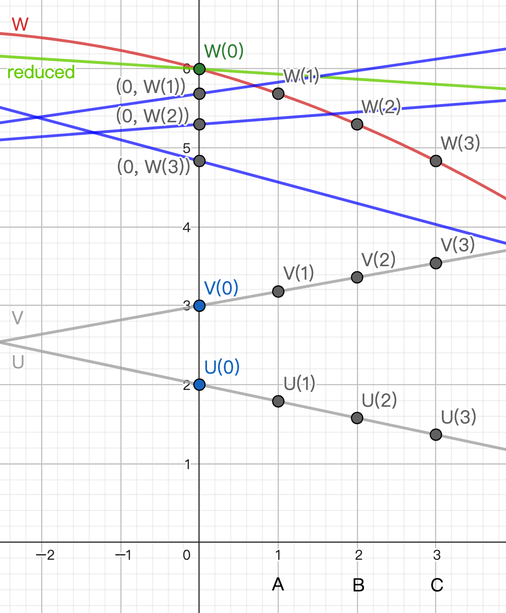

# BGW

在前面的 GMW 中, 我們看到在 boolean circuit 上, 用 XOR 做 additive share 拆分的作法.

而在 1988 由 Ben-Or - Goldwasser - Wigderson 提出的作法中, 用的是由 + 和 * 所組成的 arithmetic circuit, 用的是多項式拆分的 Shamir secret sharing. 另外也不用 oblivious transfer.

不過從最外面看, 拆分 input 成 shares / 逐 gate 計算新 shares / 合併 output shares 的步驟還是一樣的.

## Shamir Secret Sharing

前面我們看過 additive sharing:
```
secret = a1 + a2 + a3

secret = a1 ⊕ a2 ⊕ a3
```
現在我們利用通過 (0, secret) 的 polynomial 來做 Shamir secret sharing:
```
secret = A(0)   a1 = A(1)      a2 = A(2)      a3 = A(3)
                    
                for party A    for party B    for party C      
```
一樣是拆成幾個數字, 只是拆開和合併的方法變得不一樣. 我們用 `[]` 的符號來代表一組 shares.

&nbsp;


我們把焦點從原來 secret 這個數字轉到一個 polynomial, 或者是這個 polynomial 上的一些點.

當我們計算中間的步驟 `a + b = c` 或 `a * b = c` 時, 幾個 party 手上拿的不是 a b 的數字, 而是 a b 的 shares [a] [b].

我們想要從 [a] [b] 得出一組新的 shares [c], 也就是這組 shares 的 polynomial 會通過 (0, c).

## Degree

不同於前面的 additive sharing, Shamir secret sharing 需要多考慮一個參數, 就是 polynomial 的 degree.

以 deg() = 2 的曲線為例. 3 個點可以決定 2 次曲線. 所以洩漏 2 個點沒有關係, 洩漏 3 個點就洩漏 secret 了.

這樣說來, degree 高不容易洩密, 那不是越高越好嗎?

但是 degree 也不是要多高就能多高. 因為一個人只能拿一份 share (也就是一個點), 所以過程中多項式的 degree 都受到這個限制.

如果我們有 3 個 party, 就只能決定 2 次曲線. 3 次曲線就不行了.<br>
而乘法在過程中會讓 degree 加倍, 所以平常不能用 2 次曲線只能用 1 次曲線. 等一下我們會詳細介紹.

## 從 [u] [v] 得到 [u+v]

前面提到, arithmetic circuit 是由 + * 組成的. 我們先看比較簡單的 + .

想計算 u + v = w , 也就是從 [u] [v] 得到 [u+v]<br>
有 Polynomial U 通過 (0, u). u 拆成 (1, U(1)) (2, U(2)) (3, U(3)) 在 A B C 手上.<br>
有 Polynomial V 通過 (0, v). v 拆成 (1, V(1)) (2, V(2)) (3, V(3)) 在 A B C 手上.

有沒有什麼 polynomial 會通過 (0, u+v) 呢?<br>
很多個.<br>
最容易想到的是 let polynomial W = U + V .<br>
則 W(0) = U(0) + V(0) = u + v .

那, 我們有辦法求出 W, 或者說, 求出 W 上的一些點嗎?<br>
有.

A 手上有 U(1) V(1). A 不用和別人溝通, 把手上的數字加起來.<br>
W 會經過 (1, U(1)+V(1)), 因為 U(1) = V(1) + W(1).

B 手上有 U(2) V(2). B 不用和別人溝通, 把手上的數字加起來.<br>
W 會經過 (2, U(2)+V(2)), 因為 U(2) = V(2) + W(2).

C 手上有 U(3) V(3). C 不用和別人溝通, 把手上的數字加起來.<br>
W 會經過 (3, U(3)+V(3)), 因為 U(3) = V(3) + W(3).

這樣算出來的 W(1) W(2) W(3) 就是一份 u + v 的 shares.

## 從 [u] [v] 得到 [u*v]

再來看 + * 中比較複雜的 * .

想計算 u * v = w , 也就是從 [u] [v] 得到 [u*v]<br>
有 Polynomial U 通過 (0, u). u 拆成 (1, U(1)) (2, U(2)) (3, U(3)) 在 A B C 手上.<br>
有 Polynomial V 通過 (0, v). v 拆成 (1, V(1)) (2, V(2)) (3, V(3)) 在 A B C 手上.

有沒有什麼 polynomial 會通過 (0, u*v) 呢?<br>
很多個.<br>
最容易想到的是 let polynomial W = U * V .<br>
但是直接用會有問題!



問題在哪裡?

如果 let W = U * V 的話, deg(W) = deg(U) + deg(V).<br>
像上面圖中兩條直線就變成了紅色的二次曲線.<br>
這樣只要做幾次乘法, polynomial 的 degree 就會一直上升. 很快就會超過 party 能接受的個數了.

所以在 * 這邊, 除了拿到 W = U * V 的 shares 之外, 還要想辦法降低 degree. 也就是找出另一個也能通過 W(0), 但 degree 比較低的 polynomial.

# Degree reduction (and randomization)

在 Shamir secret sharing 中, 通常從 shares reconstruct secret 的作法是: 用 Lagrange polynomial interpolation 找出通過 shares 的 polynomial, 再代入 0 求出 secret.

Lagrange basis 只和選定的 x 有關, 和 y 無關.

假設 party A B C 的 x 是 1 2 3. 此時 W = U * V 可寫成

$$W(x) = \frac{(x - 2)(x - 3)}{(1 - 2)(1 - 3)}W(1) + \frac{(x - 3)(x - 1)}{(2 - 3)(2 - 1)}W(2) + \frac{(x - 1)(x - 2)}{(3 - 1)(3 - 2)}W(3)$$

<br>
但我們不是對所有 x 都有興趣. 我們只對 W(0), 也就是 secret 有興趣. 代 0 進去得到

$$\begin{aligned}W(0) &= \frac{(0 - 2)(0 - 3)}{(1 - 2)(1 - 3)}W(1) + \frac{(0 - 3)(0 - 1)}{(2 - 3)(2 - 1)}W(2) + \frac{(0 - 1)(0 - 2)}{(3 - 1)(3 - 2)}W(3) \\&= 3 W(1) + (-3) W(2) + 1 W(3)\end{aligned}$$

此時 x 消失了. 剩下在 W 前面的三個常數: 3 -3 1 .

<mark>意思是: 只要我們把 shares 個別乘上 3 -3 1 再加起來, 這個 weighted sum of shares 就是 secret.</mark>

可以參考下圖: 其中 P 是用 3 -3 1 組起來的, 和用 polynomial 算出來的 W(0) 是一模一樣的.
[(geogebra)](https://www.geogebra.org/calculator/a55ddkcg)




假設原來的 polynomial U V 都是 degree t.

<mark>我們再把 W(1) W(2) W(3) 這三個數字用通過 (0, W(1)), (0, W(2)), (0, W(3)) 的三個 random t 次多項式取代:</mark>

$$\begin{aligned}W(0) = & 3 W(1) + (-3) W(2) + 1 W(3) \\ \\ & 3 poly1(x) + (-3) poly2(x) + 1 poly3(x)\end{aligned}$$

這樣 "灌水" 得到的 weighted sum 是一個新的多項式, 代 0 進去會得到 W(0), 而且 degree 仍然維持在 t !

三個 party 可以再互相交換 poly1 poly2 poly3 的 shares 來算出這個新的直線的, 通過 u * v 的 shares.


[(geogebra)](https://www.geogebra.org/calculator/vmx2ws9e)

以上圖為例. A B C 拿著 u = 2 的 shares 和 v = 3 的 shares, 想計算 u * v = 6 的 shares.

因為只有 3 個人, 所以 let t = 1, 也就是直線. (t = 2 在乘法過程中會變成 4, 超過 3 個人的限制)

W = U * V 是紅色的 degree 2 的 polynomial. 需要 degree reduction.

(1, W(1)) (2, W(2)) (3, W(3)) 是 A B C 可以分別各自計算的 W 的 shares.

取三個 degree 1 的 random polynomial 分別經過 (0, W(1)) (0, W(2)) (0, W(3)), 也就是三條藍色的直線.

這三條直線做 3 -3 1 的 weighted sum, 就是能經過 (0, W(0)), 而且 degree 只有 1 的綠色直線. 

那我們實際上要怎麼算出這條直線的 shares 呢?

A 拿著 U(1) V(1), 計算 W(1) = U(1) * V(1).<br>
取 random poly1 過 (0, W(1)). 算出 shares poly1(1) poly1(2) poly1(3) 分給其他人.

B 拿著 U(2) V(2), 計算 W(2) = U(2) * V(2).<br>
取 random poly2 過 (0, W(2)). 算出 shares poly2(1) poly2(2) poly2(3) 分給其他人.

C 拿著 U(3) V(3), 計算 W(3) = U(3) * V(3).<br>
取 random poly3 過 (0, W(3)). 算出 shares poly3(1) poly3(2) poly3(3) 分給其他人.

A 計算 3 * poly1(1) + (−3) * poly2(1) + 1 * poly3(1) .

B 計算 3 * poly1(2) + (−3) * poly2(2) + 1 * poly3(2) .

C 計算 3 * poly1(3) + (−3) * poly2(3) + 1 * poly3(3) .

這三個值, 就是一份代表新直線的, 經過 2 * 3 的 shares.


## 總結

在 BGW 中, 我們用 Sharmir secret sharing 來拆分/合併 shares.

加法不需要溝通, 可以各自計算.

乘法在個自乘完後, 還要互相溝通才能降低 degree.

第一個重要的觀察是: 如果我們只在乎重建後的 polynomial 在 x = 0 的值, 那拿 shares 做 weighted sum 就好.

第二個重要的觀察是: 我們把 weighted sum 中的 shares 從 scalar "灌水" 成 polynomial, 這樣可以再分 shares 給別人做 weighted sum.


TODO
TODO: 後面灌水這段其實是在跑一個 linear combination
TODO

----
## 後記

- 原始的 paper 是 [BGW](https://dl.acm.org/doi/pdf/10.1145/62212.62213) 這篇. Degree reduction 作法和這裡介紹的不一樣. 書中和這裡介紹的 degree reduction 來自 [GRR](https://dl.acm.org/doi/10.1145/277697.277716).

- 書中沒有提, 但 BGW GRR papers 都有提到 U * V 不夠 random, 還需要做 randomization. 這在 randomly 挑選 poly1 poly2 poly3 的時候處理掉了.

- 本來 Lagrange interpolation 比較複雜, 但在選定 x = 0 1 2 3 之後, 一下子變成簡單的 weighted sum. 這點和中國餘式定理是一樣的. (兩個作法本來就很像)

