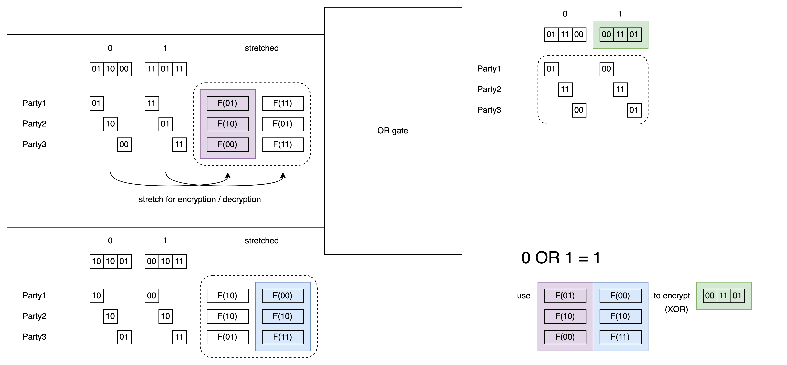
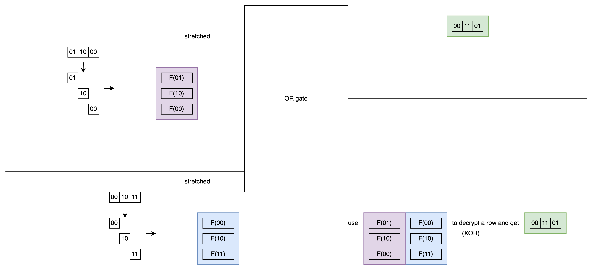
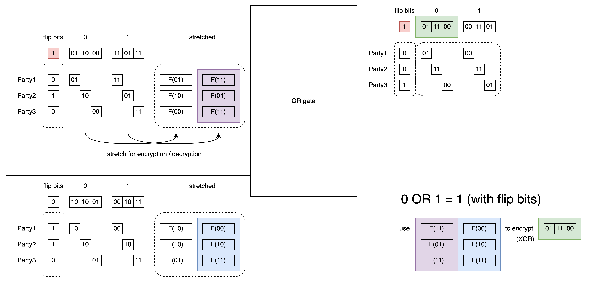

# BMR

In the previous GMW and BGW protocols, we saw that these protocols can handle computations involving more than two parties.

However, due to the relationship between the "∧" gate and the "*" gate, many rounds are required between parties (varying with circuit depth).

BMR asks: Can we handle computations involving more than two parties, but run in constant rounds like Yao's Garbled Circuit?

## Garbling Together

In Yao's GC, one person generates the garbled table, and another evaluates it.

In BMR, the table is generated by all parties together using a simpler MPC protocol, involving communication.

Once a single party receives all inputs, they can evaluate the entire circuit on their own, without gate-by-gate communication.

Since the table generation is done in parallel for all gates/wires, the number of rounds required is independent of depth.

In Yao's GC, the output label is encrypted using two input labels, ensuring that only one can be opened during evaluation.

BMR follows the same principle. Now, these two labels are divided among each party, like this:

This example shows an OR gate, calculating one of the 4 ciphertext rows: 0 OR 1 = 1.

Each party uses a PRF or hash function to stretch their part of the label, encrypting (XOR) the corresponding output label.

This ciphertext is computed using a custom MPC protocol. It's just XORing 7 (or 3) bit strings together.
(For example, using the [previously mentioned protocol](./Two-to-Three-en-US.md))

The parts enclosed in dashed lines in the figure are the MPC inputs. Since PRF/hash is already computed locally, the MPC is simple.

I hope that after looking at the figure, equation (3.1) in the book becomes easier to understand.

$$e_{v_a,v_b} = w_c^{v_c} \bigoplus_{j=1..n} (F(i,w_{a,j}^{v_a}) \oplus F(i,w_{b,j}^{v_b}))$$

## Evaluate

The evaluator receives two labels, cuts them, stretches them, and then decrypts the output label.

However, observe the above figure: If Party1 is evaluating, when they see "011000" with "01" at the front, they'll realize it's the same as their label 0 for this wire. This would leak information.

So BMR adds a flip bit design. Although Party1 can still compare labels, if they don't know the flip bit for this wire, they won't know what value the label actually represents.

## Flip bits

For each wire, each party randomly selects a flip bit.
The XOR of all these flip bits becomes the flip bit for this wire.
Each party only knows their own flip bit.
No one knows the flip bit for intermediate wires.

If the flip bit is 0, it has no effect.
If the flip bit is 1, then in the operation, label 0 is used instead of label 1, and label 1 is used instead of label 0.

The above figure also calculates the ciphertext for 0 OR 1 = 1.
Note that the flip bits for the first input label and output label wires are 1.
So the label selection for these two wires is reversed.

This logic is shown in Figure 3.3 of the book.

$$e_{v_a,v_b} = w_c^{v_c \color{blue}{\oplus f_c}} \bigoplus_{j=1..n} (F(i,w_{a,j}^{v_a \color{blue}{\oplus f_a}}) \oplus F(i,w_{b,j}^{v_b \color{blue}{\oplus f_b}}))$$

Note that the upper right index of w now includes the influence of the flip bit f.

Finally, parties also pass the actual bits of input wires to this simpler MPC to calculate the labels for input wires. Once made public, evaluation can proceed.

## Summary

In BMR, we use a simpler MPC protocol to implement the MPC for the function we actually want to compute.

BMR extends Garbled Circuit, achieving an MPC protocol for more than two parties in constant rounds.

TODO: The book doesn't describe much about the implementation of the underlying simple MPC, so we need to look at other references.

