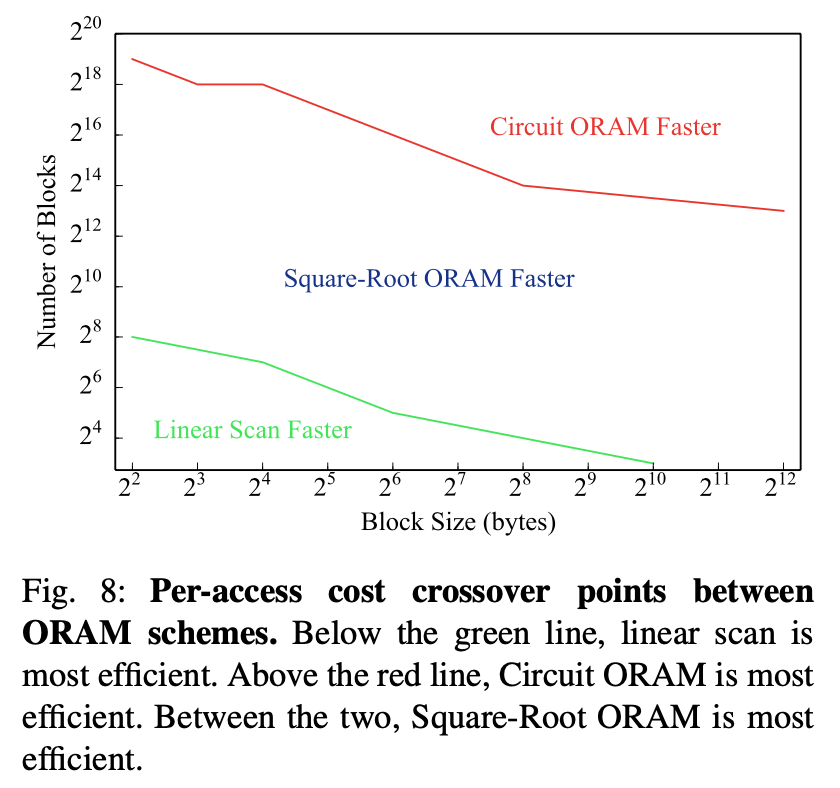
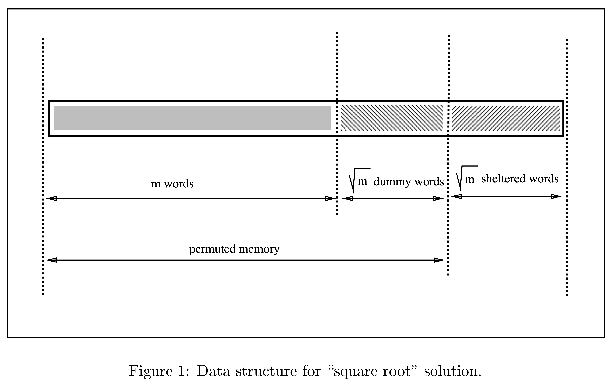

# Circuit ORAM / Square-Root ORAM

## Circuit ORAM

In the previous article, we saw how to combine ORAM with MPC: find an ORAM scheme, implement it with a circuit, and the large array no longer occupies O(N) circuit complexity, but reduces to sublinear.

Although any sub-linear ORAM scheme can be used, many ORAMs were originally designed with bandwidth considerations between server and client in mind.

Wang et al.'s Circuit ORAM, on the other hand, is designed with circuit complexity in mind. So while the eviction algorithm in Path ORAM is simple for general client-side computation, it becomes complex in MPC circuits. In Circuit ORAM, the eviction is implemented differently.

In some settings (4GB data size with 32-bit blocks), this approach uses 30 times fewer non-free gates than directly using Path ORAM. However, the blocks here are smaller and there are more of them (128M).

TODO: I haven't looked into the actual implementation of Circuit ORAM (such as metadata scan).

## Square-Root RAM-MPC

Although ORAM can reduce complexity to sublinear, implementing ORAM algorithms as circuits comes with a cost, and it only outperforms linear scan when N is relatively large. Additionally, the initialization cost of some ORAMs is impractically high.

Because many practical programs don't use very large arrays, [Zahur et al.](https://www.cs.umd.edu/~jkatz/papers/sqoram.pdf) point out:
> This means that for practical sizes, the entire body of research on ORAM has had little impact as far as RAM-SC is concerned.

So they proposed a method that, although asymptotically worse, performs better in many practical situations.

 
(From Figure 8 in [Zahur et al.](https://www.cs.umd.edu/~jkatz/papers/sqoram.pdf))

Zahur's method is a modification of the Square-Root ORAM proposed by Goldreich and Ostrovsky in 1996, which has an overhead of O(N^0.5) rather than polylog.

Let's first look at the original Square-Root ORAM.

### Square-Root ORAM

 
(From Figure 1 in [Goldreich and Ostrovsky](https://dl.acm.org/doi/10.1145/233551.233553))

In addition to the original main memory of length m, we add two blocks of length m^0.5: dummy words and sheltered words.

Every m^0.5 accesses, we re-permute.

Initially, randomly permute the contents of the first m + m^0.5 positions. (Generate tag with PRF + Oblivious Sort)

For each subsequent access to index i, first scan the sheltered words of size m^0.5. 
If not found in shelter, read from position Pi(i). Append to sheltered words. 
If found in shelter, read from position Pi(next dummy). Append to sheltered words.

After m^0.5 accesses, the shelter is full, so we re-permute.

From the outside, the memory access patterns for different indices all look the same.

### Square-Root ORAM + MPC

The above Square-Root ORAM has two problems when applied to MPC:
1. PRF is expensive to compute in MPC
2. Oblivious Sort can be improved

Here, Zahur uses the previously mentioned [Waksman Network](./Permutation-Network-en-US.md) to replace oblivious sort.

TODO: Haven't fully understood this part yet.

----
## Postscript

You can refer to these videos:
1. [ORAM - Prof. Benny Pinkas](https://www.youtube.com/watch?v=3RWyVGwG9U8)
2. [Revisiting Square Root ORAM: Efficient Random Access in Multi-Party Computation](https://www.youtube.com/watch?v=OnOF8zzIL9I)
