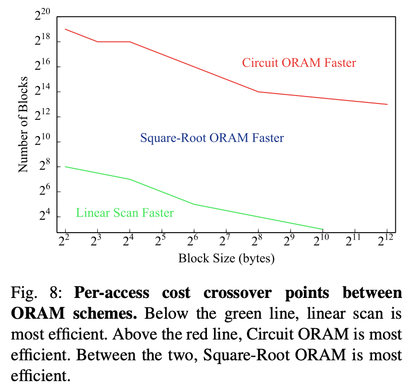

# Circuit ORAM / Square-Root ORAM

## Circuit ORAM

在前一篇中, 我們看到怎麼把 ORAM 和 MPC 結合: 找一個 ORAM scheme, 用 circuit implement, 大的 array 就不再佔用 O(N) 的 circuit complexity, 而是降到 sublinear.

雖然拿任何一個 sub-linear 的 ORAM scheme 來都可以用. 但是許多 ORAM 原本是以 server client 間的 bandwidth 為考量.

Wang et al. 的 Circuit ORAM 則是以 circuit complexity 為考量. 所以像 Path ORAM 中 evict 的演算法雖然在一般 client 端計算很簡單, 但是在 MPC circuit 中計算就顯得複雜. 在 Circuit ORAM 中的 evict 就改用別的寫法.

在某些 setting 下 (4GB data size with 32-bit blocks), 這個作法的 non-free gate 比直接拿 Path ORAM 來用的作法少 30 倍. 不過這邊的 block 比較小, 個數也比較大 (128M 個).

TODO: 我沒有進去看 Circuit ORAM 的實際作法(如 metadata scan).

## Square-Root RAM-MPC

雖然用 ORAM 可以降到 sublinear, 可是 ORAM algorithm 用 circuit 實作本來就有成本, 要等到 N 比較大才能贏過 linear scan. 另外有些 ORAM 的 initialization cost 也高到不實用.

因為實際程式很多 array 的個數其實不大, [Zahur et al.](https://www.cs.umd.edu/~jkatz/papers/sqoram.pdf) 指出:
> This means that for practical sizes, the entire body of research on ORAM has had little impact as far as RAM-SC is concerned.

於是他們提出了雖然 asympotically worse, 但是在許多實際情況表現比較好的方法.

 
(來自 [Zahur et al.](https://www.cs.umd.edu/~jkatz/papers/sqoram.pdf) 的 Figure 8)

Zahur 的方法是修改自 Goldreich and Ostrovsky 在 1996 提出的, overhead 是 O(N^0.5) 而不是 polylog 的 Square-Root ORAM.

我們先看原本的 Square-Root ORAM.

### Square-Root ORAM

 
(來自 [Goldreich and Ostrovsky](https://dl.acm.org/doi/10.1145/233551.233553) 的 Figure 1)

我們在原本長度 m 的 main memory 之外加兩塊 m^0.5 長度的區塊: dummy words 和 sheltered words.

每 m^0.5 次 access 會重新 permute.

一開始先 randomly permute 前面 m + m^0.5 個位置的內容. (PRF 產生 tag + Oblivious Sort)

接下來每次 access index i 都會先 scan 大小為 m^0.5 的 sheltered words. 
Shelter 沒找到, 就去讀 Pi(i) 的位置. Append 到 sheltered words. 
Shelter 有找到, 就去讀 Pi(next dummy) 的位置. Append 到 sheltered words.

經過 m^0.5 次 access 之後 sheltered 滿了, 就重新 permute.

從外面來看, 不同 index 的 memory access pattern 都是一樣的.

### Square-Root ORAM + MPC

上面的 Square-Root ORAM 拿到 MPC 來有兩個問題:
1. PRF 在 MPC 計算很貴
2. Oblivious Sort 也可以改進

這邊 Zahur 用前面提過的 [Waksman Network](./Permutation-Network-zh-TW.md) 來取代 oblivious sort.

TODO: 還沒有完全看懂.

----
## 後記

可以參考影片
1. [ORAM - Prof. Benny Pinkas](https://www.youtube.com/watch?v=3RWyVGwG9U8)
2. [Revisiting Square Root ORAM: Efficient Random Access in Multi-Party Computation](https://www.youtube.com/watch?v=OnOF8zzIL9I)