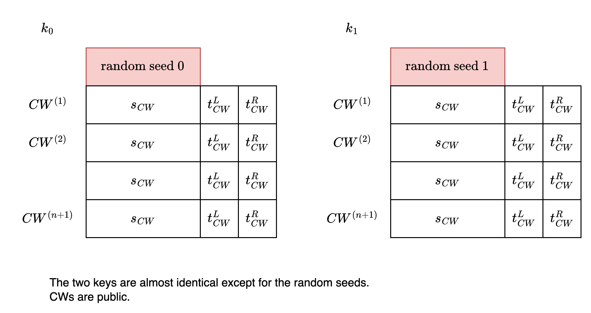

# Function Secret Sharing / Distributed Point Function

Function Secret Sharing (FSS) aims to split a function f into N functions for N parties.

For the same input x, party 0 calculates f0(x), party 1 calculates f1(x), ...

These values will be additive shares of the original f(x), meaning f0(x) + f1(x) + ... = f(x).

Different function families may have different FSS approaches. The following introduces Boyle et al.'s method for Distributed Point Function. (For definition and application, please refer to the [previous article](./Point-Function-Distributed-Point-Function-en-US.md))

## Boyle's Construction

Here we look at a special case: f's domain is [0, 7], and only when x = 5, f(x) = 1. There are only two parties, P0 and P1.

Boyle's method is to compute an imaginary tree. P0 and P1 compute their shares respectively.


We want only the leaf f(5) to be 1.

The "1-0-1" path for calculating f(5) is called the "special evaluation path". Calculate from root to leaf.

Each node (s, t) consists of a lambda-bit seed s and a 1-bit control bit t.

<mark>Important invariants</mark>: We hope that during the calculation process, if we deviate from the special evaluation path, this node will be (00....0, 0).<br>
(OFF, black. P0 P1 hold exactly the same bits.)

If not deviated, then this node will be (random bits, 1).<br>
(ON, red. P0 P1 do not hold exactly the same bits.)<br>

Finally, we output the control bit of the leaf. Only the control bit of leaf 5 will be 1.

Note that throughout the process, P0 P1 cannot discover that f(5) = 1.

## Generation / Evaluation

Boyle's construction has two algorithms.

Gen() can split f into f0 and f1, described by key0 and key1 respectively. Distributed to P0 P1.

P0 gives x and key0 to Eval() to calculate f0(x).<br>
P1 gives x and key1 to Eval() to calculate f1(x).

Let's work backwards from the evaluation perspective to figure out what kind of key the initial generation should prepare.

The evaluation method is similar to the "PRNG -> PRF" approach of [GGM](https://dl.acm.org/doi/10.1145/6490.6503): starting from the root's seed, each time use PRNG to extend the node to twice its length, then cut it into two child nodes. (Also extend the length of two control bits)

Initially, Gen() generates two uniformly random bit strings for P0 P1 as the seeds of the root.<br>
Let P0 P1 use PRNG to generate 2 4 8 ... child nodes respectively.<br>
But obviously, the nodes created this way won't satisfy the previous invariants when reconstructed.

So Gen() prepares additional "correction words" (CW) at each level of the tree, which can modify the bits generated by PRNG to conform to the invariants. In the reconstructed tree, this modification will nullify the child node that deviates from the special evaluation path, while the other child node remains random bits.

### Conditional Correction

In actual Eval(), the two parties perform "conditional correction" separately: if the control bit t they hold is 1, they XOR the correction word to make corrections, otherwise no correction.

If P0 P1 hold shares of control bit t = 0, it could be (0, 0) or (1, 1).<br>
Since P0 P1 correcting twice is equivalent to no correction, the reconstructed result won't change whether it's (0, 0) or (1, 1).
```
s0 ⊕ s1 = (s0 ⊕ CW) ⊕ (s1 ⊕ CW)
```

If P0 P1 hold shares of control bit t = 1, it could be (1, 0) or (0, 1).<br>
This will make the reconstructed result corrected by CW once.
```
(s0 ⊕ CW) ⊕ s1 = s0 ⊕ (s1 ⊕ CW) = (s0 ⊕ s1) ⊕ CW
```


### Levels and Invariants

Let's start from the top level. Since the root must be on the special evaluation path, we set its control bit t = 1.

Then generate each level downwards.

If the parent node is on the special evaluation path, use CW to modify the deviated child node to s = 0, t = 0. Also use CW to ensure the non-deviated child is s = random, t = 1.


If the parent node is already not on the special evaluation path, it will be s = 0, t = 0. Because t = 0, conditional correction doesn't work (and does not need to take effect). Both child nodes will still be s = 0, t = 0.


Since CW doesn't need to correct nodes that have already deviated, and there's only one node still on the special evaluation path at each level, only one CW needs to be prepared for each level.

Optimization: Since we only need to ensure that one of the two children is corrected to 0, and the s of the other child can be any random string, we can copy half of the CW, saving half the space.

### Keys



In the Gen() process, first randomly generate root seeds for P0 P1 respectively.<br>
The root must be on the special evaluation path, P0 P1's control bits are directly assigned as (0, 1), no need to store in the key.


Suppose we have the following 4 -> (4 + 1 + 4 + 1) bits PRNG G():
```
0000 0001000101
0001 0100100010
0010 1111010111
0011 1010100011
0100 0101010101
0101 0000011001
0110 1001000111
0111 1010011110
1000 0100110000
1001 1010101010
1010 1110110000
1011 1101100011
1100 1111000000
1101 0111101101
1110 1001100001
1111 1001110011
```

Suppose we randomly give P0 P1 seeds "0100" and "1110" respectively.

After expanding through G, it will be "0101010101" and "1001100001".

To maintain invariants, we can gradually deduce the CW needed for each level on the special evaluation path "1-0-1".


----
## Postscript

Boyle's lecture content at BIU is worth watching: [FSS Part 2 - Elette Boyle](https://www.youtube.com/watch?v=Zm-MUVve2_w).
