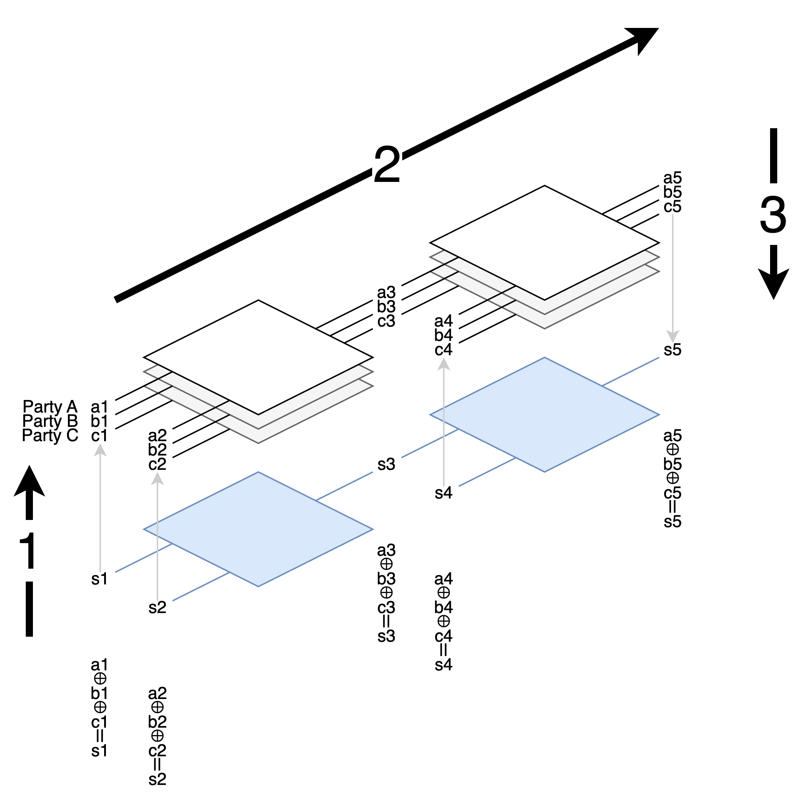
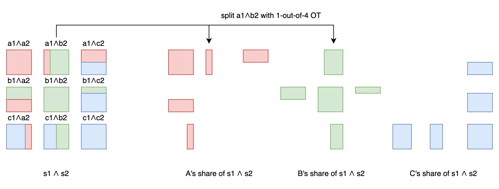

# GMW / GMW87

Earlier, we introduced Yao's Garbled Circuit from 1986, which is suitable for a protocol involving two parties.

In 1987, Goldreich-Micali-Wigderson proposed a protocol that can be used in scenarios with more parties.



Now each party has their own copy of the circuit and shares of wire values.

The execution is divided into three steps:

1. Each party holding an input wire value splits the value into shares and distributes them to each party.
2. Following the topological order, calculate new shares on the output wire using the rules of each gate.
3. Combine the shares of the final output wires and announce the answer.

We use [value] to represent the shares of a split value. For example, the calculation of (a ⊕ b) ∧ c would become:
1. Split a, b, c into [a] [b] [c], and distribute to others.
2. Figure out how to calculate [a⊕b] from [a] [b], and then [(a⊕b)∧c] from [a⊕b] [c].
3. Reconstruct (a⊕b)∧c from [(a⊕b)∧c].

Each step of the entire protocol satisfies the property that "split / compute / reconstruct = direct computation". So the answer calculated step by step will be correct.

Let's see how GMW is actually implemented.

## Splitting input / Reconstructing output

Party A holds an input s1 and needs to split it into shares for A, B, and C to hold.

GMW uses XOR additive shares, which means splitting into `s1 = a1 ⊕ b1 ⊕ c1`.

Party A can take random numbers for two of the shares, and then subtract these two from s1 to get the third share.
For example, if s1 is 1, party A takes random numbers a1 = 0, b1 = 1, then calculates c1 = 0.
Party A keeps a1 and distributes b1 and c1 to B and C.

Reconstructing is simply XORing everything together.

## Computing the circuit

Here, a boolean circuit composed of NOT / XOR / AND gates is used.

The advantage of using this set of gates is that NOT / XOR can be computed separately by each party without communication. Only AND requires communication between parties.

The rules for each gate are as follows:

### NOT gate

The first party reverses their input share. Other parties copy the input as output. This way, a new set of shares is obtained.

(!a1) ⊕ b1 ⊕ c1 = !(a1 ⊕ b1 ⊕ c1)

In this example, we can see that we focus on whether the reconstructed output of all shares satisfies the logic of this gate. The output of a single party doesn't need to satisfy the logic of this gate.

### XOR gate

Each party calculates individually according to the normal XOR rules, and a new set of correct shares can be obtained.

Given:
```
s1 = a1 ⊕ b1 ⊕ c1
s2 = a2 ⊕ b2 ⊕ c2
```
If we let the new shares a3, b3, c3 be the result of each party calculating ⊕ separately:
```
a3 = a1 ⊕ a2
b3 = b1 ⊕ b2
c3 = c1 ⊕ c2
```
Will a3 ⊕ b3 ⊕ c3 = s1 ⊕ s2 ?
Yes!
```
a3 ⊕ b3 ⊕ c3
= (a1 ⊕ a2) ⊕ (b1 ⊕ b2) ⊕ (c1 ⊕ c2)
= (a1 ⊕ b1 ⊕ c1) ⊕ (a2 ⊕ b2 ⊕ c2)
= s1 ⊕ s2
```

### AND gate

The complexity lies here. If each party calculates AND independently, the combined result will be incorrect. So they need to communicate.

#### AND gate: 2 parties

Let's first discuss the case with only 2 parties, A and B.

```
a1         a2         a3
⊕          ⊕          ⊕
b1         b2         b3
=          =          =
s1    ∧    s2    =    s3
```
A and B each have shares a1, a2, b1, b2. Now we want to find a3, b3 that satisfy the above property.

<mark>A says to B: "I know a1 and a2, but I don't know your b1 and b2. So I've calculated the corresponding s3 for every possible combination of b1 and b2. I'll take my share a3 from s3 first, and you can take the remaining b3 from me using Oblivious Transfer."</mark>

Here, I'll use a1 = 0, a2 = 1 as an example. Suppose A randomly decides a3 = 1. We need to find all possible b3.
```
a1 a2  b1 b2  s1=a1⊕b1 s2=a2⊕b2 s3=s1⊕s2  a3 b3=s3⊕a3
0  1   0  0   0        1        1         1  0
0  1   0  1   0        0        0         1  1
0  1   1  0   1        1        0         1  1 <==
0  1   1  1   1        0        1         1  0
```

Suppose B has b1 = 1, b2 = 0.
B performs a 1-out-of-4 Oblivious Transfer with A, obtaining the corresponding b3 = 1.

At this point, the new a3 ⊕ b3 = s3 is a new set of shares satisfying the above property.

#### AND gate: N parties

Let's look at the case where N = 3. (Please generalize for other cases yourself)

```
a1         a2         a3
⊕          ⊕          ⊕
b1         b2         b3
⊕          ⊕          ⊕
c1         c2         c3
=          =          =
s1    ∧    s2    =    s3
```

Given the two sets of shares a1, b1, c1 and a2, b2, c2. We want to find a new set of shares a3, b3, c3 that satisfy the above property.

Applying the distributive property (∧ is *, ⊕ is +)
```
s3 = s1 ∧ s2
   = (a1⊕b1⊕c1) ∧ (a2⊕b2⊕c2)
   = ⊕ ( a1∧a2 a1∧b2 a1∧c2
         b1∧a2 b1∧b2 b1∧c2
         c1∧a2 c1∧b2 c1∧c2 )
```
Except for the diagonal terms a1∧a2 (which A can calculate on their own), b1∧b2 (which B can calculate on their own), and c1∧c2 (which C can calculate on their own), all others require communication.

For example, a1∧b2 requires information from both A and B. So A and B perform the 1-out-of-4 OT mentioned earlier, and each obtains two numbers split from a1∧b2. These two numbers combined can give a1∧b2.

Use the same method to handle the 6 off-diagonal numbers. After OT, each number is split into 2 shares.

Finally, each person has one independently calculated diagonal share and four shares obtained from OT with others. XORing these 5 shares will give their own share of s3.



## Conclusion

In GMW, we express the function using a boolean circuit and use additive shares for splitting and reconstructing. OT is used for communication during the steps.

In the next article on BGW, we will express the function using an arithmetic circuit and use polynomials to split shares. And we won't need OT.
