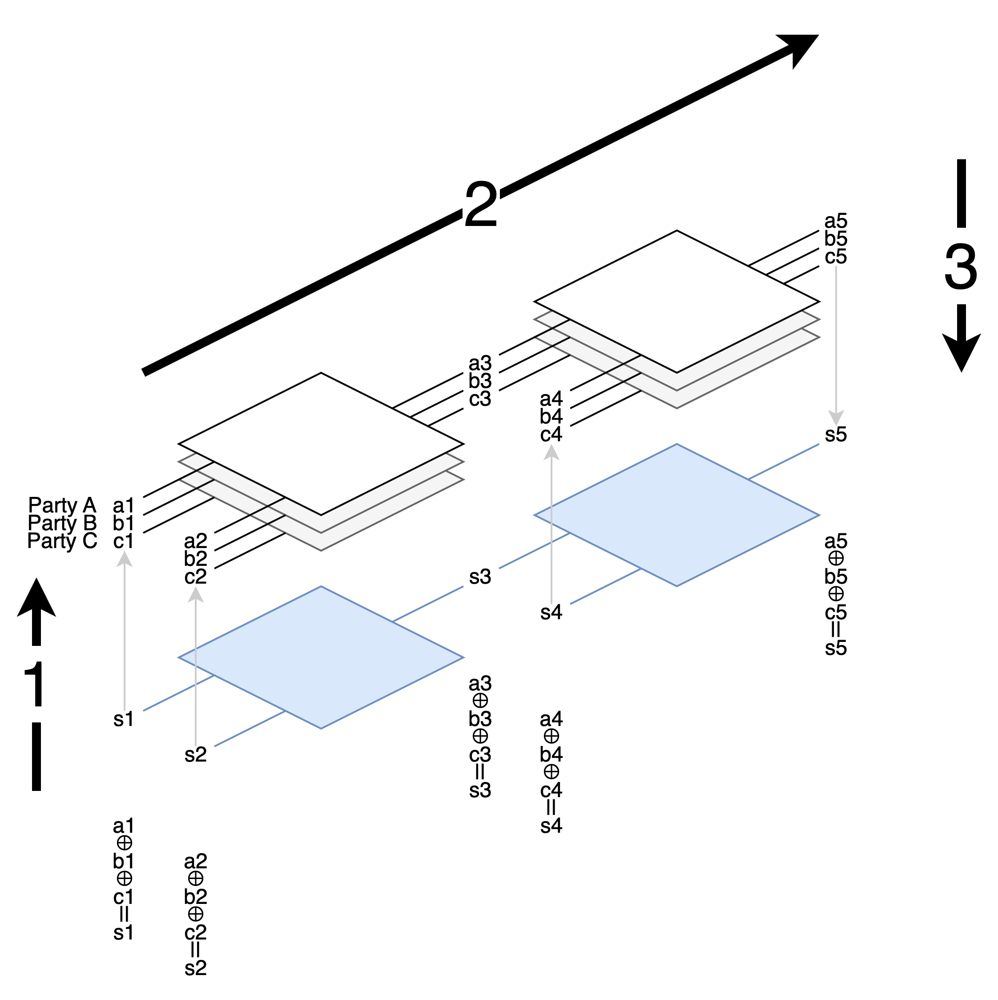
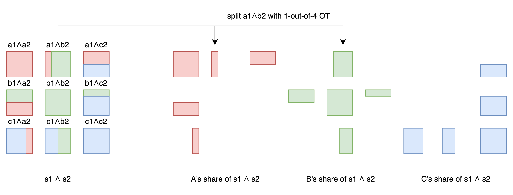

# GMW / GMW87

前面介紹了 1986 年的 Yao's Garbled Circuit, 是適合兩個 party 的 protocol.

1987 年 Goldreich-Micali-Wigderson 提出的 protocol 則可以用於更多 party 的場景.



每個 party 現在有自己的一份 circuit 和 shares of wire values.

執行上分成三步驟

1. 每個持有 input wire value 的 party, 把 value 拆成 shares 分給每個 party.
2. 依照 topological order, 用每個 gate 的規則計算 output wire 上的新的 shares.
3. 把最後的 output wires 的 shares 合併, 再公布答案.

我們用 [value] 來代表 value 拆開的 shares. 舉例來說, 像原本 (a ⊕ b) ∧ c 的計算, 會變成
1. 拆開 a b c 成 [a] [b] [c], 分給其他人.
2. 想辦法從 [a] [b] 算出 [a⊕b], 以及從 [a⊕b] [c] 算出 [(a⊕b)∧c]
3. 從 [(a⊕b)∧c] reconstruct 出 (a⊕b)∧c

而整個 protocol 的每個步驟都滿足 "input 拆開 / 計算 / output 合起來 = 直接計算" 的性質. 所以逐步算完的答案會是對的.

我們來看 GMW 實際上是怎麼實作的.

## input 拆開 / output 合起來

如果 A 持有 input s1, 要分開讓 A B C 三個人持有 shares.

GMW 這邊用 XOR 的 additive shares, 也就是拆開成 `s1 = a1 ⊕ b1 ⊕ c1` .

A 可以在其中兩份取亂數, 再從 s1 扣掉這兩份就能得到第三份 share 了.<br>
舉例來說, 如果 s1 是 1, A 取亂數得 a1 = 0, b1 = 1, 則算出 c1 = 0.<br>
A 留著 a1, 把 b1 c1 分給 B 和 C.<br>

合併也只要通通 ⊕ 起來就好了.

## 計算 circuit

這裡用的是由 NOT / XOR / AND gates 組成的 boolean circuit.

用這組 gates 的好處是: NOT / XOR 可以每個 party 分開算, 不用互相溝通. 只有 AND 需要 party 間的溝通.

每個 gate 的規則如下:

### NOT gate

第一個 party 把自己的 input share reverse 就好. 其他 party copy input 成 output. 這樣就能得到一組新的 shares.

(!a1) ⊕ b1 ⊕ c1 = !(a1 ⊕ b1 ⊕ c1)

另外在這個例子裡可以看到, 我們注重的是所有 shares 合起來的 output 是否滿足這個 gate 的邏輯. 單一 party 的 output 不用滿足這個 gate 的邏輯.

### XOR gate

每個 party 都分別照一般的 XOR 規則個別計算, 就能得到一組新的正確的 shares.

已知
```
s1 = a1 ⊕ b1 ⊕ c1
s2 = a2 ⊕ b2 ⊕ c2
```
如果令新的 shares a3 b3 c3 是每個 party 分別計算 ⊕ 的結果:
```
a3 = a1 ⊕ a2
b3 = b1 ⊕ b2
c3 = c1 ⊕ c2
```
那會有 a3 ⊕ b3 ⊕ c3 = s1 ⊕ s2 嗎?<br>
有的!
```
a3 ⊕ b3 ⊕ c3
= (a1 ⊕ a2) ⊕ (b1 ⊕ b2) ⊕ (c1 ⊕ c2)
= (a1 ⊕ b1 ⊕ c1) ⊕ (a2 ⊕ b2 ⊕ c2)
= s1 ⊕ s2
```

### AND gate

複雜的在這裡. 每個 party 獨自計算 AND 的話, 合起來會不對. 所以要互相溝通.

#### AND gate: 2 parties

先講只有 2 個 party A B 的情形.

```
a1         a2         a3
⊕          ⊕          ⊕
b1         b2         b3
=          =          =
s1    ∧    s2    =    s3
```
A B 手上各有 shares a1 a2 b1 b2. 現在想求出一份 a3 b3 滿足上面的性質.

<mark>A 對 B 說: "我知道 a1 a2, 但我不知道你的 b1 b2. 所以我對每一組可能的 b1 b2 算出了對應的 s3. 我先從 s3 裡面拿走我的 share a3, 剩下的 b3 你再用 Oblivious Transfer 來拿走吧."</mark>

這邊我以 a1 = 0 a2 = 1 為例. 假設 A 取亂數決定了 a3 = 1. 求所有可能的 b3.
```
a1 a2  b1 b2  s1=a1⊕b1 s2=a2⊕b2 s3=s1⊕s2  a3 b3=s3⊕a3
0  1   0  0   0        1        1         1  0
0  1   0  1   0        0        0         1  1
0  1   1  0   1        1        0         1  1 <==
0  1   1  1   1        0        1         1  0
```

假設 B 手上是 b1 = 1, b2 = 0.<br>
B 和 A 進行 1-out-of-4 Oblivous Transfer, 拿到對應的 b3 = 1 .

至此, 新的 a3 ⊕ b3 = s3 是一組新的, 滿足上述性質的 shares.

#### AND gate: N parties

我們看 N = 3 的 case. (其他 case 請自己 generalize)

```
a1         a2         a3
⊕          ⊕          ⊕
b1         b2         b3
⊕          ⊕          ⊕
c1         c2         c3
=          =          =
s1    ∧    s2    =    s3
```

已知 a1 b1 c1 和 a2 b2 c2 這兩份 shares. 想要求一份新的 shares a3 b3 c3 滿足上面的性質.

套用分配率 (∧ 是 *, ⊕ 是 +)
```
s3 = s1 ∧ s2
   = (a1⊕b1⊕c1) ∧ (a2⊕b2⊕c2)
   = ⊕ ( a1∧a2 a1∧b2 a1∧c2
         b1∧a2 b1∧b2 b1∧c2
         c1∧a2 c1∧b2 c1∧c2 )
```
除了對角線的 a1∧a2 可以 A 自己算, b1∧b2 可以 B 自己算, c1∧c2 可以 C 自己算之外, 其他都需要溝通.

像 a1∧b2 就需要 A B 手上的資訊. 所以 A B 進行前面說過的 1-out-of-4 OT, 兩人各自得到 a1∧b2 拆出來的兩個數字, 這兩個數字合起來可以得到 a1∧b2 .

用同樣的手法處理 6 個不在對角線上的數字. 每個數字在 OT 後都分成 2 shares.

最後每個人手上都有一個獨自計算的對角線的 share, 和四個和別人 OT 得到的 shares. 5 個 shares XOR 起來會是屬於自己的 s3 的 share.




## 尾聲

在 GMW 中, 我們把 function 用 boolean circuit 來表達, 並用 additive share 的方式來拆分和合併. 步驟中用 OT 來互相溝通.

在下一篇的 BGW 中, 我們將把 function 用 arithmetic circuit 來表達, 用多項式來拆分 shares. 而且不用 OT.


