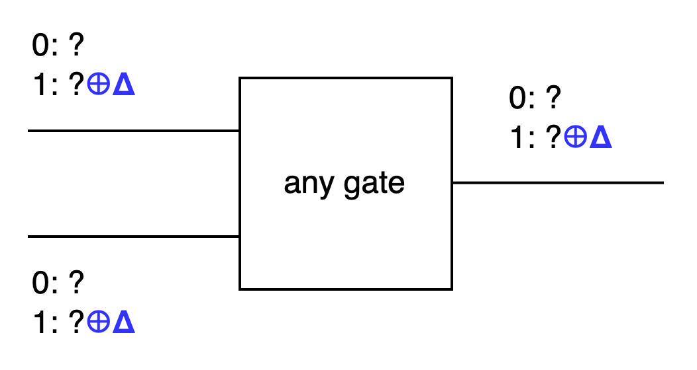
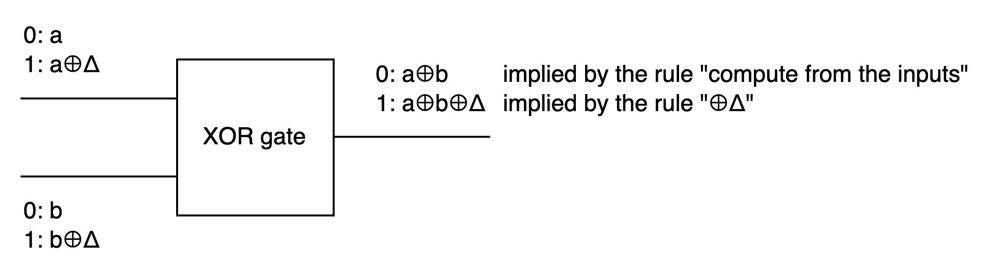

# Garbled Circuit - FreeXOR

The bottleneck in executing the Garbled Circuit protocol lies in transmitting a large number of gate ciphertexts.

FreeXOR, like GESS in Section 3.6 of this book, aims to transform garbled circuits from "table lookup" back to "computation".

In other words, if an XOR gate's output label can be directly calculated by the evaluator running a program with two input labels, then this gate doesn't need to transmit ciphertexts. Since local computation is much cheaper than sending and receiving data, this gate can be considered almost "free".

## How

FreeXOR has a rule: there's a global `Δ` randomly chosen by the generator. For every wire in the circuit, key 0 is derived from key 1 `⊕ Δ`. This rule applies to every gate, not just XOR gates.



Below, we use a and b to represent the input wires of a gate, and c to represent the output wire. (This notation is simplified compared to the book)

If wire a's key 0 is a, then wire a's key 1 would be a⊕Δ.<br>
If wire b's key 0 is b, then wire b's key 1 would be b⊕Δ.

Here, we divide all the gates in the circuit into two categories: XOR and non-XOR.

### XOR Gates

Let's first look at the key XOR gate.

The original XOR table is:
```
0 0 0
0 1 1
1 0 1
1 1 0
```
If the XOR gate is "computed" as mentioned earlier, then the output would naturally be the XOR of the inputs.

Looking at the first row, `0 XOR 0 = 0`, wire c's key 0 should be the XOR of wire a and b's respective key 0s, which is a⊕b.

Since key 1 for all gates should be derived from key 0 ⊕Δ, wire c's key 1 would be a⊕b⊕Δ.



Do these defined wire c keys (a⊕b, a⊕b⊕Δ) satisfy the computation rules in the other 3 rows?
```
0 1 1   a ⊕ (b⊕Δ) = a⊕b⊕Δ
1 0 1   (a⊕Δ) ⊕ b = a⊕b⊕Δ
1 1 0   (a⊕Δ) ⊕ (b⊕Δ) = a⊕b ⊕Δ ⊕Δ = a⊕b
```
It works perfectly!

### non-XOR Gates

Now let's look at non-XOR gates.

Since we're not computing these, we'll still honestly build the ciphertext table. Wire c's key 0 is randomly generated like in a regular garbled circuit, let's say it's c. Wire c's key 1 must comply with the ⊕Δ rule, so it would be c⊕Δ. The rest is to calculate wire c's 0 and 1 according to gate logic, replace them with either (c, c⊕Δ), and then encrypt.

### Detailed Approach

This section briefly introduces the overview of FreeXOR. For the generator's detailed approach, please refer to Figure 4.1 in the book. Like the previously introduced GRR3, the output wire's label is related to the input, so it also needs to be in topological order.

The book omits the evaluator's detailed approach. If you want to check your answers, you can look at Algorithm 2 in the [original paper](https://www.cs.toronto.edu/~vlad/papers/XOR_ICALP08.pdf).

For the detailed protocol, please see Protocol 1 in the original paper. (NOT-gates have been removed)

## Security

The original paper has a section on "Intuition for security". The main idea is: `H(a || b || i) ⊕ c` is a kind of one-time pad, and each pad value should only be used once. When the evaluator reaches a gate, they should only know one label for each of the two input wires, so the other 3 output labels that shouldn't be seen cannot be decrypted. Therefore, for the output wire, they also only know one of the two labels, which to them is just a random string, unable to deduce the original value.

TODO: Detailed security proof is in section 3.2 "Proof of Security" of the original paper.

TODO: Choi et al. point out issues with the original paper, noting that the hash here requires circular correlation robustness.

## Combo

FreeXOR can't be combined with Pinkas' GRR2, but it can be combined with GRR3.

The later-developed FlexXOR can be combined with GRR2, though XOR sometimes has a cost and is more complex.

The even later Half Gates can be compatible with FreeXOR, and can compress AND gates to only need two ciphertexts, while being relatively simple. It's a very good optimization combination.

In the next article, we'll look at Half Gates.

----

## Postscript

Vladimir Kolesnikov, the first author of FreeXOR, is one of the three authors of this book. GESS is also his work.

Two of the authors of this book are co-authors of FlexXOR.