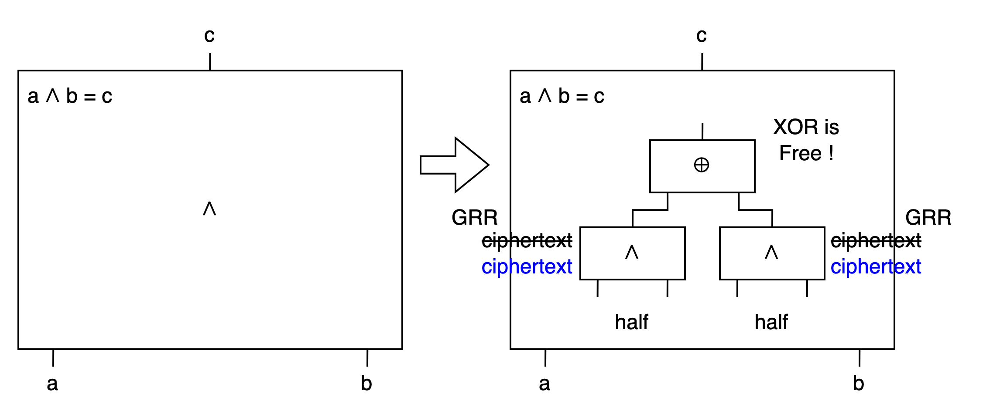
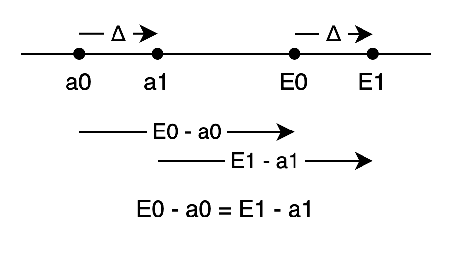

# Garbled Circuit Optimization: Half Gates

執行 Garbled Circuit protocol 的 bottleneck 在 bandwidth.

為了減少所需的 bandwidth, 有各式各樣用來減少 ciphertext 的 optimization. 彼此相容的 optimization 還能組合在一起, 發揮更大的威力.

Half Gates 就是能和 FreeXOR 組合的一種 optimization. 在保持 FreeXOR 的優勢之下, Half Gate 能把一個 AND gate 降到只需要 2 個 ciphertext! 是一個強大的組合.

Half Gates 把原來的一個 AND gate 拆成兩個 half gates, 再用 XOR 串起來. XOR 可以套 FreeXOR, 不用 ciphertext. 而兩個 half gates 又可以各自套用 GRR3 的手法讓 ciphertext 從兩個降到一個. 這樣一整個 AND gate 就可以只要兩個 ciphertext, 且其他 XOR gate 仍然是 free 的.



但什麼是 half gate ?

## Half Gate

平常兩個 input wire 的 gate 會需要 2 * 2 個 row 來表示 4 種可能的 input 組合.

那, 如果其中一個 wire 的 value 是已知的, 我們就只要處理 2 * 1 種組合就好. 這樣的 gate 我們叫它 half gate.

但是如果 gate 是在 circuit 深處, 經過複雜的計算後, 為什麼還有 wire 有已知的 input ???

這是我讀這個作法一開始時最大的疑惑(和痛苦).

所以不同於書中和原 paper 中的順序, 我想先囉唆地介紹這個 known input 的由來, 再介紹怎麼利用這個 input 來減少 ciphertexts.

## 哪裡跑出來的 known input ?

我們平常用的整數有加法和乘法. 對任意整數 a b r, 分配率都成立: `a * (b + r) = (a * b) + (a * r)` .

當我們看到普通的 `a * b`, 如果硬是要套分配律的話, 也可以弄出
```
a * b
= a * (b + r - r)
= a * (r + (b - r))
= (a * r)  +  (a * (b - r))
```
從最外面看, 會是用一個 `+` 把兩個 `*` 串起來.

而在 boolean logic 中, `∧` 是 `*`, `⊕` 是 `+` (同時也是 `-`).

所以我們有分配律 `a ∧ (b ⊕ r) = (a ∧ b) ⊕ (a ∧ r)`.

同樣在只有 `a ∧ b` 的時候也可以硬塞一個 r
```
a ∧ b
= a ∧ (b ⊕ r ⊕ r)
= a ∧ (r ⊕ (b ⊕ r))
= (a ∧ r)  ⊕  (a ∧ (b ⊕ r))
```
從最外面看, 是一個 XOR gate 把兩個 AND gate 串起來. 這個式子對任意的 a b r 都成立.

<mark>等一下我們會讓 `r` 和 `b ⊕ r` 變成 known input.</mark>

<a name="the_diagram">

</a>

## 巧妙的弄出 known input 的手法

(提醒: Half Gates 的實作會用到
[Point-and-Permute](Garbled-Circuit-Point-and-Permute-zh-TW.md)
和
[FreeXOR](Garbled-Circuit-FreeXOR-zh-TW.md)
和
[GRR3](Garbled-Circuit-Garbled-Row-Reduction-GRR3-zh-TW.md).
)

這裡的 r 是怎麼來的?

當 Generator 在處理 circuit 時, 如果遇到 `a ∧ b`, 就會用 "某種手法" 決定一個 random bit r, 套用上面的公式.

所以對於 Generator 來說, 雖然 a b 要到 evaluate 時才有確定的值, 但新的 AND gate `(a ∧ r)` 就有一個 generate 時就能知道的 input r 了.

由於 r 已經固定, 所以只要處理 2 * 1 而不是 2 * 2 種變化.

我們把 `G = (a ∧ r)` 這個 Generator 有 known input 的 AND gate 稱為 <mark>"Generator Half Gate"</mark>.

再看另一個 AND gate `E = (a ∧ (b ⊕ r))`, 所謂的 <mark>"Evaluator Half Gate"</mark>.

由於 a 和 b 都要到 evaluate 時才決定, 這樣 Generator 要怎麼利用上面的技巧呢?

這裡的設計很特別: 我們讓 Generator 透露 `b ⊕ r` 給 Evaluator. 而且是透過 point-and-permute 的 pointer bit 來做到的.

如同前面幾篇文章的介紹, Garbled Circuit 為了不洩漏更多資訊給 Evaluator, 在計算過程中只會讓 Evaluator 知道 label, 但不會知道 label 對應的 value. 這邊 wire a b 真實的 value 都是不能讓 Evaluator 知道的.

但是因為 r 只有 Generator 知道, 又是 uniformly random, 所以透露 `b ⊕ r` 給 Evaluator 也沒關係, 不會洩漏 b. (one-time pad)

可是 Generator 只知道 r. 在真正執行前就算想透露 `b ⊕ r`, 又怎麼知道跑到這個 gate 的時候 b 會是什麼 value 呢 ??

## 跟著 label 走的一封信

電影裡面常常有這種劇情: 一個人打開信紙, 有一個聲音對他說:

```
親愛的 John:

當你讀到這封信的時候, 事情應該已經 blah blah ...

所以我 blah blah ...
```

這邊也很類似.

Generator 在 wire b 的兩個 label 上面各寫了一封信. 在 label 0 上寫著:

```
親愛的 Evaluator:

當你拿到這個 label 的時候, b 應該已經確定了吧.

雖然我不能和你說這個世界的 b 和 r 的 value,
但我把 b ⊕ r 告訴你, 那就是 ${套入實際的值} .

希望你可以好好利用它.
```

label 1 也寫著類似的內容, 只是 `b ⊕ r` 的值不一樣.

最直覺的實作方法, 就是在兩個 label 後面各多加一個 `b ⊕ r` 的 bit.

但是 Half Gates 的作者更省. 這兩封信都只各花了... 0 個 bit.

## 0 個 bit ?

或許可以這樣看:

在 Point-and-Permute 中, Generator 丟了銅板個決定 bit p, 在 0 1 兩個 key 後面各貼了 bit p 和 !p.

既然 p 已經是 random 的, 丟銅板又很花力氣, 那我們是不是可以直接 <mark> let r = p </mark> 就好了呢?

如果 p = r = 0, 那 wire b 的兩個 label 會像是:
```
b     pointer bit  b ⊕ r
key0  0            0
key1  1            1
```
如果 p = r = 1, 那 wire b 的兩個 label 會像是:
```
b     pointer bit  b ⊕ r
key0  1            1
key1  0            0
```
我們可以發現, 在這兩個 case 中, `b ⊕ r` 都剛好和對應的 pointer bits 的值一樣! 所以不用額外加個重複的 bit, Evaluator 拿到 label 時, <mark>看最後面 pointer bit 的值就剛好是 `b ⊕ r` 的值</mark>.

也由於 Evaluator 不知道手上的 label 代表 0 還是 1, 所以看到 pointer bit 也不知道是 p 還是 !p, 也就是不知道是 r 還是 !r . 所以沒有洩密.

講到這裡, 我們讓 Generator half gate `a ∧ r` 有一個 Generator 在 genarate 時就知道的 input `r` .

我們也讓 Evaluator half gate `a ∧ (b ⊕ r)` 有一個 Evaluator 在 evaluate 時會知道的 input `b ⊕ r` .

我們看怎麼利用這個特性來幫助我們生成這兩個 half gate 的 ciphertexts.

## Generator Half Gate 的 ciphertexts

當我們碰到一個 AND gate `a ∧ b = c` 時, 我們希望 Evaluator 可以拿著兩個 input label 算出 output label.

經過轉換, 我們還是一樣希望 Evaluator 可以拿著兩個 input label a b 算出 output label c, 只是現在要經過中間的 3 個 gates.

以下我採用和書中不同的 wire 名稱. 書中的 a b c 會在講解時指向不同的 wire. 這裡我參考[原 paper](https://eprint.iacr.org/2014/756), 讓 Generator Half Gate 的 output wire 叫 wire G, Evaluator Half Gate 的 output wire 叫 wire E, 讓 a b c 指向固定的 wire. (請參考[前面的圖](#the_diagram))

以下用 a0 代表 wire a 的 value 是 0 的 label. a1 代表 wire a 的 value 是 1 的 label. 依此類推.

先看 Generator Half Gate `G = a ∧ r`

Generator 已經決定 r 了, 所以<br>
如果 r = 0, 則 G 一定是 0. 準備 plaintexts G0 G0.<br>
如果 r = 1, 則 G 到 evaluation 時看 label a 決定. a0 對到 G0, a1 對到 G1. 準備 plaintexts G0 G1.

所以 Generator 準備這樣的 table:
```
if (r == 0) {
    Enc(a0, G0)
    Enc(a1, G0)
} else {
    Enc(a0, G0)
    Enc(a1, G1)
}
```
再用 label a 的 pointer bits permute 過.

Evaluator 到時候拿著 label a, 就可以解開 label a pointer bit 指到的那個 row, 得到 wire G 的 label.

## Evaluator Half Gate 的 ciphertexts

再看 Evaluator Half Gate.

這邊的 Evaluator code 不是單純的查表, 而是需要跑一段 code.

此時 Evaluator 手上有 wire a 的 label (可能是 a0 或 a1)<br>
手上有 wire b 的 label (可能是 b0 或 b1)<br>
有 b ⊕ r 的 value (來自 wire b label 的 pointer bit)<br>
我們要讓 Evaluator 拿到正確的 E = a ∧ (b ⊕ r) 的 label, 且只能拿到 E0 E1 其中一個.

我們的 ciphertext 的形式會是
```
Enc(      one label of wire b, plaintext1)
Enc(the other label of wire b, plaintext2)
```
先用不同的 encryption key 確保 evaluator 只能解開剛好一個. 用 b ⊕ r 判斷要解哪一個, 再看要怎麼從解出的 plaintext1 或 plaintext2 得到對的 E0 或 E1.

### case b ⊕ r = 0 (for E = a ∧ (b ⊕ r))

當 b ⊕ r = 0 時, 整個 AND 不用看 a 就直接是 0. 我們讓 plaintext1 = E0 就好.

但是要用 b0 還是 b1 來 encrypt / decrypt 呢?

如果 evaluate 時 b ⊕ r = 0, 那必定 b == r .<br>
在 b ⊕ r = 0 的前提下, r 是 0 則 Evaluator 會拿到 b0.<br>
在 b ⊕ r = 0 的前提下, r 是 1 則 Evaluator 會拿到 b1.

所以 Generator 準備這樣的第一筆 ciphertext (for b ⊕ r = 0)
```
Enc(r == 0 ? b0 : b1,   E0)
```
到 evaluate 時若 b ⊕ r ＝ 0, 就拿 wire b 的 label 來 decrypt 這第一筆 ciphertext, 就能得得出 E0.

### case b ⊕ r = 1 (for E = a ∧ (b ⊕ r))

當 b ⊕ r = 1 時, E 的 label 就還要看 a.

但是在 generate 時還不知道 a, 所以我們的 plaintext2 注定是個半成品, 到 evaluate 時還要和 a 的 label 作用才能得到對的 E0 或 E1.

我們希望能有
```
some_function(a0, plaintext2) = E0
some_function(a1, plaintext2) = E1
```
這個機制要怎麼設計呢?

這裡會用到 FreeXOR 的性質.

FreeXOR 中, 每個 wire 的 label 0 加上 Δ 會得到 label 1.<br>
所以 a0 ⊕ Δ = a1, E0 ⊕ Δ = E1.

所以如果我們在 a0 上面加上某個 diff 如果能變成 E0, 那 a1 加上同樣的 diff 也會變成 E1 !



想像成整數就是
```
a0 + (E0 - a0) = E0
a1 + (E0 - a0) = E1
```
寫成 boolean 就是
```
a0 ⊕ (E0 ⊕ a0) = E0
a1 ⊕ (E0 ⊕ a0) = E1
```
我們就讓 `plaintext2 = E0 ⊕ a0` 存著這個 diff.<br>
然後用和 case b ⊕ r = 0 相反的 "the other label of b" 加密.<br>
所以 Generator 準備這樣的第二筆 ciphertext (for b ⊕ r = 1)
```
Enc(r == 0 ? b1 : b0,   E0 ⊕ a0)
```
等 Evaluator 解出 diff 之後, 把 diff 加在他手上的 wire a 的 label, 就能得到 wire E 的 label 了.

到此, Evaluator Half Gate 的兩筆 ciphertext 都準備完成了. 可以依序輸出, 不要 permute. 每個 case 各用一個 ciphertext.

### Evaluator Half Gate 如何求值?

如果對 b ⊕ r 的兩個 case 都充分理解的話, Evaluator 的 code 應該會像這樣:
```
function compuateEvaluatorGate(eCiphertext1, eCiphertext2, aLabel, bLabel) {
    let b_XOR_r = pointerBitOf(bLabel);
    if (b_XOR_r == 0) {
        return decrypt(bLabel, eCiphertext1);
    } else {
        let diff = decrypt(bLabel, eCiphtertext2);
        return xor(aLabel, diff);
    }
}
```

## 收成

我們幫 Generator Half Gate 做出了兩個 ciphertexts:
```
Enc(a0, G0)
Enc(a1, r == 0 ? G0 : G1)
```

也幫 Evaluator Half Gate 做出了兩個 ciphertexts:
```
Enc(r == 0 ? b0 : b1,   E0)
Enc(r == 0 ? b1 : b0,   E0 ⊕ a0)
```

我們有 4 個 ciphertexts. 但是透過選擇 G0 和 E0, 我們可以讓這兩組 ciphertext 中的第一筆都變成 0 . 這樣就傳後面兩筆就好了. (GRR3 的手法)

最後的 XOR gate 則是用算的. FreeXOR 不需要 ciphertext.

所以整個 AND gate `c = a ∧ b` 總共只需要兩個 ciphertext. 而且和 FreeXOR 相容.

收工!

----

後記:

我覺得在書中 Evaluator Gate 隱藏了一些細節 (像 `b ⊕ r` 沒有 wire 也就沒有 label). 這些細節可以透過[原 paper](https://eprint.iacr.org/2014/756) 的 Fig 1 和 Fig 2 補上.

本書作者 Mike Rosulek 2015 時在 Simons Institude 給過[一場演講](https://www.youtube.com/watch?v=FTxh908u9y8), 非常好看! <br>
在 [47:35](https://www.youtube.com/watch?v=FTxh908u9y8#t=47m35s) 有人提問:<br>
"do you have any idea roughly how many gates you will actually be in the position where you know one of your inputs / so obviously the input gates you know what your inputs are / but after that how far can you propagate it normally"<br>
這個人和一開始的我有著一樣的問題 :-)

<script>
function resizeImg(i) { i.style.width = (i.naturalWidth * 0.25) + "px"; }
function resizeAllImg() { document.querySelectorAll(".to-be-resized").forEach(resizeImg); }
window.addEventListener("load", resizeAllImg);
</script>