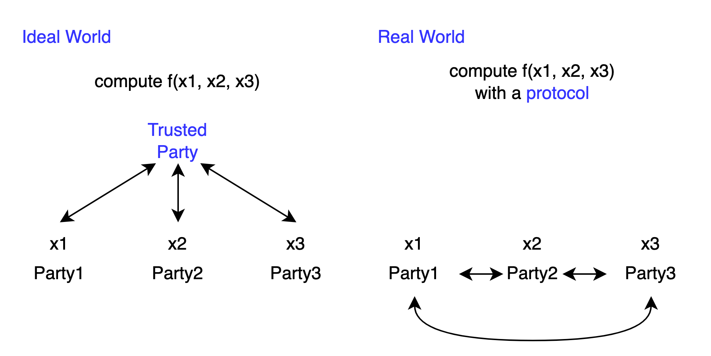

# Introduction

The following is a summary of my reading of the book [A Pragmatic Introduction to Secure Multi-Party Computation](https://securecomputation.org/).

The problem MPC aims to address is: If a function requires inputs from multiple people to be calculated, how do we design a computation method (protocol) that doesn't leak more information about the inputs than what is revealed by the function output?

## Before there were protocols

First, it's important to note that the function output does leak information.

For example, if another person and I calculate `f(x, y) = x + y` together, and I know the answer s and my input x, I can immediately obtain the other person's y by calculating s - x.

For instance, if another person and I calculate `f(x, y) = (x + y) % 2` together, and I know the answer and my x, although I can't explicitly know which number the other person's y is, I already know whether y is odd or even, eliminating half of the possibilities.

As mentioned earlier, besides the information leaked by the answer itself, our designed protocol should not leak any additional information.

## Ideal v.s. Real

In an ideal world, we could find a trusted party who won't leak secrets. Everyone would secretly give their input to the trusted party, who would then give the calculated result of f to everyone.

However, in the real world we live in, the cost of finding a trusted party is very high. So we want to establish protocols that allow parties to achieve the effect of calculating f as in the ideal world, without relying on a trusted party.

## Generic v.s. Custom

The book introduces some generic protocols that can handle various functions using the same approach. Additionally, for some f, custom, more efficient protocols can be designed based on their specific characteristics.

## Adversary Models: "semi-honest" v.s. "malicious"

Furthermore, when designing protocols, we need to pay attention to the so-called "adversary model". In other words: How "bad" are the people participating in these protocols?

The protocols introduced in the first half of the book are designed based on the "semi-honest" (also known as "honest-but-curious") model. This means that the participants in the protocol will follow the protocol design and not deliberately deviate from it, but they will try to infer others' inputs from the messages received. We need to calculate f under this condition while preventing information leakage. (The "malicious" model is where participants deliberately deviate)

At first, I thought: Isn't the semi-honest model too weak? Why would bad people in reality obediently follow the steps? What's the significance of this model?

Later, my thoughts changed.

First, such scenarios may indeed exist in reality. For example, multiple hospitals want to find a method to solve a disease but cannot leak patient data to each other. We assume that the person responsible for executing at each hospital sincerely wants to solve the disease, so they will calculate according to the protocol. However, if there are bad people in the hospital, although they don't have write permission to sabotage the protocol, they might have read permission to eavesdrop or peek at data transmitted from other hospitals (such as looking at screens). The protocol we design needs to ensure that even in such situations, no secrets will be leaked.

Second, there are methods to strengthen a protocol that is secure under the semi-honest model to be secure under the malicious model as well. This requires adding anti-cheating measures, though it will also reduce some efficiency. (I haven't read the detailed approach yet)

Below, I will introduce some protocols under the semi-honest model, as well as the primitives required for these protocols.
