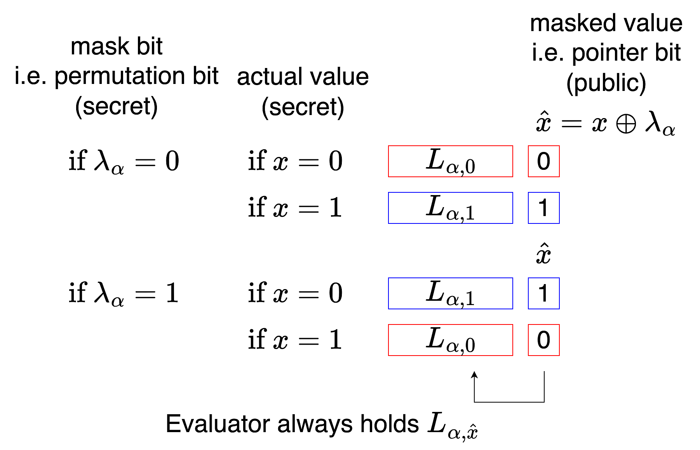
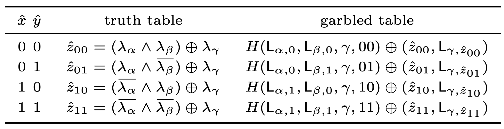
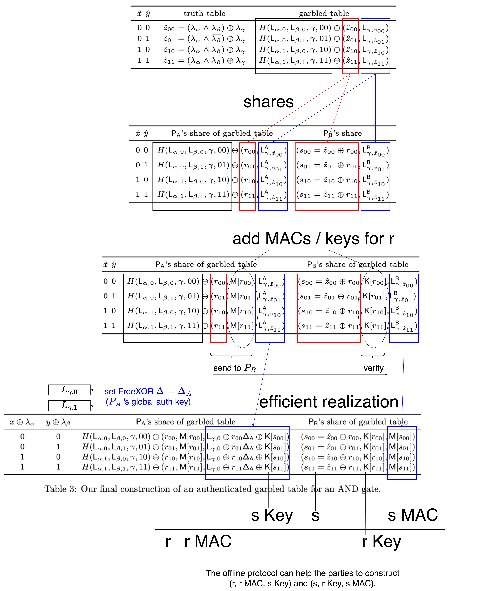

# Authenticated Garbling

In the previous garbled circuit approach, to prevent generator cheating, we used cut-and-choose (circuit level / gate level). However, this overhead is relatively high.

In Authenticated Garbling, the generator only gives one circuit to the evaluator. The correctness is ensured through authenticated shares.


## Authentication

The sender has several boolean variables: b1 b2 b3.

We want the receiver to trust the sender when the sender tells the receiver the values of b1 b2 b3.

The approach is: an imaginary trusted party (offline protocol) first sends a global key DELTA to the receiver.

For each variable, the trusted party sends individual keys to the receiver, and sends values and corresponding MACs to the sender.

Here, both keys and MACs are k-bit binary strings.

```
Receiver global key: DELTA

variable   key for receiver   MAC for sender

b1         K_b1               K_b1 ⊕ b1*DELTA
b2         K_b2               K_b2 ⊕ b2*DELTA
b3         K_b3               K_b3 ⊕ b3*DELTA

```
That is to say:<br>
If the sender wants to tell the receiver "b1 = 0", they should attach MAC K_b1.<br>
If the sender wants to tell the receiver "b1 = 1", they should attach MAC K_b1 ⊕ DELTA.

If the sender wants to cheat, it means they need to guess a k-bit binary string correctly. This is very difficult. (This is a special case of BDOZ)

In other words, by having the sender send the value and MAC, and the receiver verify with the key, we can ensure the correctness of the value.

## Mask Bit

(Here we use the notation from the original [paper](https://eprint.iacr.org/2017/030))

In garbled circuit, for each wire $\alpha$, we first generate two labels $L_{\alpha,0}$ and $L_{\alpha,1}$.

Then flip a coin to decide a "mask bit" $\lambda_\alpha$. (or "permutation bit")<br>
When mask bit = 0, the labels remain normal.<br>
When mask bit = 1, the labels are reversed.

Calculate masked bit $\hat{x} = x \oplus \lambda_\alpha$. Since $\lambda_\alpha$ is random, it masks $x$, so revealing $\hat{x}$ doesn't leak $x$. Also because $\hat{x}$ is random, it can be used as the point-and-permute pointer bit to attach to the label.

We want:

If $\lambda_\alpha = 0$:<br>
If $x = 0$, then $\hat{x} = 0$. Evaluator will get $L_{\alpha,0}$ and pointer bit 0.<br>
If $x = 1$, then $\hat{x} = 1$. Evaluator will get $L_{\alpha,1}$ and pointer bit 1.

If $\lambda_\alpha = 1$:<br>
If $x = 0$, then $\hat{x} = 1$. Evaluator will get $L_{\alpha,1}$ and pointer bit 1.<br>
If $x = 1$, then $\hat{x} = 0$. Evaluator will get $L_{\alpha,0}$ and pointer bit 0.

When the evaluator receives the label, they can see the public pointer bit $\hat{x}$, and knows they have $L_{\alpha,\hat{x}}$. But as long as they don't know the mask bit $\lambda_\alpha$, they still cannot know $x$.



## Garbled Table

Next, we create the garbled table.

Since $\hat{x} = x \oplus \lambda_\alpha$, therefore $x = \hat{x} \oplus \lambda_\alpha$.<br>
Since $\hat{y} = y \oplus \lambda_\alpha$, therefore $y = \hat{y} \oplus \lambda_\alpha$.

Taking AND gate $x \land y = z$ as an example.

Rows are directly ordered by pointer bits $\hat{x}$ and $\hat{y}$.

When $\hat{x} = 0, \hat{y} = 0$, then

$$
\begin{split}
\hat{z_{00}} &= z \oplus \lambda_\gamma \\
&= (x \land y) \oplus \lambda_\gamma \\
&= ((\hat{x} \oplus \lambda_\alpha) \land (\hat{y} \oplus \lambda_\beta)) \oplus \lambda_\gamma \\
&= ((0 \oplus \lambda_\alpha) \land (0 \oplus \lambda_\beta)) \oplus \lambda_\gamma \\
&= (\lambda_\alpha \land \lambda_\beta) \oplus \lambda_\gamma
\end{split}
$$

At this point, the evaluator will hold $L_{\alpha,\hat{x}}$ which is $L_{\alpha,0}$.<br>
They will also hold $L_{\beta,\hat{y}}$ which is $L_{\beta,0}$.<br>
We want the evaluator to be able to decrypt $L_{\gamma,\hat{z}}$ and pointer bit $\hat{z}$.<br>
So we use $L_{\alpha,0}$ and $L_{\beta,0}$ to encrypt $L_{\gamma,\hat{z}}$ and $\hat{z}$. (XOR Hash($L_{\alpha,0}$, $L_{\beta,0}$) onto it)

The remaining three rows are similar. We can get the table from page 5 of the original paper:<br>


## Selective-Failure Attack

In previous chapters, we saw selective-failure attack: the generator corrupts part of the circuit, causing problems for the evaluator with specific inputs. If the evaluator experiences and reports a problem, it leaks the evaluator's input.

In the above example, if the generator corrupts the first row and the evaluator reports a problem, then the generator will know that $\hat{x} = 0$ and $\hat{y} = 0$.

Since the generator also knows the mask bits $\lambda_\alpha$ and $\lambda_\beta$, they can deduce the true values of x and y for these two wires. Thus leaking the evaluator's input.

Can we modify the above steps so that even if the evaluator reports a problem, it won't leak information?

We can prevent the generator from seeing $\lambda_\alpha$ and $\lambda_\beta$.

We split $\lambda_\alpha$ and $\lambda_\beta$ into shares held jointly by the two parties.

However, if the generator holds the entire garbled table, they can still potentially derive the mask bits from it (TODO). So we also need to split the table into shares.

How should we split it for efficient computation?

## Efficient Realization

As mentioned before, when users see pointer bit $\hat{x}$, they get $L_{\alpha,\hat{x}}$.<br>
If combined with FreeXOR, then when $\hat{x} = 0$ they get $L_{\alpha,0}$, and when $\hat{x} = 1$ they need to add FreeXOR's global $\Delta$.

Similarly, if we continue looking at the first row of $x \land y = z$, then

$$L_{\gamma,\hat{z}_{00}} = L_{\gamma,0} \oplus \hat{z}_{00} \Delta$$

Here we use a trick: Let FreeXOR global $\Delta = \Delta_A$, where $\Delta_A$ is generator $P_A$'s global authentication key.

$$= L_{\gamma,0} \oplus \hat{z}_{00} \Delta_A$$

To prevent the generator from knowing $\hat{z}$, we split it into $\hat{z} = r + s$.

$$
\begin{split}
&= L_{\gamma,0} \oplus (r_{00} \oplus s_{00}) \Delta_A \\
&= L_{\gamma,0} \oplus r_{00}\Delta_A \oplus s_{00}\Delta_A
\end{split}
$$

Seeing $\oplus s_{00}\Delta_A$, we forcefully add $K_{s00}$ to make it into MAC $M_{s00}$.

$$
\begin{split}
&= L_{\gamma,0} \oplus r_{00}\Delta_A \oplus (K[s_{00}] \oplus K[s_{00}]) \oplus s_{00}\Delta_A \\
&= (L_{\gamma,0} \oplus r_{00}\Delta_A \oplus K[s_{00}]) \oplus (K[s_{00}] \oplus s_{00}\Delta_A) \\
&= (L_{\gamma,0} \oplus r_{00}\Delta_A \oplus K[s_{00}]) \oplus (M[s_{00}])
\end{split}
$$

The left part goes to the generator, the right part goes to the evaluator.<br>
When the generator sends the left part to the evaluator, the evaluator can reconstruct $L_{\gamma,\hat{z}_{00}}$.

With the help of the offline protocol (functionality $F_{Pre}$), parties can obtain these shares / keys / MACs, and then compute the "authenticated" garbled table.



## Postscript

I only understand part of this protocol.

You can refer to the original author Xiao Wang's [presentation](https://www.youtube.com/watch?v=8zCqki-ilZM).


<script>
MathJax = {
  tex: {
    inlineMath: [['$', '$'], ['\\(', '\\)']]
  }
};
</script>
<script type="text/javascript" id="MathJax-script" async
  src="https://cdn.jsdelivr.net/npm/mathjax@3/es5/tex-mml-chtml.js">
</script>
