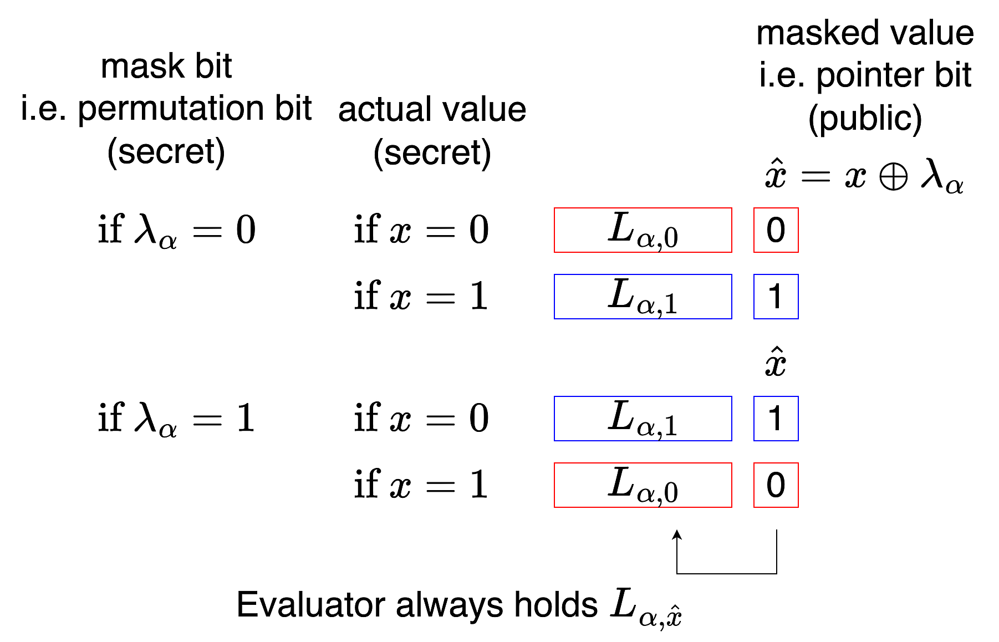
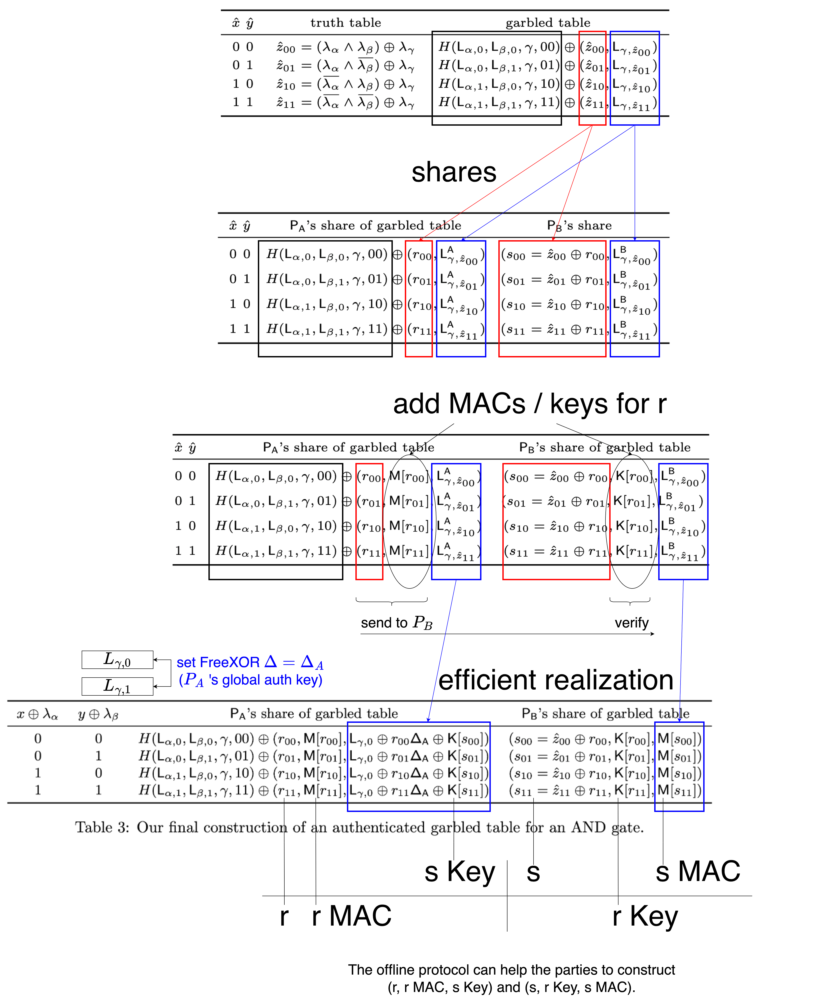

# Authenticated Garbling

在前面 garbled circuit 的作法中, 為了防止 generator 作弊, 所以用了 cut-and-choose (circuit level / gate level). 但這樣的 overhead 比較高.

在 Authenticated Garbling 中, generator 只交給 evaluator 一份 circuit. 藉由 authenticated shares 來確保其正確性.


## Authentication

Sender 手上有幾個 boolean variables: b1 b2 b3.

我們希望 sender 告訴 receiver b1 b2 b3 的值的時候, receiver 願意相信 sender 的說法.

作法是: trusted party (offline protocol) 先發給 receiver 一個 global key DELTA.

對於每個 variable, trusted party 再發單獨的 key 給 receiver, 發 value 和對應的 MAC 給 sender.

此處 key 和 MAC 都是 k-bit binary strings.

```
Receiver global key: DELTA

variable   key for receiver   MAC for sender

b1         K_b1               K_b1 ⊕ b1*DELTA
b2         K_b2               K_b2 ⊕ b2*DELTA
b3         K_b3               K_b3 ⊕ b3*DELTA

```
也就是說:<br>
如果 sender 想對 receiver 說 "b1 = 0", 則應該附上 MAC K_b1.<br>
如果 sender 想對 receiver 說 "b1 = 1", 則應該附上 MAC K_b1 ⊕ DELTA.

Sender 如果想造假, 等於要能猜中一個 k-bit binary string. 難度很高. (這是 BDOZ 的 special case)

也就是說, 讓 sender 送出 value 和 MAC, receiver 用 key 驗證, 就可以確保 value 的正確性.

## Mask Bit

(此處用原 [paper](https://eprint.iacr.org/2017/030) 的 notation)

在 garbled circuit 中, 對於每個 wire $\alpha$, 我們先 generate 出兩個 label $L_{\alpha,0}$ 和 $L_{\alpha,1}$.

再丟銅板決定一個 "mask bit" $\lambda_\alpha$. (or "permutation bit")<br>
當 mask bit = 0 時, label 和平常一樣.<br>
當 mask bit = 1 時, label 會反過來.

計算 masked bit $\hat{x} = x \oplus \lambda_\alpha$. 因為 $\lambda_\alpha$ 是 random 的, 把 $x$ 遮蓋掉了, 所以公開 $\hat{x}$ 也不會洩漏 $x$. 也因為 $\hat{x}$ 是 random, 可以當 point-and-permute 的 pointer bit 來 attach 在 label 上.

我們希望:

如果 $\lambda_\alpha = 0$:<br>
如果 $x = 0$, 則 $\hat{x} = 0$. Evaluator 會拿到 $L_{\alpha,0}$ 和 pointer bit 0.<br>
如果 $x = 1$, 則 $\hat{x} = 1$. Evaluator 會拿到 $L_{\alpha,1}$ 和 pointer bit 1.

如果 $\lambda_\alpha = 1$:<br>
如果 $x = 0$, 則 $\hat{x} = 1$. Evaluator 會拿到 $L_{\alpha,1}$ 和 pointer bit 1.<br>
如果 $x = 1$, 則 $\hat{x} = 0$. Evaluator 會拿到 $L_{\alpha,0}$ 和 pointer bit 0.

Evaluator 拿到 label 時可以看到 public pointer bit $\hat{x}$, 也知道手上拿的是 $L_{\alpha,\hat{x}}$. 但只要不知道 mask bit $\lambda_\alpha$, 就仍然無法知道 $x$.



## Garbled Table

再來我們製作 garbled table.

因為 $\hat{x} = x \oplus \lambda_\alpha$, 所以 $x = \hat{x} \oplus \lambda_\alpha$.<br>
因為 $\hat{y} = y \oplus \lambda_\alpha$, 所以 $y = \hat{y} \oplus \lambda_\alpha$.

以 AND gate $x \land y = z$ 為例子.

Rows 直接用 pointer bits $\hat{x}$ 和 $\hat{y}$ 的順序來看.

當 $\hat{x} = 0, \hat{y} = 0$, 則
$$
\begin{split}
\hat{z_{00}} &= z \oplus \lambda_\gamma \\
&= (x \land y) \oplus \lambda_\gamma \\
&= ((\hat{x} \oplus \lambda_\alpha) \land (\hat{y} \oplus \lambda_\beta)) \oplus \lambda_\gamma \\
&= ((0 \oplus \lambda_\alpha) \land (0 \oplus \lambda_\beta)) \oplus \lambda_\gamma \\
&= (\lambda_\alpha \land \lambda_\beta) \oplus \lambda_\gamma
\end{split}
$$
Evaluator 到這邊會持有 $L_{\alpha,\hat{x}}$ 也就是 $L_{\alpha,0}$.<br>
也會持有 $L_{\beta,\hat{y}}$ 也就是 $L_{\beta,0}$.<br>
我們希望 evaluator 可以 decrypt 出 $L_{\gamma,\hat{z}}$ 和 pointer bit $\hat{z}$.<br>
所以用 $L_{\alpha,0}$ 和 $L_{\beta,0}$ 來 encrypt $L_{\gamma,\hat{z}}$ 和 $\hat{z}$. (把 Hash($L_{\alpha,0}$, $L_{\beta,0}$) XOR 上去)

剩下三個 row 類似. 我們可以得到原 paper page 5 中的 table:<br>


## Selective-Failure Attack

在前面的章節中, 我們看過 selective-failure attack: generator 破壞一部分的 circuit, 讓 evaluator 在特定的 input 會發生問題. 如果 evaluator 發生並回報了問題, 則洩漏了 evaluator 的 input.

在上面的例子中, 如果 generator 破壞了第一個 row, 且 evaluator 回報了問題的話, 則 generator 會知道 $\hat{x} = 0$ 且 $\hat{y} = 0$.

因為 generator 也知道 mask bits $\lambda_\alpha$ 和 $\lambda_\beta$, 所以可以推導出這兩個 wire 真正的 x 和 y 的 value. 因此洩漏了 evaluator 的 input.

我們有沒有辦法修改上面的步驟, 使得 evaluator 就算回報問題, 也不會洩密呢?

我們可以讓 generator 看不到 $\lambda_\alpha$ 和 $\lambda_\beta$.

我們把 $\lambda_\alpha$ 和 $\lambda_\beta$ 拆成兩個 party 共同持有的 shares.

但是如果 generator 持有整份的 garbled table 的話, 仍然有機會從中推導出 mask bits (TODO). 所以也要把 table 拆成 shares.

怎麼拆才會好計算呢?

## Efficient Realization

前面提到, 當使用者看到 pointer bit $\hat{x}$ 時會拿到 $L_{\alpha,\hat{x}}$.<br>
如果搭配上 FreeXOR, 則 $\hat{x} = 0$ 時就是拿到 $L_{\alpha,0}$, 而 $\hat{x} = 1$ 時要加上 FreeXOR 的 global $\Delta$.

同理, 如果繼續看 $x \land y = z$ 的第一個 row, 則

$$L_{\gamma,\hat{z}_{00}} = L_{\gamma,0} \oplus \hat{z}_{00} \Delta$$

接著這邊用了一個技巧: Let FreeXOR global $\Delta = \Delta_A$, 此處 $\Delta_A$ 是 generator $P_A$ 的 global authentication key.

$$= L_{\gamma,0} \oplus \hat{z}_{00} \Delta_A$$

為了不讓 generator 知道 $\hat{z}$, 把它拆開成 $\hat{z} = r + s$.

$$
\begin{split}
&= L_{\gamma,0} \oplus (r_{00} \oplus s_{00}) \Delta_A \\
&= L_{\gamma,0} \oplus r_{00}\Delta_A \oplus s_{00}\Delta_A
\end{split}
$$

看到 $\oplus s_{00}\Delta_A$, 再硬湊 $K_{s00}$ 進來就變成 MAC $M_{s00}$.

$$
\begin{split}
&= L_{\gamma,0} \oplus r_{00}\Delta_A \oplus (K[s_{00}] \oplus K[s_{00}]) \oplus s_{00}\Delta_A \\
&= (L_{\gamma,0} \oplus r_{00}\Delta_A \oplus K[s_{00}]) \oplus (K[s_{00}] \oplus s_{00}\Delta_A) \\
&= (L_{\gamma,0} \oplus r_{00}\Delta_A \oplus K[s_{00}]) \oplus (M[s_{00}])
\end{split}
$$
左邊給 generator, 右邊給 evaluator.<br>
當 generator 把左邊送給 evaluator 時, evaluator 就可以還原出 $L_{\gamma,\hat{z}_{00}}$.

在 offline protocol (functionality $F_{Pre}$) 的幫助下, parties 可以得到這些 shares / keys / MACs, 進而算出 "authenticated" garbled table.



## Postscript

我只理解了這個 protocol 的一部分.

可以參考原作者 Xiao Wang 的[演講](https://www.youtube.com/watch?v=8zCqki-ilZM).


<script>
MathJax = {
  tex: {
    inlineMath: [['$', '$'], ['\\(', '\\)']]
  }
};
</script>
<script type="text/javascript" id="MathJax-script" async
  src="https://cdn.jsdelivr.net/npm/mathjax@3/es5/tex-mml-chtml.js">
</script>