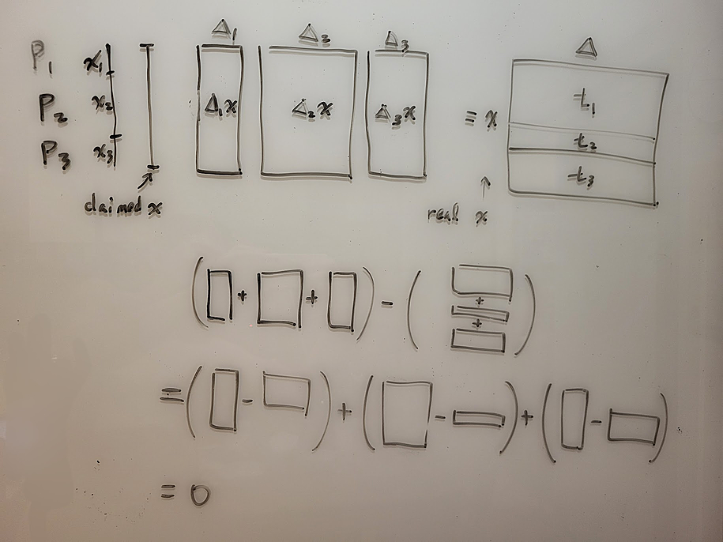

# Malicious Secret Sharing - Authenticated Secret Sharing

## BDOZ

In the semi-honest case, each party holds shares of certain variables.

For example, P1 P2 P3 hold the following additive shares:
```
var10  6
P1     2
P2     3
P3     1
```
When we need to reconstruct "var10 = 6", each party just needs to reveal their share and add them together.

However, in the malicious setting, how does P2 know that when P1 says "my share of var10 is 2", P1's share is really 2?

In BDOZ, besides splitting variables into shares, each variable is also equipped with pairwise keys and MACs between parties. (Initially obtained from the offline protocol, will be derived in the comptation steps)

When P1 needs to tell P2 "my share of var10 is 2", P1 must also include the P1-to-P2 MAC for var10. When P2 receives it, P2 will verify using the P1-to-P2 key for var10. If P2 calculates `MAC(2, var10-key-P1-to-P2) = var10-MAC-P1-to-P2` and the equation holds, then P2 is willing to believe P1 is not cheating.

```
var10  6   For sending                             For verifying
P1     2   var10-MAC-P1-to-P2 var10-MAC-P1-to-P3   var10-key-P2-to-P1 var10-key-P3-to-P1
P2     3   var10-MAC-P2-to-P1 var10-MAC-P2-to-P3   var10-key-P1-to-P2 var10-key-P3-to-P2
P3     1   var10-MAC-P3-to-P1 var10-MAC-P3-to-P2   var10-key-P1-to-P3 var10-key-P2-to-P3
```
So when we have n parties, for each variable, we need O(n^2) keys and MACs to ensure correctness.

These keys/MACs are not only valid for shares of a single value but must also be updated along with computations.<br>
For example, if F(x, y) = ((x * y) + x) * y, calculating f(6, 4) would look something like this:
```
let var10 = 6  // only known by P1 (with keys / MACs)
let var20 = 4  // only known by P2 (with keys / MACs)
let var30 = var10 * var20  // secret value (with new keys / MACs)
let var40 = var30 + var10  // secret value (with new keys / MACs)
let var50 = var40 * var20  // open and verify
```
If an honest party calculates the keys for var30 var40 var50 according to the protocol, then the keys at each step allow them to resist messages from dishonest parties.

## Offline / Online

Like the Beaver triple introduced earlier, BDOZ is divided into offline and online phases.

P1 P2 P3 first use the offline phase protocol to generate many "singles" and "triples". This process is independent of both the online input and the function to be computed online.

In the online phase, first take 2 sets of singles and turn them into input values (var10 = 6, var20 = 4). Use triples during multiplication. Calculate correct keys/MACs at each step. Finally, open the output variable var50 and check correctness.

## SPDZ

In BDOZ, n parties verify each other pairwise, requiring an additional O(n^2) numbers to be stored.

SPDZ changes this to all parties verifying together. Each variable only needs one additional number per party, requiring O(n) numbers in total.

Finally opening a variable requires three steps: open shares / commit to diffs / open diffs. Here it's very difficult for dishonest parties to get fake values past verification. (They would need to guess the diff in honest parties' hands)

## A SPDZ Example

Below we use a field of mod 7 as an example.

In SPDZ, there is a global delta, with each party holding a share.<br>
Each party only knows their own share but doesn't know what delta is.<br>
Suppose delta is 6.<br>
Suppose P1 P2 P3 each hold d1 = 2, d2 = 3, d3 = 1.

In the shares of each variable x, each party additionally holds a share of t = delta * x.<br>
Each party only knows their own share but doesn't know what x and t are.

Suppose x is 2. Then t = delta * x = 6 * 2 = 12 = 5 mod 7.<br>
Suppose P1 P2 P3 each hold x1 = 5, x2 = 1, x3 = 3 and t1 = 3, t2 = 5, t3 = 4.

Now let's try to reconstruct x.

Each party first publishes their shares of x: x1 = 5, x2 = 1, x3 = 3.

Each party can reconstruct x = (5 + 1 + 3) mod 7 = 2 mod 7.

But we don't know if anyone cheated.

So next P1 needs to publish a commitment to d1 * x - t1 in their possession.<br>
So next P2 needs to publish a commitment to d2 * x - t2 in their possession.<br>
So next P3 needs to publish a commitment to d3 * x - t3 in their possession.

Let's observe both sides of the subtraction above. The left side adds up to (d1+d2+d3) * x = delta * x, the right side adds up to t which is also delta * x. If no one cheated, these three diffs should add up to 0.

Next, the three parties need to open these three numbers.
```
d1 * x - t1 = 2 * 2 - 3 = 1
d2 * x - t2 = 3 * 2 - 5 = 1
d3 * x - t3 = 1 * 2 - 4 = -2
```
Indeed they add up to 0.

These three numbers won't leak d1 d2 d3, nor will they leak t1 t2 t3. They also won't leak delta.

Committing before opening prevents the last person from seeing previous numbers and making it sum to 0.

If P2 P3 collude and try to deceive P1 that x is 3, but P2 P3 don't know what d1 t1 are, so it's very difficult to cancel out the value of 3 * d1 - t1. Thus they can't deceive P1.

We can also think of it this way: To protect the x1 x2 x3 shares of x from being altered, a trusted party created delta and delta * x. The trusted party split delta * x in two ways: one splits x, one splits the entire delta * x. These two methods should reconstruct to the same value. And the method to check if they're the same is not to fully reconstruct both directions and compare (as this would leak information), but to see if the total diff is 0.



Also, if the opening process only sends messages to a single party (say P1), then only P1 will know the actual value while other parties remain unaware.

## Computation

Below we continue using field mod 7.

delta = 6 = d1 + d2 + d3 = 2 + 3 + 1

If P1 P2 P3 have [2].
```
     x   delta * x
     2   6 * 2
P1   5   3
P2   1   5
P3   3   4
```

We want to be able to perform some operations while maintaining verifiability.

### x * c

First look at how to multiply the original shares by c. (c is public constant)
```
     2c   6 * 2c
P1   5c   3c
P2   1c   5c
P3   3c   4c
```
This gives us a verifiable [2 * c].

### x + c

Next look at how to add c to the original shares.
```
delta * (x + c) = (delta * x) + (delta * c)

     2+c   6 * (2+c)
P1   5+c   3 + 2c    <- (t1 + d1 * c)
P2   1     5 + 3c    <- (t2 + d2 * c)
P3   3     4 + 1c    <- (t3 + d3 * c)
```
This gives us a verifiable [2 + c].

### x + y

If
```
     x   delta * x     y   delta * y
     2   6 * 2         3   6 * 3
P1   5   3             4   2
P2   1   5             5   1
P3   3   4             1   1
```

To calculate x + y, we can add the corresponding numbers:
```
     x + y         delta * (x + y)
     2 + 3 = 5     6 * 2 + 6 * 3 = 2
P1   5 + 4 = 2     3 + 2 = 5
P2   1 + 5 = 6     5 + 1 = 6
P3   3 + 1 = 4     4 + 1 = 5
```
This gives us a verifiable [x + y].

### x * y

To calculate x * y we need a Beaver triple. Suppose we get a pre-prepared a * b = c.<br>
P1 P2 P3 don't know the numbers a b c.
```
x = a + d
y = b + e
x * y = (a + d) * (b + e)
      = ab + ae + db + de
      = c  + ae + db + de

let var1 = x
let var2 = y

let var3 = a
let var4 = b
let var5 = c

let var6 = d = x - a = var1 - var3
open var6 
let var7 = e = y - b = var2 - var4
open var7

let var8 = ae = var3 * constant var7
let var9 = db = constant var6 * var4
let var10 = de = constant var6 * constant var7

let var11 = x * y
          = c + ae + db + de
          = var5 + var8 + var9 + constant var10
```
This gives us a verifiable [x * y].

## Initializing Input

Suppose we already have a single "v" in var1.<br>
Now we want P1 to input their input x into var2.<br>
We want only P1 to know var2's value, other parties shouldn't know.<br>
We want var2 to have a format that can be verified by SPDZ.

Initially all parties open var1 = v to P1.

P1 calculates constant "x - v", publishes x - v, requests everyone to calculate var2 = var1 + (x - v).

This way var2 becomes a variable that meets the conditions.

## Finale

Both BDOZ and SPDZ prepare some additional numbers to block dishonest parties. Honest parties only need to calculate corresponding numbers step by step to verify the correct final output.

In the SPDZ paper, somewhat homomorphic encryption (SHE) is used to generate shares in SPDZ format. Later Keller et al. proposed MASCOT to speed up the offline phase. After that, Keller et al. proposed Overdrive based on SHE to improve the offline phase. For implementation, refer to the MP-SPDZ [repository](https://github.com/data61/MP-SPDZ).

