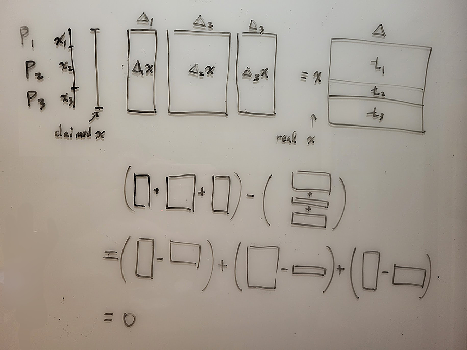

# Malicious Secret Sharing - Authenticated Secret Sharing

## BDOZ

在 semi-honest 的情況下, 每個 party 各自持有某個 variable 的 shares.

比方說 P1 P2 P3 持有以下的 additive shares:
```
var10  6
P1     2
P2     3
P3     1
```
當我們要 reconstruct 出 "var10 = 6" 的時候, 只要每個 party 把自己的 share 公開再相加就好.

但是在 malicious 的情境中, P2 怎麼知道當 P1 說 "我的 var10 的 share 是 2" 的時候, P1 的 share 就真的是 2 呢?

在 BDOZ 中, 每個 variable 除了拆成 shares 之外, 還對每個 variable 加上了 party 之間一對一的 key 與 MAC. (一開始從 offline protocol 得來的, 後面再逐步推導)

當 P1 要和 P2 說 "我的 var10 的 share 是 2" 的時候, 還要附上 var10 的 P1-to-P2 的 MAC. 而 P2 收到之後, 會用 var10 的 P1-to-P2 的 key 來 verify. 如果 P2 計算 `MAC(2, var10-key-P1-to-P2) = var10-MAC-P1-to-P2` 等式成立, 則 P2 願意相信 P1 沒有作弊.

```
var10  6   For sending                             For verifying
P1     2   var10-MAC-P1-to-P2 var10-MAC-P1-to-P3   var10-key-P2-to-P1 var10-key-P3-to-P1
P2     3   var10-MAC-P2-to-P1 var10-MAC-P2-to-P3   var10-key-P1-to-P2 var10-key-P3-to-P2
P3     1   var10-MAC-P3-to-P1 var10-MAC-P3-to-P2   var10-key-P1-to-P3 var10-key-P2-to-P3
```
所以當我們有 n 個 party 時, 對於每個 variable, 我們都要有 O(n^2) 個 key 和 MAC 來確保正確性.

這些 key / MAC 不僅對一個 value 的 shares 有效, 而且還要能隨著計算更新.<br>
舉例來說, 如果 F(x, y) = ((x * y) + x) * y, 想計算 f(6, 4) 大概會像這樣:
```
let var10 = 6  // only known by P1 (with keys / MACs)
let var20 = 4  // only known by P2 (with keys / MACs)
let var30 = var10 * var20  // secret value (with new keys / MACs)
let var40 = var30 + var10  // secret value (with new keys / MACs)
let var50 = var40 * var20  // open and verify
```
一個 honest party 如果照著 protocol 計算出 var30 var40 var50 的 keys, 則每一步的 keys 都讓他能抵擋來自 dishonest party 的訊息.

## Offline / Online

和前面介紹的 Beaver triple 一樣, BDOZ 分成 offline 和 online 的 phases.

P1 P2 P3 先用 offline phase 的 protocol 製造出很多 "single"s 和 "triple"s. 這個過程和 online 的 input 無關, 甚至也和 online 要計算的 function 無關.

到 online phase 時, 先取來 2 組 singles, 讓它變成 input 的值 (var10 = 6, var20 = 4). 在乘法時取用 triples. 每一步都計算正確的 keys / MACs. 最後再 open output variable var50 並檢查正確性.

## SPDZ

BDOZ 中, n 個 party 一對一的互相 verify, 總共需要另外儲存 O(n^2) 個數字.

SPDZ 改成是所有 party 一起 verify. 每個 variable 每個 party 只要另存一個數字, 總共只要 O(n) 個數字.

最後 open 一個 variable 需要三個步驟: open shares / commit to diffs / open diffs. 這裡 dishonest party 很難讓假的 value 通過驗證. (等於要猜中 honest party 手中的 diff 才行)

## A SPDZ Example

以下我們用 mod 7 的 field 為例.

SPDZ 中, 有一個 global 的 delta, 由每個 party 各持有一份 share.<br>
每個 party 只知道自己的 share, 但不知道 delta 是多少.<br>
假設 delta 是 6.<br>
假設 P1 P2 P3 各持有 d1 = 2, d2 = 3, d3 = 1.

在每個 variable x 的 shares 中, 每個 party 另外持有一個 t = delta * x 的 share.<br>
每個 party 只知道自己的 share, 但不知道 x 和 t 是多少.

假設 x 是 2. 則 t = delta * x = 6 * 2 = 12 = 5 mod 7 .<br>
假設 P1 P2 P3 各持有 x1 = 5, x2 = 1, x3 = 3 以及 t1 = 3, t2 = 5, t3 = 4 .

現在我們試著 reconstruct x.

每個 party 先 publish 自己的 x 的 shares: x1 = 5, x2 = 1, x3 = 3 .

每個 party 可以各自 reconstruct 出 x = (5 + 1 + 3) mod 7 = 2 mod 7 .

但是我們不知道有沒有人作弊.

所以接著要 P1 publish 手上的 d1 * x - t1 的 commitment.<br>
所以接著要 P2 publish 手上的 d2 * x - t2 的 commitment.<br>
所以接著要 P3 publish 手上的 d3 * x - t3 的 commitment.

我們觀察上面減號的兩邊. 左邊加在一起可以湊出 (d1+d2+d3) * x = delta * x, 右邊是湊出 t 也是 delta * x . 如果沒有人作弊的話, 這三個 diff 加起來應該是 0.

接著要三個 party open 這三個數字.
```
d1 * x - t1 = 2 * 2 - 3 = 1
d2 * x - t2 = 3 * 2 - 5 = 1
d3 * x - t3 = 1 * 2 - 4 = -2
```
加在一起的確是 0.

這三個數字不會洩漏 d1 d2 d3, 也不會洩漏 t1 t2 t3. 也都不會洩漏 delta.

先 commit 再 open 是怕最後一個人看到前面的數字才湊成 0. 先 commit 可以避免這個問題.

假設 P2 P3 共謀, 想要欺騙 P1 x 是 3. 但 P2 P3 完全不知道 d1 t1 是多少, 因此很難去 cancel 3 * d1 - t1 的值. 也就騙不了 P1.

我們也可以想成: 為了保護 x 拆出的 x1 x2 x3 不被更改, 有個 trusted party 弄出了 delta 和 delta * x. Trusted party 用兩種方法拆解 delta * x : 一種是拆 x, 一種是拆整個 delta * x. 這兩個方法拼起來的值應該要一樣. 而檢查是否一樣的方法並不是把兩個方向各自完整的 reconstruct 再比較(因為這樣會洩密), 而是看總 diff 是否為 0.



又, 如果 open 的過程只對單一個 party (比方說 P1) 送訊息, 則可以只讓 P1 知道實際的 value, 而其他 party 保持不知道.

## 計算

以下繼續用 mod 7 的 field.

delta = 6 = d1 + d2 + d3 = 2 + 3 + 1

如果 P1 P2 P3 有著 [2].
```
     x   delta * x
     2   6 * 2
P1   5   3
P2   1   5
P3   3   4
```

我們希望可以作一些運算, 且仍然保持可以 verify 的性質.

### x * c

先看怎麼把原來的 shares "* c" . (c 是 public constant)
```
     2c   6 * 2c
P1   5c   3c
P2   1c   5c
P3   3c   4c
```
這樣就得到了一份可 verify 的 [2 * c] .

### x + c

再看怎麼把原來的 shares "+ c" .
```
delta * (x + c) = (delta * x) + (delta * c)

     2+c   6 * (2+c)
P1   5+c   3 + 2c    <- (t1 + d1 * c)
P2   1     5 + 3c    <- (t2 + d2 * c)
P3   3     4 + 1c    <- (t3 + d3 * c)
```
這樣就得到了一份可 verify 的 [2 + c] .

### x + y

如果
```
     x   delta * x     y   delta * y
     2   6 * 2         3   6 * 3
P1   5   3             4   2
P2   1   5             5   1
P3   3   4             1   1
```

想計算 x + y 的話, 可以把對應的數字加起來:
```
     x + y         delta * (x + y)
     2 + 3 = 5     6 * 2 + 6 * 3 = 2
P1   5 + 4 = 2     3 + 2 = 5
P2   1 + 5 = 6     5 + 1 = 6
P3   3 + 1 = 4     4 + 1 = 5
```
這樣就得到了一份可 verify 的 [x + y] .

### x * y

想計算 x * y 需要 Beaver triple. 假設拿到一組事先準備好的 a * b = c . <br>
P1 P2 P3 不知道 a b c 這三個數字.
```
x = a + d
y = b + e
x * y = (a + d) * (b + e)
      = ab + ae + db + de
      = c  + ae + db + de

let var1 = x
let var2 = y

let var3 = a
let var4 = b
let var5 = c

let var6 = d = x - a = var1 - var3
open var6 
let var7 = e = y - b = var2 - var4
open var7

let var8 = ae = var3 * constant var7
let var9 = db = constant var6 * var4
let var10 = de = constant var6 * constant var7

let var11 = x * y
          = c + ae + db + de
          = var5 + var8 + var9 + constant var10
```
這樣就得到了一份可 verify 的 [x * y] .

## 初始化 Input

假設已經有拿到一個 single "v" 在 var1.<br>
現在希望 P1 可以把自己的 input x 輸入到 var2.<br>
我們希望只有 P1 知道 var2 的 value, 其他 party 不知道.<br>
我們希望 var2 有著可以被 SPDZ verify 的格式.

一開始所有 party 對 P1 open var1 = v.

P1 計算出 constant "x - v", publish x - v, 要求大家計算 var2 = var1 + (x - v) .

這樣 var2 便是符合條件的 variable.

## 尾聲

BDOZ 和 SPDZ 都是多準備一些額外的數字, 讓 dishonest party 會被擋下. Honest party 只要只要一步一步的計算對應的數字, 就能 verify 最後正確的 output.

SPDZ 的 paper 中用 somewhat homomorphic encryption (SHE) 的方式生成符合 SPDZ 格式的 shares. 後來 Keller et al. 提出了 MASCOT 來加速 offline phase. 之後 Keller et al. 又提出基於 SHE 的 Overdrive 來改進 offline phase. 實作可以參考 MP-SPDZ 的 [repository](https://github.com/data61/MP-SPDZ).

