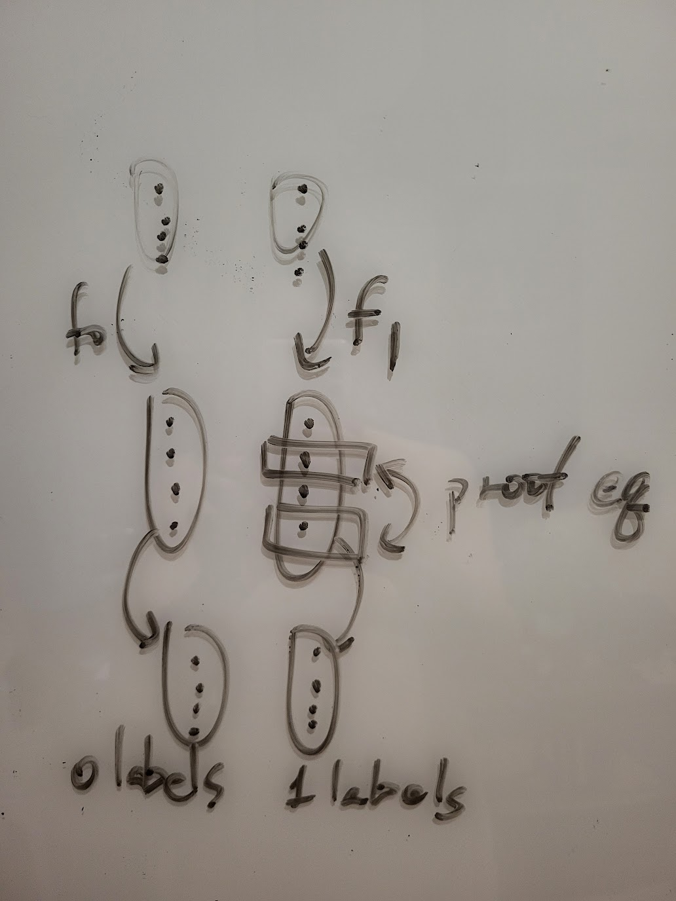

# Malicious Security - Cut-and-Choose

In previous articles, we assumed that each party would follow the protocol, and under this premise, we discussed whether the protocol would leak information.

Next, we remove this assumption.

Taking Garbled Circuit as an example, the generator converts the function F that they want to compute into a garbled circuit and sends it to the evaluator.

If the generator is malicious, they might first tell the evaluator "Let's compute F(x, y) = x > y ? 0 : 1", but actually deviate from the protocol and send the circuit for "F2(x, y) = first bit of y" to the evaluator. This way, when the evaluator sends the answer back to the generator, their input would be leaked (all or part of it).

How can we prevent this problem?

## Cut-and-Choose

One technique is "Cut-and-Choose" (originally referring to a scenario where one person cuts the cake and another chooses). Here, one party does something, allowing the other party to pick some to check.

For Garbled Circuit, we can require the generator to produce multiple circuits for the same F, and the evaluator selects some circuits to check. If the generator provides circuits that are not F, they might be caught by the evaluator. If the selected circuits are verified to indeed be F, then the evaluator evaluates the remaining unchecked circuits.

The method of selecting circuits obviously affects the probability of the generator being caught doing something bad. The evaluator can check up to N-1 out of N circuits, but this is very costly and the probability of being deceived is still not negligibly small.

The evaluator can also check fewer circuits, then evaluate multiple remaining circuits and compare the results. If several results are inconsistent, then it's clear that the generator is intentionally misbehaving.

But we need to be careful here. Even the act of "pointing out that the generator is cheating" might leak information. If the generator produces a circuit like this:
```
if (first bit of y == 1) {
    output a wrong answer of F(x, y)
} else {
    output F(x, y)
}
```
Then when this circuit is evaluated along with other normal circuits, if the evaluator points out the malicious behavior, it's equivalent to leaking one bit.

An improved method is: take the majority from multiple evaluation results. The book says:
> The cut-and-choose parameters (number of circuits, probability of checking each circuit) are chosen so that Pr[majority of evaluated circuits incorrect ∧ all check circuits correct] is negligible.

Intuitively: If the number of circuits evaluated later is large enough, incorrect circuits need to be numerous enough to achieve a majority. But as this number increases, it becomes very difficult not to be sampled during the initial check.

The book mentions that if we want the error rate to be less than 2^(-lambda), we need at least 3.12 * lambda copies of the circuit, and it suggests selecting a proportion of 0.6 of the circuits for checking, leaving 0.4 for evaluation. (But we also need to consider the cost of performing checks and evaluations)

## Input Consistency

The evaluator will evaluate multiple selected circuits for the same function once each. It's possible that a malicious generator or malicious evaluator might provide different inputs in different evaluations.

### Input Consistency (Evaluator)

To prevent a malicious evaluator, the generator can connect all the 0 labels of the same wire from all circuits to be evaluated together, and do the same for the 1 labels, allowing the evaluator to use OT only once to select for each wire.

### Input Consistency (Generator)

Here we introduce the concept of a 2-universal hash, used to describe a set of hash functions where each one is very unlikely to have collisions: For any given distinct inputs z1 and z2, if we randomly pick a single h from the hash functions, the chance of h(z1) = h(z2) is very small. As small as 1 / |range|. That is, when the range is very large, if the hash output values are the same, we consider the inputs to be the same.

Here we require the generator to first provide the input labels for each circuit. Then the evaluator picks a hash function. Use MPC to calculate the hash result of the generator's input values in each circuit. If all output values are the same, we believe the generator has given the same input values in each circuit.

Additionally, to avoid leaking the generator's input, we add a random r to hash together.

## Selective Abort Attack (Selective Failure)

A malicious generator can replace the 1 label of a certain wire with garbage during OT. This way, if the evaluator's input on this wire is 1, it will cause the computation to fail. The fact of this "computation failure" would leak to the generator that "this bit is 1".

This technique relies on the possibility of both failure and non-failure occurring. That is, "success => that bit should be 0", "failure => that bit should be 1".

The book mentions that Lindell and Pinkas (2007) and subsequently Shelat and Shen (2013) used a technique. They convert the evaluator's input y into y'. The characteristic of this y' is: if only k or fewer bits are known, it is completely unrelated to y, and no information about y can be obtained.

Here, y and y' satisfy a property: M * y' = y. M is a public matrix, and its computation doesn't increase cost under FreeXOR.

For a given y, there should be multiple y' that satisfy M * y' = y. Here, the evaluator randomly selects one of these y' to encode y.

Now the input of the modified circuit becomes the generator's x and y'. You can think of it as the first half calculating y = M * y', then continuing to calculate the original F(x, y). The input obtained by a malicious generator's attack becomes y'.

The selection of M's parameters here attempts to put a malicious generator in a dilemma:

* If the number of manipulated wires doesn't exceed k, although there will be both failure and non-failure results, because too few bits of y' are obtained, it's not possible to infer information about y.
* If the number of manipulated wires exceeds k, the failure rate will be almost 1. Therefore, there are no "success/failure" cases to distinguish y, because it always fails.

## Input Recovery Technique

As mentioned earlier, if we want the error rate to be lower than 2^(-lambda), we need to copy at least 3.12 * lambda circuits for cut-and-choose, which is costly.

Lindell and Brandão separately proposed methods to improve this problem in 2013. The general idea is: if the evaluated results are inconsistent, this result can be used to continue calculating the generator's input x (input recovery). Then the evaluator independently calculates F(x, y). The entire process continues regardless of whether it's consistent or not, so the generator cannot make the evaluator leak information.

The purpose here is not to make the generator suffer losses by revealing "the generator cheated" or "the generator's input is x". Although this might be useful in some scenarios, it would leak the evaluator's input, which is not ideal.

This way, it becomes even more difficult to deceive the evaluator. Previously it was:
1. Bad circuits can't be sampled.
2. Bad circuits must occupy the "majority" of the remaining circuits.

Now it is:
1. Bad circuits can't be sampled.
2. Bad circuits must occupy "all" of the remaining circuits! (consistent)

Therefore, if the probability of each circuit being checked is 1/2, only lambda copies of circuits are needed to reduce the error rate to 2^(-lambda).

## Batched Cut-and-Choose

If the same function needs to be evaluated N times, we can try to further reduce the average cost.

It was originally O(lambda), now it can be reduced to O(lambda / log N). (lambda is the security parameter)

The method is:
1. Generator produces N * rho + c circuits
2. Evaluator selects c circuits to check
3. Divide the remaining N * rho circuits into N buckets, evaluating rho circuits each time.

The generator only succeeds in deceiving the evaluator if bad circuits aren't checked in the beginning, and later some bucket is entirely filled with bad circuits. (Or the majority are bad)

## Gate-level Cut-and-Choose: LEGO

A boolean circuit can be composed using only NAND gates.

Nielsen and Orlandi's idea is: produce many NAND gates, select some to check like in batched cut-and-choose, put the rest into buckets. Then use multiple NAND gates from the same bucket to "solder" various fault-tolerant gates that are correct as long as the majority is correct. Then use these gates to compose a single circuit for evaluation.

This uses a concept called "Homomorphic Commitment": for two values a and b, create two commitments. Then you can choose to open a, open b, or open "a XOR b" as needed.

A wire on a gate has k0 k1. FreeXOR is used here, so k1 = k0 ⊕ delta. Because delta is a globally shared constant, both k0 and k1 cannot be made public during checking.

The checking method has been adjusted here: among the four rows in a NAND gate, the evaluator randomly picks one to check.
For example: if wire a NAND wire b = wire c.
```
a b c
0 0 1      ka0 kb0 kc1
0 1 1      ka0 kb1 kc1
1 0 1      ka1 kb0 kc1 <== check: open ka1 / kb0 / kc1
1 1 0      ka1 kb1 kc0
```
Here, because only one key is opened for each wire, delta is not leaked.

Also, because cheating here only has a 1/4 chance of being checked (someone improved it to 1/2), more gates are needed.

Next is to connect wires from different gates. If wire u needs to be transmitted to wire v, then ku0 needs to be converted to kv0, ku1 converted to kv1.

The difference between ku0 and kv0: let suv = ku0 ⊕ kv0. The difference between ku1 and kv1 is exactly the same due to FreeXOR. In other words, blindly adding suv can turn ku0 into kv0, ku1 into kv1. And this difference can be opened using homomorphic commitment.

TODO: Haven't understood how to solder multiple NANDs into a fault-tolerant gate.

Even if only evaluating once, the saving effect here is similar to batch, only needing O(1) + O(lambda / log N). (N is the number of gates)

----
## Postscript

The "input consistency" section in the book cites the 2011 version of Shelat and Shen, I guess it actually intended to cite the 2013 version?

The [2011](https://eprint.iacr.org/2011/533.pdf) version, when dealing with the generator's input consistency, uses claw-free functions, sending some random points to the range through f0 f1, then calculating circuit labels from range elements.

The properties of claw-free functions allow the generator to prove to the evaluator that these range elements are calculated from the same f0 or f1. And because their distributions are the same, it doesn't leak whether it's f0 or f1.


