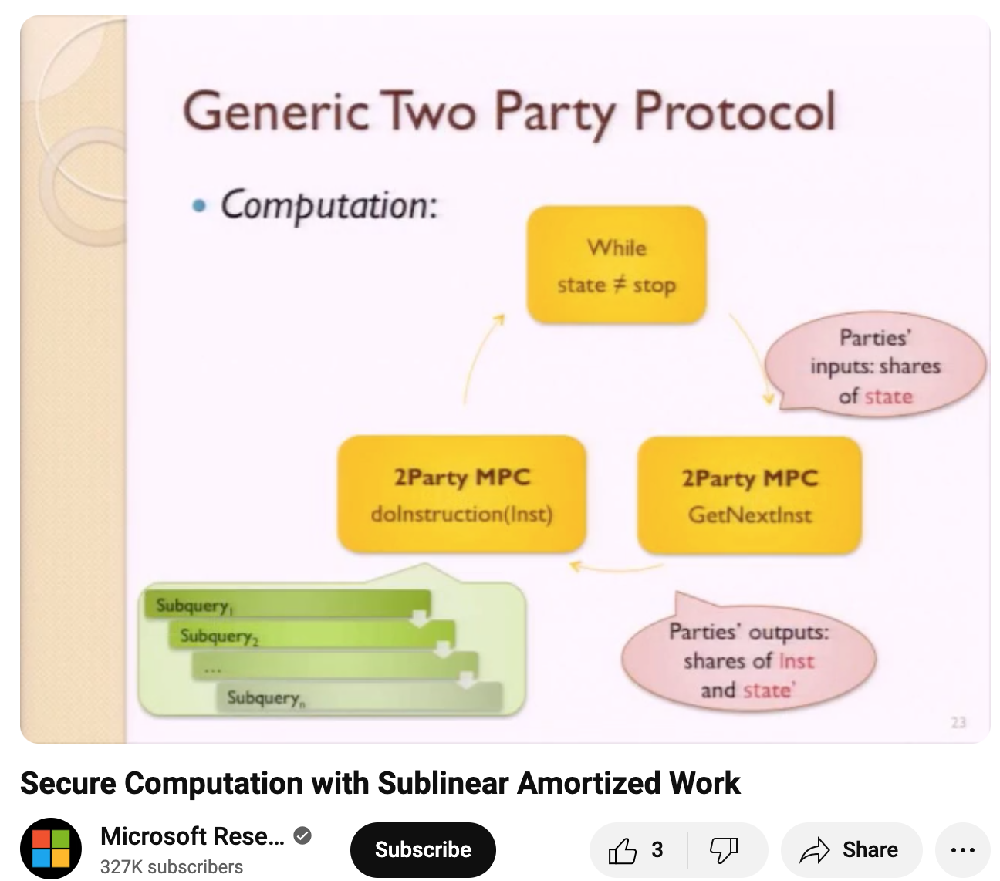

# ORAM and MPC

In the previous article, we introduced the concept of ORAM and presented a simple implementation -- Path ORAM.

We discussed two scenarios: Client / Server and CPU / Memory.<br>
The goal is to prevent the Server from extracting information from the Client's access pattern.<br>
Similarly, we aim to prevent the Memory from gaining information from the CPU's access pattern.

Many MPC protocols convert programs into circuits for execution.<br>
If we use the internal wires of a circuit to simulate an array, the circuit complexity for each array access is O(array size).<br>
If there are many accesses and the array is large, the cost can be very high.<br>
However, moving the array outside the circuit risks information leakage.

Therefore, [Gordon et al.](https://www.cs.umd.edu/~jkatz/papers/oram.pdf) proposed a solution: using circuit + ORAM.<br>
This means moving the array outside the circuit but protecting the data and data access pattern with ORAM.<br>
The ORAM logic is implemented in the circuit and computed using an MPC protocol. The two parties jointly execute the role of the ORAM client / CPU.

The circuit's interior is protected by the MPC protocol, so no one knows the data / virtual address.<br>
The circuit's exterior is protected by ORAM, so no one knows the data / virtual address either.

## Pure function + State + Instruction

The original program logic is now divided into segments of pure functions by memory access.

```
(state, memory value) -> (next instruction, new state)
```

Whenever a read / write to memory is needed, instead of directly obtaining the value, it produces a read / write instruction with a virtual address, along with the current state.

This instruction is executed by ORAM. The execution result, together with the state, is then passed to the pure function to calculate the next memory instruction and new state.

During this process, only physical memory access instructions are reconstructed from the shares.

In this architecture, there's no need to use very large arrays as circuit inputs, thus providing an opportunity to achieve sublinear complexity. (ORAM is polylog)

However, the original paper mentions that a more expensive initialization is required. The cost is then amortized over multiple operations.

Because using ORAM with circuits has a cost, this approach is only cost-effective when the array is sufficiently large (> 2^18).


<a href="https://www.youtube.com/watch?v=InW6i0oGBf0#t=35m38s">
Secure Computation with Sublinear Amortized Work (at 35m38s)

</a>

----
## Postscript

RAM is not random access memory.<br>
RAM is random access "machine".

A basic Turing machine only has a tape. To implement the functionality of `x = arr[100]`, we need 100 steps to move to arr[100].

A random access machine is a Turing machine with random access memory. Reading or writing to `arr[100]` only takes one step. (Refer to Figure 1.3 in [The Design and Analysis of Computer Algorithms](https://www.semanticscholar.org/paper/The-Design-and-Analysis-of-Computer-Algorithms-Aho-Hopcroft/10a463bb00b44bdd3a8620f2bedb9e1564bfcf32))

In Ostrovsky's [ORAM paper](https://web.cs.ucla.edu/~rafail/PUBLIC/09.pdf),
RAM is described using the interactive machines approach from [Goldwasser et al.](https://dl.acm.org/doi/10.1145/22145.22178). Two Turing machines, "CPU" and "MEM", exchange messages. The CPU sends instructions, and MEM sends results. Both Turing machines are message-driven.
