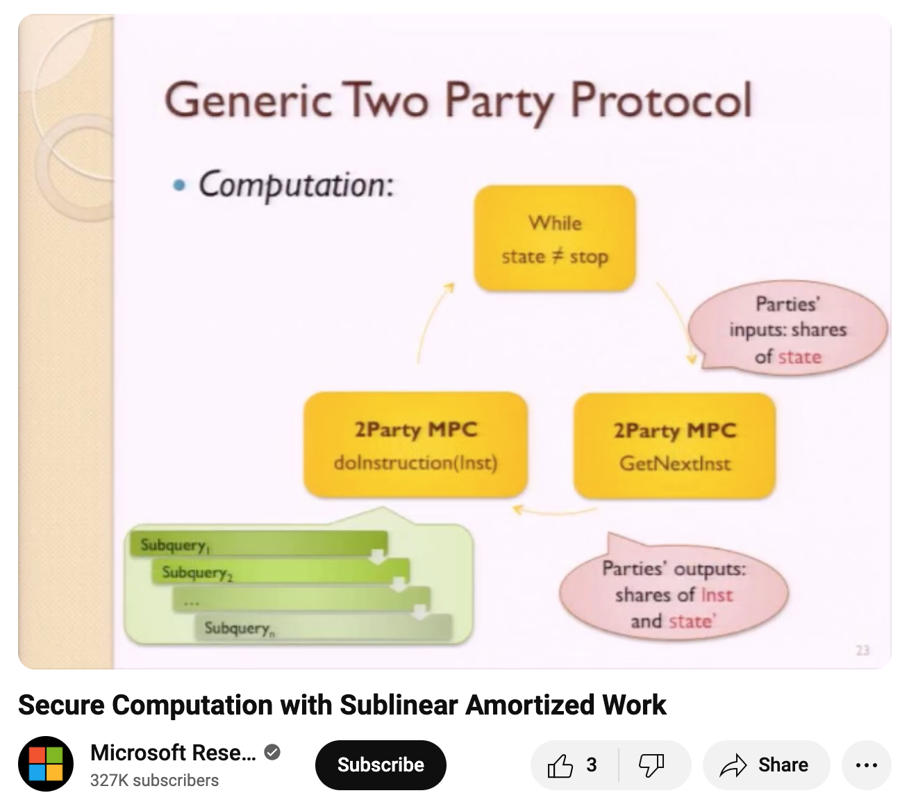

# ORAM and MPC

在上一篇中, 我們介紹了 ORAM 的概念, 以及介紹了一個簡單的作法 -- Path ORAM.

我們舉了兩種情境: Client / Server 和 CPU / Memory.<br>
希望 Server 從 Client 的 access pattern 得不出資訊.<br>
希望 Memory 從 CPU 的 access pattern 得不出資訊.

很多 MPC protocol 會把程式轉成 circuit 來執行.<br>
如果用 circuit 內部的 wires 來模擬 array 的話, 每 access 一次 array 的 circuit complexity 都是 O(array size).<br>
如果次數多, array 又大, 成本會很高.<br>
但把 array 拆到 circuit 外面又怕洩密.

所以 [Gordon et al.](https://www.cs.umd.edu/~jkatz/papers/oram.pdf) 提出的作法是: 用 circuit + ORAM.<br>
也就是把 array 拆到 circuit 外面, 但是用 ORAM 保護 data 和 data access pattern.<br>
ORAM 的邏輯用 circuit 實作, 並且用 MPC protocol 計算. 兩個 party 合起來執行 ORAM client / CPU 的角色.

Circuit 內部受到 MPC protocol 的保護, 沒有人知道 data / virtual address.<br>
Circuit 外部受到 ORAM 的保護, 也沒有人知道 data / virtual address.

## Pure function + State + Instruction

原來想執行的程式邏輯現在被 memory access 切成一段一段的 pure function.

```
(state, memory value) -> (next instruction, new state)
```

每當要 read / write memory 的時候, 不是直接拿到值, 而是產出一個 read / write 的 instruction 和 virtual address, 以及當前的 state.

這個 instruction 會被 ORAM 執行. 執行結果會和 state 再交給 pure function 算出下一個 memory instruction 和新的 state.

過程中只有 physical memory access instructions 會從 shares 中被 reconstruct 出來.

在這種架構下, 不用把很大的 array 當成 circuit input, 因此有機會做到 sublinear. (ORAM 是 polylog)

不過原 paper 說需要比較貴的 initialization. 成本再由多次 operation 來分攤.

因為 ORAM 用 circuit 有成本. 這個作法也要 array 夠大 (> 2^18) 才划算.


<a href="https://www.youtube.com/watch?v=InW6i0oGBf0#t=35m38s">
Secure Computation with Sublinear Amortized Work (at 35m38s)

</a>

----
## 後記

RAM 不是 random access memory.<br>
RAM 是 random access "machine".

基礎的 Turing machine 只有 tape. 如果要實作 `x = arr[100]` 的功能, 我們需要 100 個 step 來移動到 arr[100].

而 random access machine 是有著 random access memory 的 Turing machine. 讀寫 `arr[100]` 只需要一步. (參考 [The Design and Analysis of Computer Algorithms](https://www.semanticscholar.org/paper/The-Design-and-Analysis-of-Computer-Algorithms-Aho-Hopcroft/10a463bb00b44bdd3a8620f2bedb9e1564bfcf32) 的 Figure 1.3)

在 Ostrovsky 的 [ORAM paper](https://web.cs.ucla.edu/~rafail/PUBLIC/09.pdf) 中,
有用 [Goldwasser et al.](https://dl.acm.org/doi/10.1145/22145.22178) 的 interactive machines 的方式來描述 RAM. 兩台 turing machine "CPU" 和 "MEM" 之間互相傳遞訊息. CPU 送指令, MEM 送結果. 兩台 turing machine 都是 message driven 的.