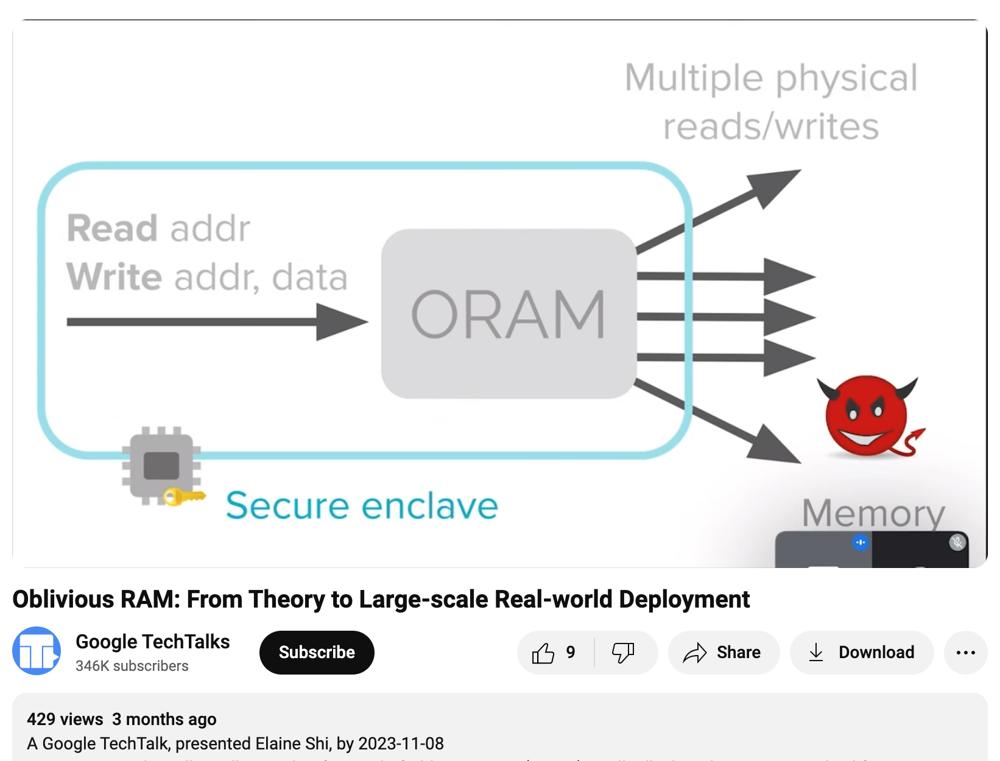
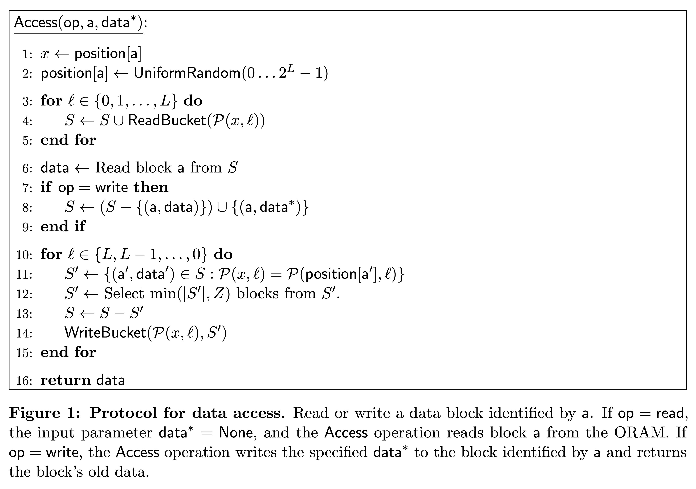

# Oblivious RAM (ORAM) / Path ORAM

The purpose of Oblivious RAM is to hide both data and data access patterns.

## Client / Server

One scenario is the client-server usage context.

The client uploads data to an untrusted server.

To prevent data leakage, the client encrypts the data before uploading. This is relatively simple.

However, sometimes the server can also gather information from access patterns.

Therefore, ORAM aims to keep not only the data itself confidential but also the real data access patterns.

## CPU / Memory

Another scenario is the CPU / memory usage context.

Suppose an adversary has physical access to a machine. They can peek at the contents of the memory and address lines but cannot see the data inside the CPU.

In addition to encrypting the memory, the CPU hides the access to a logical address within multiple physical address accesses, preventing the adversary from knowing the true access pattern.

## Hiding Access Patterns



[(from Elaine Shi's talk)](https://www.youtube.com/watch?v=iGfgngtVLr4#t=9m55s)

We can think of the above two scenarios as follows: our program wants to perform READ(addr) and WRITE(addr, data) operations on logical addresses. ORAM will convert these operations into *many* physical address operations, with an overhead that could be ten or even a hundred times more.

ORAM aims to achieve: as long as two logical operation sequences are of the same length, the physical operation sequences they are converted into will be indistinguishable (computationally).

For example,
```
R(30)        , R(10), W(20, "foo")      -> 300 physical memory accesses
W(100, "bar"), R(20), W(5, "baz")       -> 300 physical memory accesses
```
If an adversary obtains a sequence of physical accesses, they will not be able to effectively distinguish whether the original sequence was RRW or WRW.

`R(10)` and `R(20)` must be indistinguishable.

`R(10)` and `W(10, "foo")` must be indistinguishable.

`R(10) R(10)` and `R(10) R(20)` must be indistinguishable.

Quoting the Path ORAM [paper](https://eprint.iacr.org/2013/280.pdf), the following must be hidden:
> ... 1) which data is being accessed; 2) how old it is (when it was last accessed); 3) whether the same data is being accessed (linkability); 4) access pattern (sequential, random, etc); or 5) whether the access is a read or a write.

However, some information is not hidden.<br>
For instance, `RRR` and `RR` can be distinguished.<br>
When a read occurs and how long the interval between reads are also not hidden.<br>
I think this is something to be cautious about.

## Path ORAM

The 1996 paper by Goldreich and Ostrovsky is a more frequently cited work.

Here we introduce [Path ORAM](https://eprint.iacr.org/2013/280.pdf) proposed by Stefanov et al. in 2013. (Based on Shi's 2011 binary tree construction)

The basic approach is:

The client logically wants to read or write one block at a time.

On the server side, Z blocks form a bucket, and buckets form nodes in a binary tree.

<mark>Each logical block is randomly mapped to a leaf bucket. The block is not necessarily stored in that leaf bucket, but it must be on the path from that leaf bucket to the root bucket. (main invariant)</mark>

This mapping table is stored on the client side first.

When we access a logical block (whether read or write), we look up the mapping table, read and write all the buckets on the path from that leaf bucket to the root bucket. When reading, we read from root to leaf into the client's stash S. When writing, we write from leaf to root. While maintaining the invariant, we evict items from the stash as far from the root as possible.

Each accessed logic block is remapped to a random leaf. (This way, `R(10) R(10)` and `R(10) R(20)` are both two random paths)

<br>
(From Figure 1 of the [original paper](https://eprint.iacr.org/2013/280.pdf))

### Visualization

I wrote a web tool to help understand this. MIT license. Feel free to use.

[Web Page](https://lcamel.github.io/MPC-Notes/Path-ORAM/Path-ORAM.html)

[Source Code](https://github.com/LCamel/MPC-Notes/blob/main/Path-ORAM/Path-ORAM.html)

You can first watch
<a href="https://www.youtube.com/watch?v=KEROGXZzX3I">
Youtube video:<br>

</a>

### Overhead

From the server's perspective, the trace of accessing a block is always an entire path of buckets.<br>
The overhead is at least O(log N).<br>
Usually, the number of leaves in the tree is set to be the same as the number of blocks N we want to store. (Assuming N is a power of 2)<br>
If we want to store 2^20 (1M) blocks, then the path length is 21. Let's round it to 20.<br>
If a bucket holds 4 blocks, then writing one block expands to "reading 80 blocks + writing 80 blocks".<br>
Reading one block also becomes "reading 80 blocks + writing 80 blocks".

### Client State

The client needs space for both the stash and the position map.

#### Position Map

Because we need to remember the leaf bucket corresponding to each block, we need O(N) space.<br>
But the leaf number is just a number. Let's overestimate it as 32 bits = 4 bytes.<br>

If client storage is more relaxed, then 1M map entries require a 4MB map.

If client storage is a concern, then the map can be put into blocks and thrown into another new tree. (recursive ORAM)<br>
If a block is 4KB, then 1K numbers can be stored in it.<br>
1M map entries would only need 1K buckets.<br>
That is, the map of the second tree only needs 1K entries. It's a 4KB map.<br>
If size is a concern, this process can be continued.

#### Stash

Assume the stash size is R blocks. When an operation ends, we hope there are no more than R blocks in the stash.<br>
This probability is less than `14 * 0.6002 ^ -R`. (for Z = 5)<br>
Refer to Theorem 1 and Figure 5 of the original paper.

#### Stateless Client

If there are multiple clients, consider encrypting the client state and storing it on the server side.<br>
Each client downloads and uploads the state before and after operations.

Because the map can be recursively placed on the server side, and the stash is almost empty after operations, there isn't much to transfer.

### Secure Processors

Because the design is simple enough, some secure processors have adopted Path ORAM to protect memory access patterns.

However, Intel SGX does not use hardware to protect memory access patterns. You need to implement it in software yourself.

