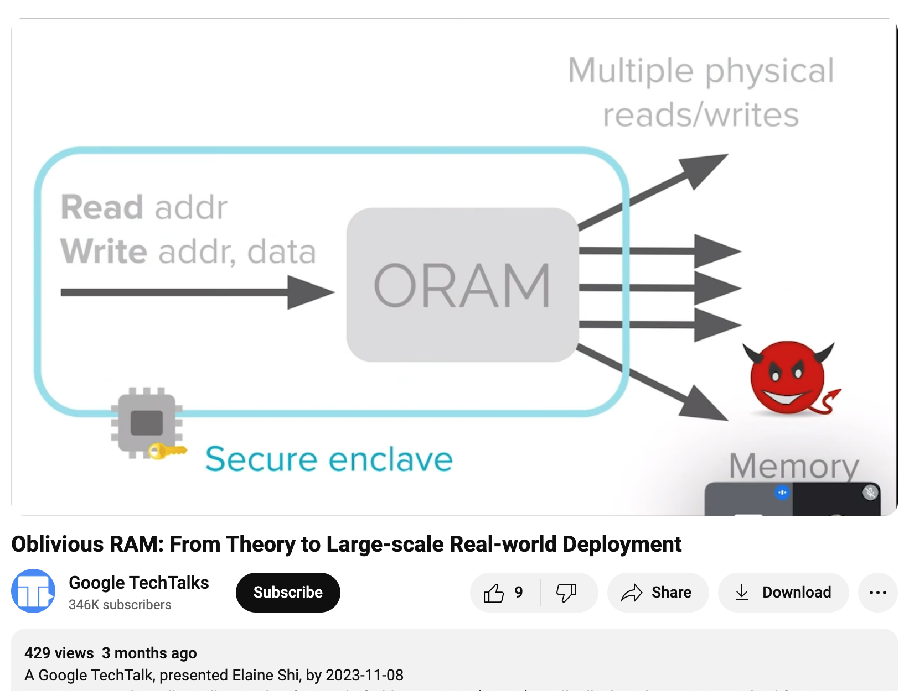
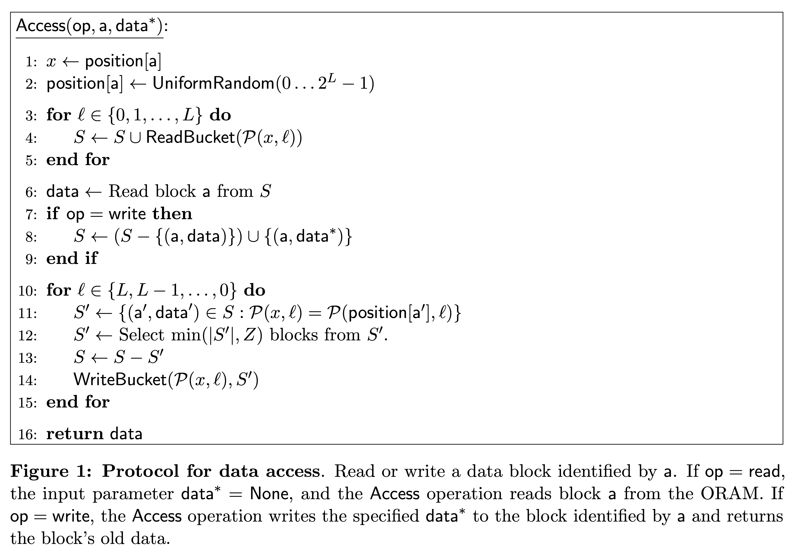

# Oblivious RAM (ORAM) / Path ORAM

Oblivious RAM 的目的是隱藏 data 和 data access pattern.

## Client / Server

一種是 client server 的使用情境.

Client 把資料上傳到不能信賴的 server 端.

因為怕資料外洩, 所以 client 自己先加密再上傳. 這比較簡單.

但是有時 server 從 access pattern 也可以觀察出資訊.

所以 ORAM 除了 data 本身不要外流, 連 data access pattern 都想保密.

## CPU / Memory

另一種是 CPU / memory 的使用情境.

假設 advasary 有一台機器的 physical access. 可以偷看 memory 和 address line 的內容, 但無法偷看 CPU 內部的資料.

除了對 memory encrypt 之外, CPU 把一個 logical address 的 access 隱藏在多次 physical address 的 access 之中, 讓 advasary 無法知道真正的 access pattern 是什麼.

## 隱藏 Access Pattern



[(from Elaine Shi's talk)](https://www.youtube.com/watch?v=iGfgngtVLr4#t=9m55s)

我們把上面兩個情境想成: 我們的程式想對 logical address 進行 READ(addr) 和 WRITE(addr, data) 的操作. 而 ORAM 會把這些操作換成*很多* physical address 的操作, overhead 可能是十倍甚至百倍.

ORAM 希望做到: 只要兩個 logical 操作的 sequences 一樣長, 則光看他們轉出來的 physical 操作 sequences 會是 indistinguishable 的. (computational)

比方說,
```
R(30)        , R(10), W(20, "foo")      -> 300 physical memory access
W(100, "bar"), R(20), W(5, "baz")       -> 300 physical memory access
```
Advasary 如果拿到一段 physical access sequence, 會無法有效地分辨出原本是 RRW 還是 WRW.

`R(10)` 和 `R(20)` 必須 indistinguishable.

`R(10)` 和 `W(10, "foo")` 必須 indistinguishable.

`R(10) R(10)` 和 `R(10) R(20)` 必須 indistinguishable.

引用 Path ORAM [paper](https://eprint.iacr.org/2013/280.pdf) 的講法, 這些都要被隱藏:
> ... 1) which data is being accessed; 2) how old it is (when it was last accessed); 3) whether the same data is being accessed (linkability); 4) access pattern (sequential, random, etc); or 5) whether the access is a read or a write.

然而也有一些資訊是沒有被隱藏的.<br>
像 `RRR` 和 `RR` 是分的出來的.<br>
什麼時候讀, 間隔多久讀也是沒有隱藏的.<br>
我覺得這是要小心的地方.

## Path ORAM

Goldreich 和 Ostrovsky 1996 的 paper 是比較常被 cite 的作品.

這裡介紹 2013 年 Stefanov et al. 提出的 [Path ORAM](https://eprint.iacr.org/2013/280.pdf). (基於 2011 年 Shi 的 binary tree construction)

大概的作法是:

Client logically 一次想讀寫一個 block.

Server 端則是把 Z 個 block 組成一個 bucket, 再以 buckets 為 nodes 組成一個 binary tree.

<mark>每個 logical block 會 randomly map 到一個 leaf bucket. 該 block 不一定儲存在那個 leaf bucket, 但一定在該 leaf bucket 到 root bucket 的這條 path 上. (main invariant)</mark>

這個 mapping table 先在 client 端存下來.

當我們 access 一個 logical block 的時候(不論 read write), 會查 mapping table, 把那個 leaf bucket 到 root bucket 這條 path 上所有的 buckets 都讀過又寫過一遍. 讀的時候會從 root 到 leaf 讀進 client 端的 stash S. 寫的時候從 leaf 寫到 root. 在維持 invariant 的條件下, 把 stash 裡的東西 evict 到離 root 越遠越好.

每次 access 的 logic block 都會 remap 到 random leaf. (這樣 `R(10) R(10)` 和 `R(10) R(20)` 都是兩條 random paths)

<br>
(取自[原 paper](https://eprint.iacr.org/2013/280.pdf)的 Figure 1)
### Visualization

我寫了一個網頁工具來幫助理解. MIT license. 歡迎使用.

[Web Page](https://lcamel.github.io/MPC-Notes/Path-ORAM/Path-ORAM.html)

[Source Code](https://github.com/LCamel/MPC-Notes/blob/main/Path-ORAM/Path-ORAM.html)

可以先看
<a href="https://www.youtube.com/watch?v=KEROGXZzX3I">
Youtube 影片:<br>

</a>

### Overhead

從 server 端看, access 一個 block 的痕跡都是一整條 的 path of buckets.<br>
Overhead 至少是 O(log N).<br>
通常 tree 的 leaf 數會設定成和想裝的 block 個數 N 一樣. (假設 N 是 power of 2)<br>
如果我們想裝 2^20 (1M) 個 block, 那 path 長度就是 21. 算成 20 好了.<br>
一個 bucket 如果裝 4 個 block, 那寫一個 block 就放大成 "讀 80 個 block + 寫 80 個 block".<br>
讀一個 block 也變成 "讀 80 個 block + 寫 80 個 block".

### Client State

Client 需要 stash 和 position map 兩塊空間.

#### Position Map

因為需要記住每個 block 對應的 leaf bucket, 所以需要 O(N) 個空間.<br>
但是因為在第幾個 leaf 只是一個數字. 假設高估成 32 bits = 4 bytes 好了.<br>

如果 client storage 比較寬鬆, 那 1M 個 map entry 要 4MB 的 map.

如果在意 client storage, 那可以把 map 再裝進 block, 丟進另一棵新的 tree. (recursive ORAM)<br>
如果一個 block 4KB, 那可以裝 1K 個數字在裡面.<br>
1M 個 map entry 就只要 1K 個 buckets.<br>
也就是第二個 tree 的 map 就只要 1K 個 entry. 是一個 4KB 的 map.<br>
在意大小的話還可以繼續做下去.

#### Stash

假設 stash 大小為 R 個 block. 當 operation 結束時, 我們希望 stash 裡面不要有超過 R 個 block.<br>
這個機率小於 `14 * 0.6002 ^ -R`. (for Z = 5)<br>
可參考原 paper 的 Theorem 1 和 Figure 5.

#### Stateless Client

如果有多個 client 的話, 可以考慮把 client state 加密後放在 server 端.<br>
每個 client 在操作前後把 state 下載再上傳.

因為 map 可以 recursive 放在 server 端, 而 stash 在操作後又幾乎都是空的, 所以要傳的東西也不多.

### Secure Processors

因為設計夠簡單, 有些 secure processor 有採用 Path ORAM 來保護 memory access pattern.

不過 Intel SGX 沒有用硬體保護 memory access pattern. 要自己用軟體實作.

