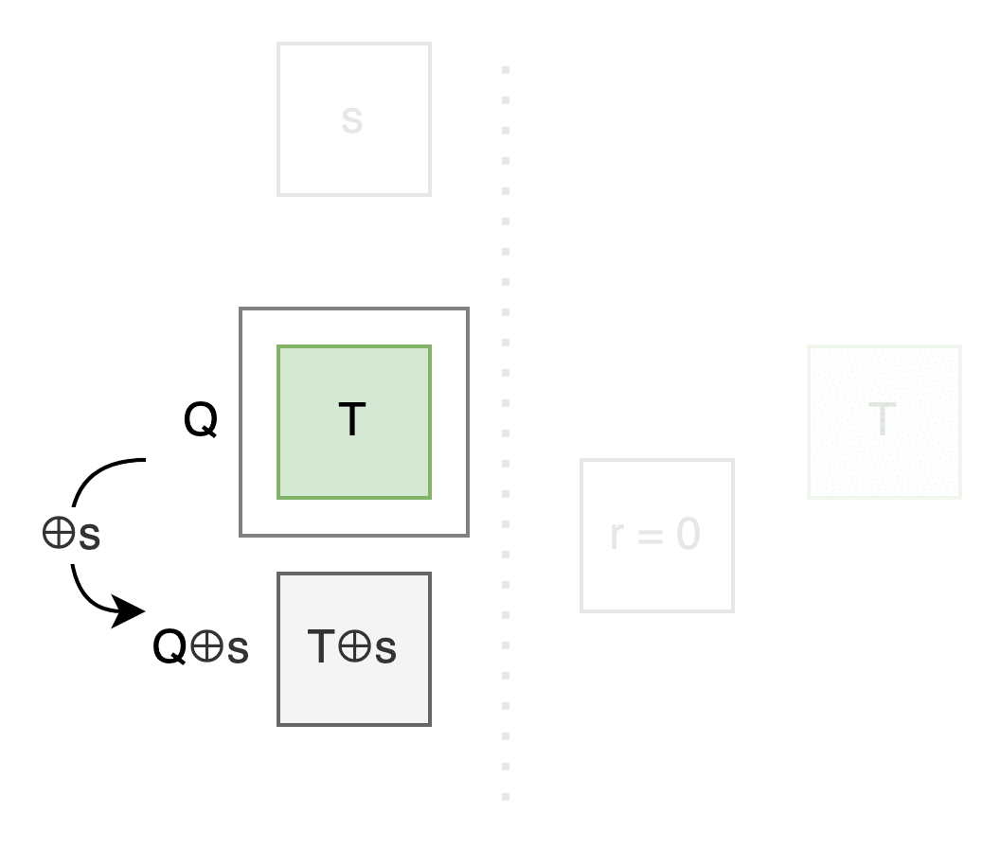
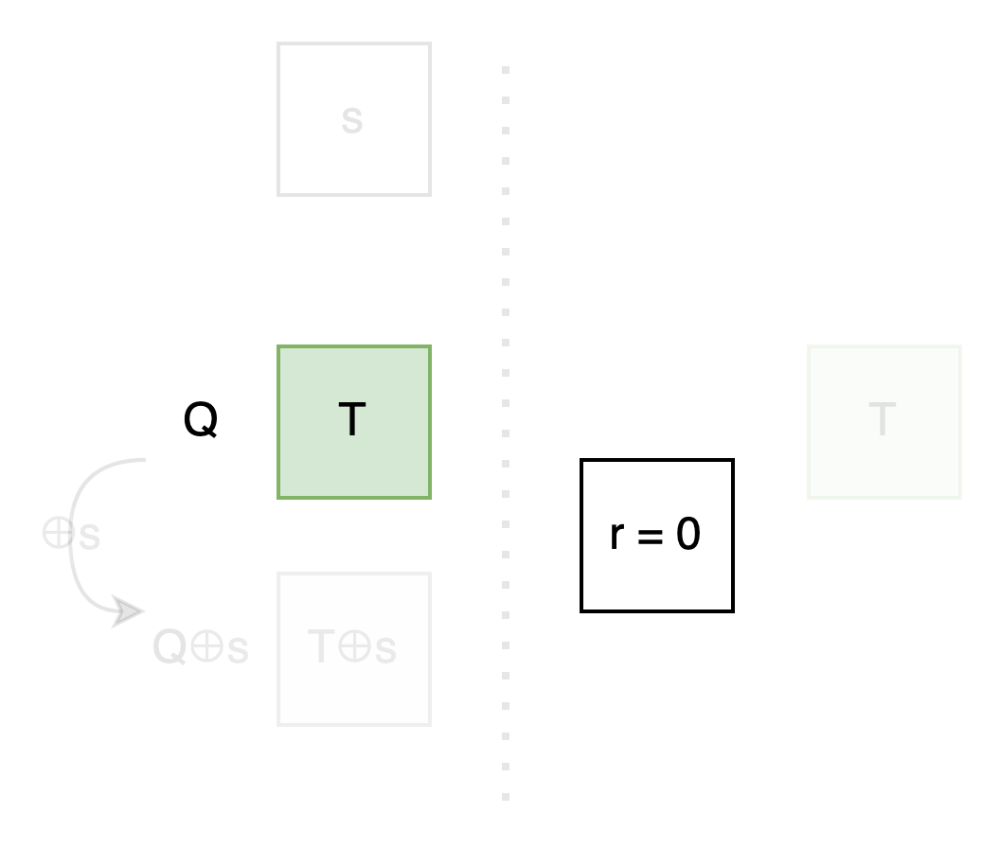
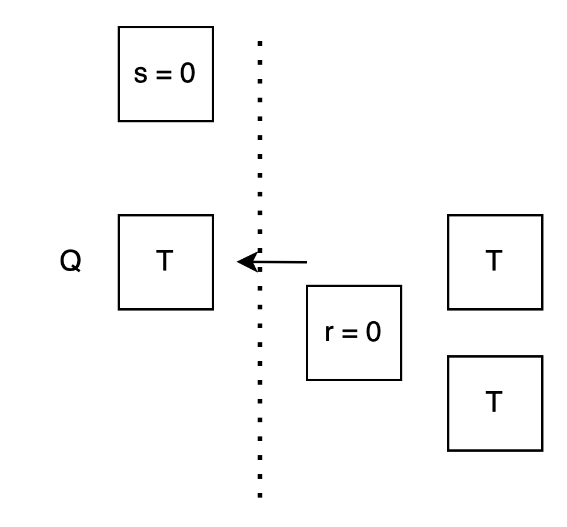
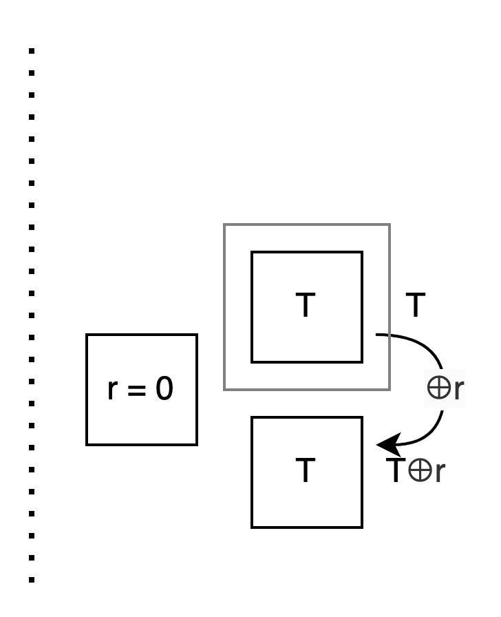

# OT Extension (IKNP)

Bob: Hi Alice.

Alice: Hi Bob. What would you like to discuss today?

Bob: After seeing Oblivious Transfer in [Garbled Circuit](../story-en-US.md) last time, I looked up some more information. I came across an interesting thing called IKNP OT Extension and wanted to discuss it with you.

Alice: Sure, let me look up some information as well...

Alice: Alright. Do you remember the OT we discussed last time?

Bob: Yes, I do. It's where you have two messages, and if I choose 0, I see message0, and if I choose 1, I see message1. But I can't see your other message, and you don't know which message I chose to look at.


Alice: So what do you think OT Extension is doing?

Bob: If you have 1 million pairs of messages for me to choose from, we'd have to perform OT 1 million times, which is quite costly.

Some people called IKNP thought: Is it possible to do, say, 100 OTs, plus some additional design, to achieve the effect of the original 1 million OTs?

Shall we roleplay the characters inside to check our understanding?

Alice: Okay. I'll be Alice... I mean, I'll be the Sender, and you be the Receiver.

Bob: OK. Let's not look at 1 million pairs of messages first, let's just look at one pair.

As the receiver, I use a secret bit r to represent which message I want. And T represents a random bit string I generate.

If I have a way to
- use r to control whether T appears in position 0 or position 1 on your side
- and put a bit string I don't know in the other empty position

Then we can use it for OT: As long as you encrypt the messages with the corresponding bit strings and send them to me, I can only uniquely decrypt the one encrypted with T -- which is the message pointed to by r.


Alice: Let's simplify it further, let's first shrink T to just one bit.

As the sender, I generate a secret random bit s.

Because you don't know s, you shouldn't know T⊕s either.

If I could calculate T⊕s, I could use it as the unknown bit you don't know to put in the other box.


Let's observe the relationship between the upper and lower boxes: No matter if r is 0 or 1, the upper box ⊕s always gives the lower box.

If we name the upper box Q, then the lower box is Q⊕s.



We can transform the original problem to: Focus on Q, see how to use r to control whether T or T⊕s appears in that box.



Bob: To summarize: We've just reduced from 1 million pairs of messages to one pair, from two bit strings to two bits, then focused on how the upper bit Q is controlled by r to be T or T⊕s, so Q⊕s will be the reverse, T⊕s or T. As long as you encrypt the messages with Q and Q⊕s and send them to me, I can only open the message where T is, thus achieving OT.

But then again, you can't know my r and T, and I can't know your s.

Alice: Yes. If I explicitly know whether I have T or T⊕s, then I would know r, which would violate the requirements of OT.

Bob: Conversely, if I know your s, I could decrypt both messages encrypted with T and T⊕s, which would also violate the requirements of OT.

So how can we make you calculate:
```
Q = T   if r = 0
Q = T⊕s if r = 1
```
in a situation where I don't know s and you don't know r? It's done by...

Alice: Waiting for you to say it...

Bob: Let's say it together...

Alice, Bob: Reverse OT!

Alice: (That's so childish...) Let's go back to reverse OT.

Bob: Reverse OT.

That is, I temporarily act as the sender, and you temporarily act as the receiver.

Regardless of whether r is 0 or 1, I prepare two boxes for you to choose with s, but the contents of the boxes will change according to r.

First, look at the case r = 0: I want you to calculate T, so I prepare two boxes, both containing T.

Alice: I choose a box using s. Whether I choose 0 or 1, because the contents are the same, I will definitely get T.



Bob: Now look at the case r = 1: I want you to calculate T⊕s. But I don't know s. So I think:

Assuming you'll pick the 0th box when s is 0, so I first put T⊕s = T⊕0 = T in the 0th box.

Assuming you'll pick the 1st box when s is 1, so I first put T⊕s = T⊕1 = NOT T in the 1st box.

Alice: This way, when I use the value of s to choose a box, whether I choose the 0th or the 1st, the content will be exactly T⊕s!


Bob: For you, the actions in these two cases are the same, which is using the value of s for reverse OT.

Alice: Although it seems like I made a choice using s, whether I calculate T or T⊕s is still based on your choice of r.

Bob: It's "our" choice.

Alice: Also, just like the two values on my side can always be represented as Q and Q⊕s, the values on your side can always be represented as T and T⊕r.

Bob: Yes. It's also more convenient to call them this way.



Alice: We've covered the core part pretty well. Let's summarize.

Bob: Okay. Initially, I want to receive message0 or message1 from you, and I use this bit r to specify.

I first randomly generate a bit T that you don't know and put it in the upper box, then calculate T⊕r and put it in the lower box.

Alice: Then I randomly generate a bit s that you don't know. I use s to do a reverse OT with you.

Although I don't know your r, the effect is that I will get T or T⊕s depending on r. I put the result in the upper box Q.

Then I calculate Q⊕s and put it in the lower box. This way, the two boxes will be (T, T⊕s) or (T⊕s, T).

I use them to encrypt message0 and message1 respectively and send them to you.

Bob: Although I know T, I don't know T⊕s, so I can only decrypt one of them, which is the message encrypted with T, controlled by the position of r.

Alice: Let me write a program...

Alice: Alright, it's like this. The left side is me, the right side is you. Black is 0, white is 1:



<a href="1D.html" target="_blank">(Open in a new window)</a>

Alice: Phew, after all this talk, we've only transmitted one pair of messages. And using 1 bit for encryption is not secure at all.

Bob: We need to use more bits for encryption.

Alice: That means your T and my s need to become longer, we need to do OT multiple times, like this:



<a href="2D.html" target="_blank">(Open in a new window)</a>

Bob: Because the entire T⊕r is prepared using the same bit r, it will be either entirely the same as or entirely opposite to T. This way, after you do OT several times, Q will also be either an entire T or an entire T⊕s.

Alice: Then I take the entire Q and ⊕s, so (Q, Q⊕s) will be two lines of (T, T⊕s) or (T⊕s, T), which can safely encrypt a pair of messages.

Bob: Now comes the crucial final step. Let's see how to use these few OTs to achieve the effect of the original large number of OTs.

Alice: Let's look at the program first, it's like this:



<a href="3D.html" target="_blank">(Open in a new window)</a>

Bob: Here, for each r, I generate corresponding T and T⊕r. Because each layer uses the same s for selection, you can use s to vertically select an entire column each time.

Alice: Because the T and T⊕r you prepare for each layer are based on the r of that layer, and Q is also my reverse OT result with s, so each layer is also (T, T⊕s) or (T⊕s, T).

Bob: Yes, I've checked each layer, and T does appear in the position pointed to by r.

Alice: Although we only performed a small number of OTs, because we selected a large number of vertical bits each time, we quickly filled up Q and Q⊕s.

This way, the two messages of each layer can be encrypted with (T, T⊕s) or (T⊕s, T) and sent to you, and a large number of OTs are completed!

Bob: Phew! Thank you for discussing this with me, I feel like I understand it even better now!

Alice: Thank you too! See you next time!

---

#### References

[Extending Oblivious Transfers Efficiently](https://iacr.org/archive/crypto2003/27290145/27290145.pdf)


[A Pragmatic Introduction to Secure Multi-Party Computation](https://securecomputation.org/)


<script>
function resizeImg(i) { i.style.width = (i.naturalWidth * 0.25) + "px"; }
function resizeAllImg() { document.querySelectorAll(".to-be-resized").forEach(resizeImg); }
window.addEventListener("load", resizeAllImg);
</script>