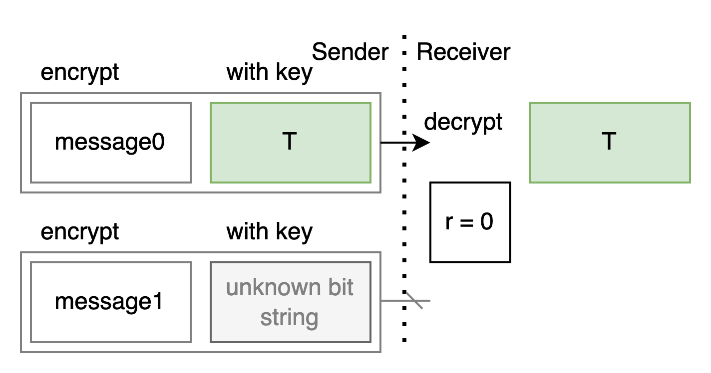
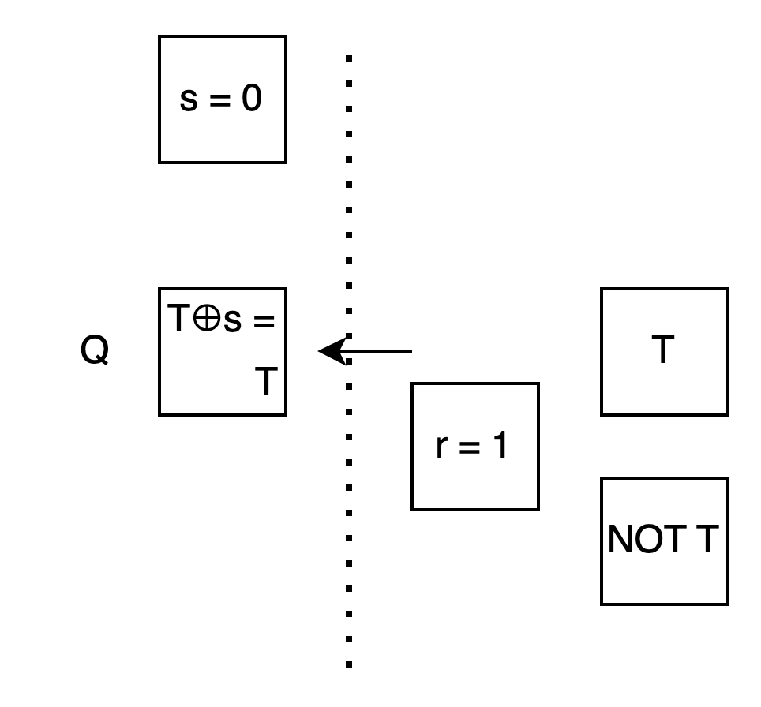

# OT Extension (IKNP)

Bob: Hi Alice.

Alice: Hi Bob. 今天想討論什麼嗎?

Bob: 上次在 Garbled Circuit 那邊看到 Oblivious Transfer 之後, 我又找了一下資料. 看到一個有趣的東西叫做 IKNP 的 OT Extension, 想找你討論看看.

Alice: 好啊, 我也查一下資料...

Alice: 好了. 你還記得上次討論的 OT 嗎?

Bob: 記得啊. 就是你有兩個 message, 我選 0 就看到 message0, 我選 1 就看到 message1. 但是我看不到你的另一個 message, 你也不知道我選了哪個 message 來看.


Alice: 那你覺得 OT Extension 在做什麼呢?

Bob: 如果今天你有 100 萬組訊息要讓我挑, 那我們就得進行 100 萬次 OT, 成本比較高.

有幾個叫 IKNP 的人就想: 有沒有可能只做比方說 1000 次 OT, 再加上一些設計, 就能達到本來 100 萬次 OT 的效果呢?

我們來扮演一下裡面的角色, 確認一下理解怎麼樣?

Alice: 好. 我當 Alice... 呃不是, 我當 Sender, 你當 Receiver.

Bob: OK. 我們先不看 100 萬組訊息, 先只看一組訊息.

作為 receiver, 我用一個秘密的 bit r 代表我想拿哪個訊息. 而 T 代表我生出的一個 random bit string.

如果我有辦法
- 用 r 來控制 T 出現在你那邊的位置 0 還是位置 1 上面
- 且另外一個空位放上我不知道的 bit string

那就可以拿來做 OT 了: 只要你把 message 用對應的 bit string 加密送給我, 我就只能唯一解出那個用 T 加密的 -- 也就是 r 指到的那個 message 了.



Alice: 我們再更簡化一點, 先把 T 縮到只有一個 bit 來看.

作為 sender, 我生出一個秘密的 random bit s.

因為你不知道 s, 所以 T⊕s 你應該也不知道.

如果我能算出 T⊕s 的話, 就能當成你不知道的 unknown bit 來放在另一格.


我們觀察上下兩格的關係: 不論 r 是 0 還是 1, 上面那格 ⊕s 總是能得到下面那格.

如果把上面那格取名為 Q, 那下面那格就是 Q⊕s .


我們可以把原來的問題轉成: 專心看 Q, 看要怎麼用 r 控制 Q 那格出現 T 還是 T⊕s .


Bob: 整理一下: 我們剛剛從 100 萬組 message 縮到一組, 從兩個 bit string 縮到兩個 bit, 再聚焦到上面那個 bit Q 如何被 r 控制成 T 或 T⊕s , 這樣 Q⊕s 就會是反過來的 T⊕s 或 T. 只要你把 message 用 Q 和 Q⊕s 加密後送給我, 我就只能開出 T 所在的那個 message, 也就達成 OT 了.

但是話又說回來, 我的 r 和 T 不能讓你知道, 你的 s 也不能讓我知道.

Alice: 嗯嗯. 如果我明確知道我拿的是 T 還是 T⊕s , 那我就知道 r 了, 這樣就違反了 OT 的需求.

Bob: 反過來看, 如果我知道你的 s 的話, 我就能解開 T 和 T⊕s 加密的兩個 message, 也違反了 OT 的需求.

那到底要怎麼在我不知道 s, 你不知道 r 的情況下, 讓你算出:
```
Q = T   if r = 0
Q = T⊕s if r = 1
```
這要怎麼做呢? 就是用...

Alice: 等你說

Bob: 一起說...

Alice, Bob: 反向 OT !

Alice: (好中二...) 先回到反向 OT.

Bob: 反向 OT.

也就是我暫時當 sender, 你暫時當 receiver.

不論 r 是 0 還是 1, 我都準備兩個箱子讓你用 s 選, 只是箱子的內容會隨著 r 而變.

先看 case r = 0: 我想讓你算出 T, 所以我準備兩個箱子, 裡面都是 T.

Alice: 我用 s 挑箱子, 不管選 0 選 1, 因為內容一樣, 所以一定都選到 T.


Bob: 再看 case r = 1: 我想讓你算出 T⊕s . 但我不知道 s. 所以我想:

假設 s 是 0 時你會挑第 0 個箱子, 所以我先把 T⊕s = T⊕0 = T 放第 0 個箱子.

假設 s 是 1 時你會挑第 1 個箱子, 所以我先把 T⊕s = T⊕1 = NOT T 放第 1 個箱子.

Alice: 這樣我用 s 的值去挑箱子, 不管選第 0 個還是第 1 個, 內容剛好都會是 T⊕s !



Bob: 對你來說, 這兩個 case 進行的動作都一樣, 就是用 s 的值來挑箱子. 也就是反向我當 sender 你當 receiver, 用 s 來進行 OT.

Alice: 雖然好像我用 s 作了選擇, 但讓我算出 T 還是 T⊕s 又還是基於你的 r 所作的選擇.

Bob: 這是 "我們" 的選擇.

Alice: 另外就像我這邊的兩個值總是能表示成 Q 和 Q⊕s 一樣, 你那邊也總是可以表示成 T 和 T⊕r .

Bob: 嗯嗯. 這樣稱呼起來也比較方便.


Alice: 這樣核心的部分講的差不多了. 我們再整理一下.

Bob: 好. 一開始我想從你那邊收到 message0 或 message1, 我 r 這個 bit 來指定.

我先 random 出一個你不知道的 bit T 放上面那格, 計算出 T⊕r 放下面那格.

Alice: 我接著 random 出一個你不知道的 bit s. 用 s 和你反向 OT.

雖然我不知道你的 r, 但效果上我會隨著 r 而拿到 T 或 T⊕s . 我把結果放在上面 Q 那格.

然後我計算出 Q⊕s 放下面那格. 這樣兩格會是 (T, T⊕s) 或是 (T⊕s, T).

我用他們分別對 message0 和 message1 加密後送給你.

Bob: 我雖然知道 T, 但不知道 T⊕s, 所以我只能解開其中一個, 也就是藉由 r 控制位置的, 用 T 加密的那個 message.

Alice: 我來寫個程式...

Alice: 好了, 就像這樣. 左邊是我, 右邊是你. 紅色是 0, 藍色是 1 :



<a href="1D.html" target="_blank">(Open in a new window)</a>


Alice: 呼, 這樣講了半天, 我們才傳了一組 message. 而且用 1 個 bit 來加密一點也不安全.

Bob: 我們需要用更多 bits 來加密.

Alice: 也就是你的 T 和我的 s 都要變長, 要多做幾次 OT.

等我一下...

好了! 像這樣:



<a href="2D.html" target="_blank">(Open in a new window)</a>

Bob: 因為一整條 T⊕r 都是用同一個 bit r 來準備的, 和 T 會是兩條相同或兩條相反. 所以你做完幾次 OT 之後, Q 會是一整條 T 或是一整條 T⊕s .

Alice: 我再把整條 Q 來 ⊕s , 這樣 (Q, Q⊕s) 就會是兩條 (T, T⊕s) 或是 (T⊕s, T), 可以安全的加密一組訊息了.

Bob: 再來就是關鍵的最後一步. 看要怎麼用這些少量的 OT 達到原來大量 OT 的效果.

我們把 1 個 bit 的 r 恢復成很多個 bits, 然後...

Alice: 先看程式好了, 像這樣:



<a href="3D.html" target="_blank">(Open in a new window)</a>

Bob: 這裡對於每一個 r, 我生出對應的 T 和 T⊕r. 讓你用 s 垂直的每次選走一整個 column.

Alice: 因為每一層你準備的 T 和 T⊕r 都是根據那層的 r 做出來的, Q 也都是我用 s 反向 OT 的, 所以每層也都是 (T, T⊕s) 或是 (T⊕s, T) .

Bob: 嗯嗯, 我檢視過每一層, 的確 T 都出現在 r 所指的位子上.

Alice: 我們雖然只進行了少量的 OT, 但是因為每次選了垂直的大量的 bits, 所以一下就把 Q 和 Q⊕s 給填滿了.

這樣每一層的兩個 message 都能用 (T, T⊕s) 或是 (T⊕s, T) 加密後送給你, 大量的 OT 就完成了! 耶!

Bob: 謝謝你和我討論, 我覺得清楚多了!

Alice: 也謝謝你!

<script>
function resizeImg(i) { i.style.width = (i.naturalWidth * 0.25) + "px"; }
function resizeAllImg() { document.querySelectorAll(".to-be-resized").forEach(resizeImg); }
window.addEventListener("load", resizeAllImg);
</script>