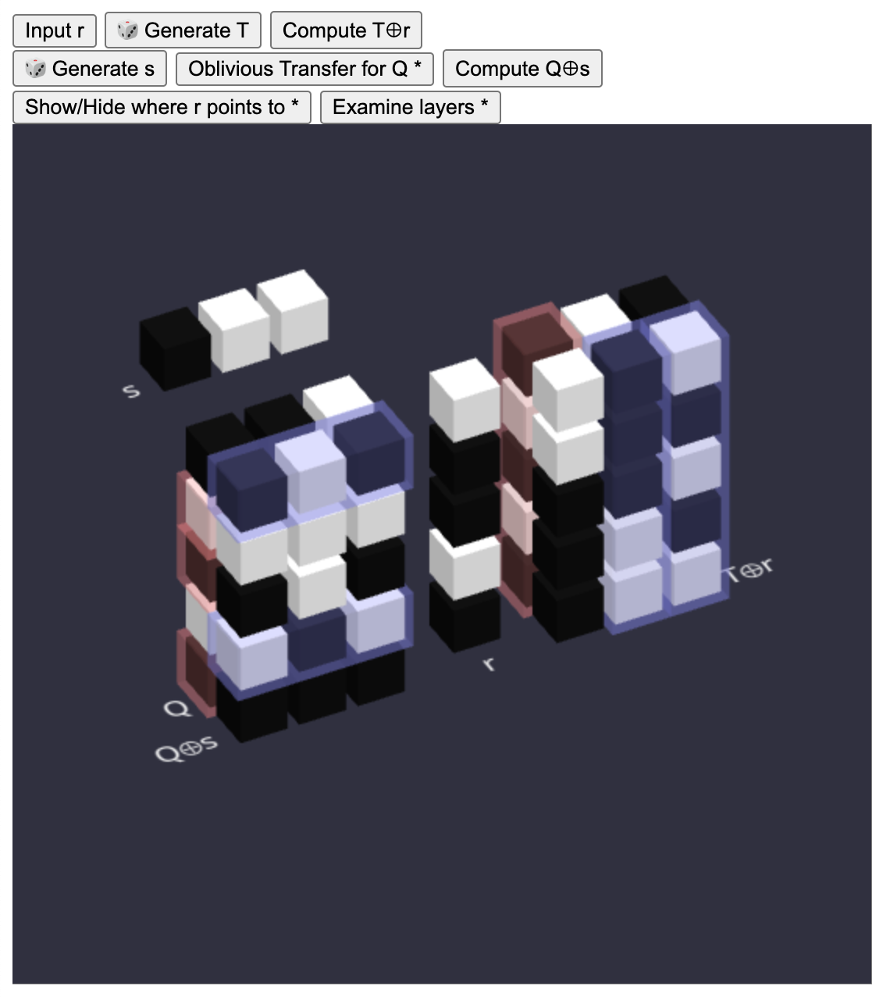

# IKNP OT Extension

在上一篇中我們討論了怎麼利用 public key cryptography 來實作 1-out-of-2 OT.

但是當我們想進行大量的 OT 時, public key 的作法就比較昂貴了.

OT Extension 的想法是: 能不能用少量的貴的 public key 的 OT (base OT), 搭配便宜的 symmetric-key operations, 來降低大量 OT 的成本?

對於 Sender 想要送的每一個 message pair, 我們想辦法在其中一個由 Receiver 指定的位置上, 製造出一個 Receiver 知道的 symmetric key, 而另一個位置對 Receiver 來說是 random string. Sender 用這兩個 string 為 key 來 encrypt messages, Receiver 就只能解開其中一個.

只要我們能大量且便宜的製造很多這樣的 keys, 就可以降低整體的成本.

像上面的圖中, 左邊是 Sender 端. 我們想在其中 5 個由 Receiver 指定的位置上 (01101) 製造出 5 把 key, 每把 key 有 3 個 bit.

而實作上我們在右邊 Receiver 端做了 3 次 reverse OT, 每次傳垂直的 5 個 bit.

這個 `(5, 3) -> (3, 5)` 的轉換, 就是節省 public key opeartion 次數的關鍵.

詳細的文章在[這裡](OT3D/story-OT-Extension-zh-TW.md).

單獨的工具展示在[這裡](https://lcamel.github.io/MPC-Notes/OT3D/).

工具的 source code 在[這裡](https://github.com/LCamel/MPC-Notes/tree/main/OT3D). MIT license, 歡迎使用.

