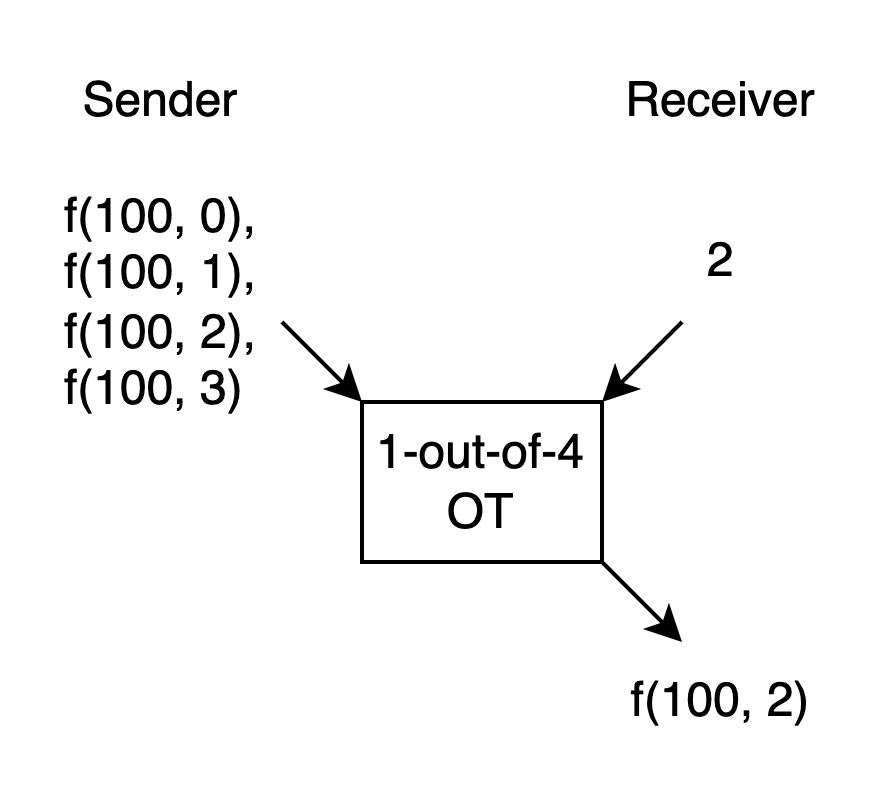
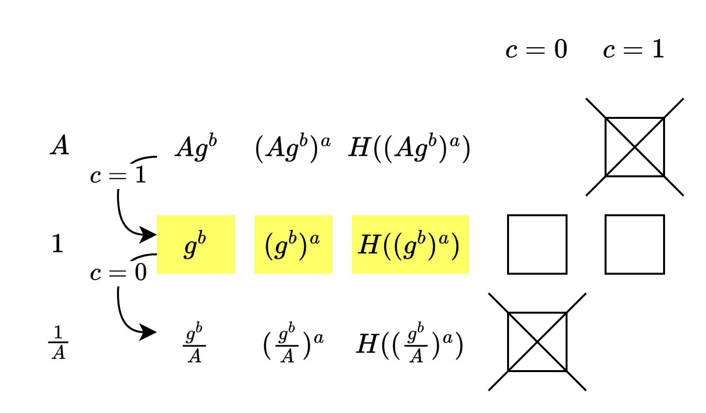

# Oblivious Transfer

Oblivious Transfer (OT) is a method of sending and receiving messages, with various flavors. Although different flavors have different functionalities, the common point is that the Sender doesn't know what the Receiver received. Below, we introduce 1-out-of-2 OT.

As shown in the image above, the Receiver has a choice bit. 
If the choice bit is 0, the Receiver will only get output m0, and won't get any information about m1. 
If the choice bit is 1, the Receiver will only get output m1, and won't get any information about m0. 
The Sender has no idea whether the Receiver got m0 or m1, meaning they can't get any information about the choice bit.

In the following text, if not specified otherwise, OT refers to 1-out-of-2 OT.

## Use Cases

We've seen OT in Garbled Circuit before, where it's used to allow the Evaluator to receive the wire label determined by their input bit from the Generator side. The Evaluator can't get information about the other label, and the Generator can't get information about the Evaluator's input bit.

OT itself, without GC or other protocols, can also be used for MPC. (Ignoring efficiency)

Suppose there's a function f(x, y), where the Sender knows x and the Receiver knows y.
Let's assume y only has four possible values: 0, 1, 2, 3. Let's say x is 100.
If we have a 1-out-of-4 OT, we can use it like this:

The Sender doesn't know what the Receiver's y is, so they calculate f for all possible y values, letting the Sender choose using y.

This way, apart from the function output itself, no additional information about x and y is leaked. However, this only works when y has very few possible values.

The IKNP OT Extension that we'll introduce later subtly uses this approach, which I find very interesting.

## Implementation

The spec for 1-out-of-2 OT is simple, but in pursuit of efficiency, various implementation techniques have been developed over the years. For example, Figure 3.6 in the book shows one such approach.

I imagine this approach as: In the final step, the Sender gives the Receiver two boxes containing messages, but only one can be opened.

To allow the Receiver to choose the message, the two boxes were initially prepared by the Receiver: one can be opened after being closed, while the other can't be opened once closed. The arrangement order determines which message the Receiver want to receive, and the Receiver send the two open boxes to the Sender.

The Sender puts m0 and m1 in the boxes in order and sends them to the Receiver. The Receiver can only open one of them, but not both.

At first, I wondered: What if the Receiver prepares two boxes that can both be reopened? 
Then I realized: It doesn't matter because we're now in a semi-honest model, so the Receiver will follow the protocol and won't deviate from it.

Initially, I wondered: Why does the Receiver prepare a pair of pk and sk in the book, and separately sample pk'? Why can't they prepare pk sk pk' sk', and then discard sk', since the Receiver is honest? 
Then I realized: This won't work. Because if sk' is generated during the process, even if it's honestly discarded, it might have already been eavesdropped by malicious actors in the Receiver's environment. This is not secure.

## Another Implementation (Not in the Book)

[Chou and Orlandi](https://eprint.iacr.org/2015/267.pdf) proposed a 1-out-of-2 OT concept similar to Diffie-Hellman, which is also worth referencing.

The approach shown in their Fig. 1 can be understood as follows:

It can be seen as: The Receiver controls whether a value known to them appears in position 0 or position 1. But they don't know what the value in the other position is, so if the Sender encrypts using these two values, the Receiver can only decrypt one message. The Sender also can't distinguish where the Receiver put this known value, so they don't know the Receiver's choice bit.

The IKNP OT Extension that we'll introduce later also uses a similar technique.

In the next article, we'll look at IKNP OT Extension.

----

## Postscript (optional)

When I first looked at OT, I didn't pay attention to the different flavors of OT, so when reading articles, I often felt a sense of disconnect. This is something to be careful about.

Initially, [the earliest OT](https://eprint.iacr.org/2005/187.pdf) was proposed by Rabin. The Sender only had one message, but it was like transmitting on a noisy line - the Receiver had a 50% chance of receiving the message and a 50% chance of receiving noise. The Sender didn't know whether the Receiver actually received it or not.

In [an interview](https://amturing.acm.org/pdf/RabinTuringTranscript.pdf), Rabin said:

"... the solution used the following seemingly impossible construct, which later on I named oblivious transfer. I have a secret and I conduct a protocol with you and at the end of that protocol, with probability exactly 1/2, you either have or do not have the secret (you, of course want to have the secret) and I have no idea whether you got it or not ..."

This OT approach is based on Quadratic Residue. You can appreciate it when you have time.

There's also an article by Crépeau [here](https://web.cs.ucla.edu/~rafail/TEACHING/SPRING-2005/WEB-RESOURCES/OT.pdf) that introduces how Rabin's OT and the 1-out-of-2 OT introduced above can implement each other (ignoring efficiency). 
Ostrovsky has written a high-level [introduction](https://web.cs.ucla.edu/~rafail/PUBLIC/OstrovskyDraftLecNotes2010.pdf) to this proof. 
I think it's enough to know they're equivalent, not necessarily to look at the details.

Kilian's [article](https://dl.acm.org/doi/10.1145/62212.62215) asks some questions, like "Suppose we have some way of breaking the knowledge symmetry condition. What problems become tractable?" "Can knowledge symmetry be implemented and used as a building block in multiparty scenarios? 
I'm not yet at a level to finish reading this article, but I like his questions. (Haha)

