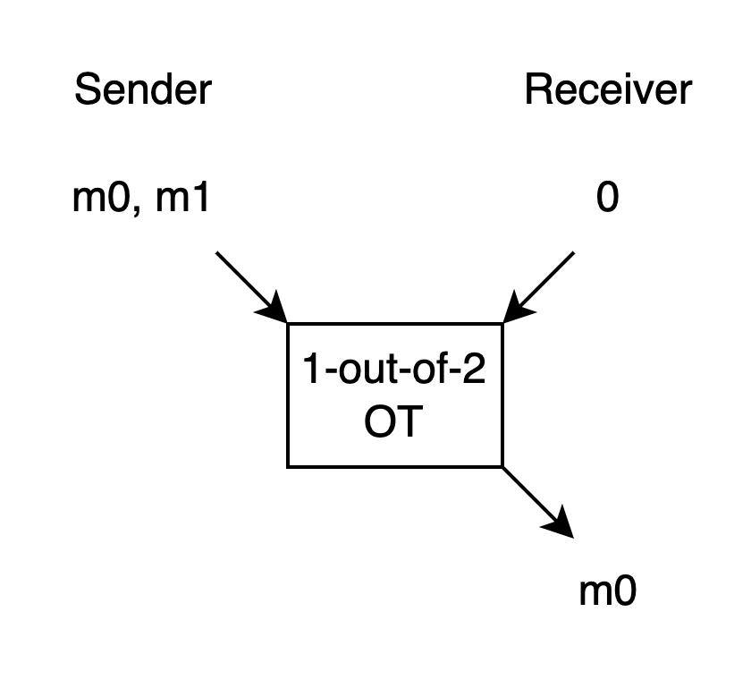
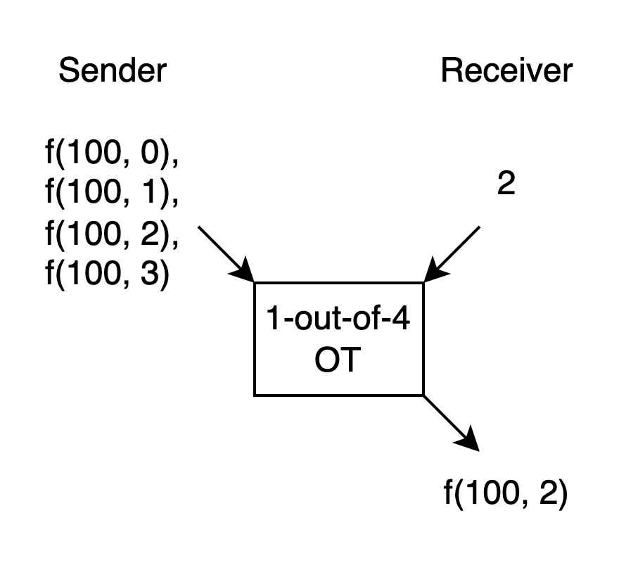
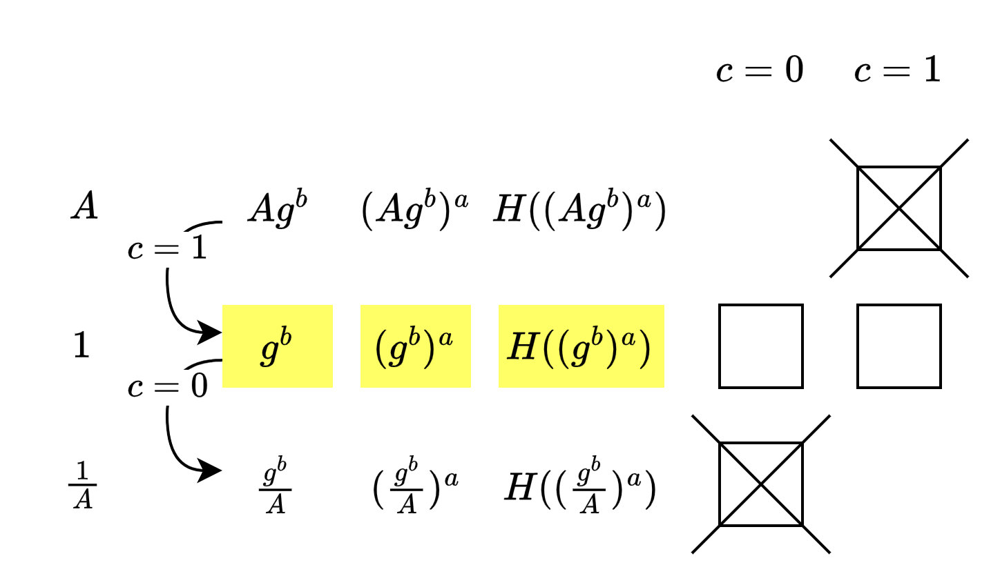

# Oblivious Transfer

Oblivious Transfer (OT) 是一種收送訊息的方法, 有很多種口味(flavour). 雖然眾多口味的功能不一樣, 但共通點是 Sender 不知道 Receiver 收到了什麼. 以下介紹 1-out-of-2 OT.

如上圖, Receiver 有一個 choice bit. 
如果 choice bit 是 0, Receiver 就只會拿到 output m0, 而且拿不到 m1 的任何一點資訊. 
如果 choice bit 是 1, Receiver 就只會拿到 output m1, 而且拿不到 m0 的任何一點資訊. 
而 Sender 完全不知道 Receiver 拿到 m0 還是 m1, 也就是拿不到 choice bit 的任何一點資訊.

下文中如果沒有特別講, OT 就指 1-out-of-2 OT.

## 用場

先前我們在 Garbled Circuit 看過 OT, 是用來讓 Evaluator 可以從 Generator 端收到自己 input bit 選定的 wire label. Evaluator 拿不到另一個 label 的資訊, Generator 也拿不到 Evaluator input bit 的資訊.

而光是 OT 本身, 不用 GC 或其他 protocol, 也可以拿來做 MPC. (不考慮效能的話)

假設有個 function f(x, y), Sender 知道 x, Receiver 知道 y.
假設 y 只有 0 1 2 3 四個可能的值好了. 假設 x 是 100.
如果我們有個 1-out-of-4 OT, 就可以這樣使用:

Sender 不知道 Receiver 的 y 是多少, 於是對所有的 y 都算一遍 f, 讓 Sender 用 y 來選.

這樣除了 function output 本身以外, 不會多洩漏 x 和 y 的資訊. 不過這只有在 y 可能的值很少的時候才能這樣全算一遍.

後面會介紹的 IKNP OT Extension 隱隱地用了這個作法, 我覺得很有意思.

## 實作

1-out-of-2 OT 的 spec 很簡單, 不過為了追求效能, 多年來發展出了各種各樣的實作技巧. 像書中 Figure 3.6 就是其中一種作法.

我把這個作法想像成: Sender 在最後一步送給 Receiver 兩個裝著 message 的箱子, 而只有一個能被打開.

為了讓 Receiver 選定 message, 所以兩個箱子當初是由 Receiver 準備的: 一個關上還能打開, 一個關上就打不開了. 用排列順序決定他想收哪個 message, 把兩個開著的箱子送給 Sender.

Sender 把 m0 m1 依序裝箱, 傳給 Receiver. Receiver 就只能開出其中一個, 但無法兩個都開.

我一開始想: 如果 Receiver 準備兩個都能再開的箱子怎麼辦? 
後來想: 沒關係, 因為我們現在是在 semi-honest 的 model 下, 所以 Receiver 會照著 protocol 走, 不會有這種偏離(deviate)的行為.

我一開始想: 書中為什麼 Receiver 準備一組 pk sk, 另外單獨 sample 了 pk' ? 為什麼不能準備 pk sk pk' sk', 然後把 sk' 丟掉就好, 反正 Receiver 是 honest 的? 
後來想: 這樣不行. 因為如果過程中 sk' 被生出來了, 即便誠實地丟掉, 也可能已經被 Receiver 環境中的壞人偷聽走了. 這樣不安全.

## 另一個實作 (不在書中的)

[Chou and Orlandi](https://eprint.iacr.org/2015/267.pdf) 提了一個概念類似 Diffie-Hellman 的 1-out-of-2 OT 也可以參考.

在其 Fig. 1 展示的作法, 我覺得可以這樣理解:

可以看成: Receiver 控制一個自己知道的值出現在位置 0 還是位置 1. 但他不知道另一個位置的值是什麼, 所以 Sender 用這兩個值加密的話 Receiver 只能解開一個訊息. 而 Sender 也分不出 Receiver 把這個已知值放在哪, 所以不知道 Receiver 的 choice bit.

後面會介紹的 IKNP OT Extension 中也有類似的手法.

下一篇, 我們來看 IKNP OT Extension.

----

## 後記 (optional)

一開始看 OT 的時候, 我沒有注意到 OT 的不同口味(flavour), 所以看文章常常有種牛頭不對馬嘴的感覺. 這點要小心.

一開始[最早的 OT](https://eprint.iacr.org/2005/187.pdf) 是 Rabin 提出的. Sender 只有一個 message, 但就像是在一個有噪音的線路上傳遞一樣, Receiver 有一半的機會收到訊息, 一半的機會收到雜訊. 而 Sender 不知道 Receiver 到底收到沒有.

在[一段訪談中](https://amturing.acm.org/pdf/RabinTuringTranscript.pdf) Rabin 說到:

"... the solution used the following seemingly impossible construct, which later on I named oblivious transfer. I have a secret and I conduct a protocol with you and at the end of that protocol, with probability exactly 1/2, you either have or do not have the secret (you, of course want to have the secret) and I have no idea whether you got it or not ..."

這個 OT 的作法是基於 Quadratic Residue 的. 有空可以去欣賞.

也有一篇 Crépeau [的文章](https://web.cs.ucla.edu/~rafail/TEACHING/SPRING-2005/WEB-RESOURCES/OT.pdf) 介紹 Rabin 的 OT 怎麼和上面介紹的 1-out-of-2 OT 彼此互相 implement (不考慮效能的話).  
這個證明 Ostrovsky 有寫過 high level 的[介紹](https://web.cs.ucla.edu/~rafail/PUBLIC/OstrovskyDraftLecNotes2010.pdf).  
我覺得知道彼此等價就好, 不見得要細看.

Kilian [的文章](https://dl.acm.org/doi/10.1145/62212.62215) 問了一些問題, 像 "Suppose we have some way of breaking the knowledge symmetry condiction. What problems become tractable?" "Can knowledge symmetry be implemented and used as a building block in multiparty scenarios? 
我程度還不夠看完這篇, 但我喜歡他的提問. (哈哈哈)

