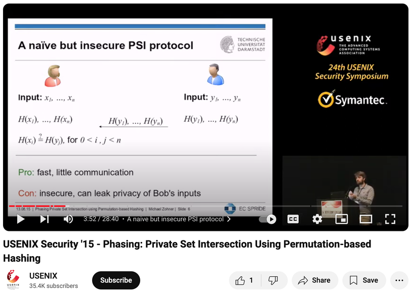

# PRF / OPRF / PSI

## Function

A function can be expressed by a formula or by a table.

For example, a boolean function with 2 inputs:

```
XOR
0 0 0
0 1 1
1 0 1
1 1 0
```

We have 2 * 2 inputs, and each input has exactly one output.

So, how many "boolean functions with 2 inputs" are there?

Each row has 2 possible outputs, so there are 2^4 such functions.

## Random Function

### Definition 1

We fill out 2^4 tables, randomly choose one from them, which means we've chosen a random function.

### Definition 2

We take a blank table with 4 rows. For each row, we randomly choose an output. Fill all 4 rows.

### Definition 3

We take a blank table with 4 rows. We don't fill it at first.<br>
When someone asks for a certain input, if the output is empty, we randomly fill in an output.<br>
If it's not empty, we return the previously filled output.

These three definitions are equivalent.

## Pseudorandom Function (PRF)

When the range of input and output is very large, the table of a random function will be very large. (exponential)

Definitions 1 and 2 are both space-consuming. Even with definition 3, it still requires space to record.

In 1986, Goldreich - Goldwasser - Micali proposed the concept of "Pseudorandom Function".

F(key, x)

Given a key, we can get a function with only a single argument, and this function behaves almost the same as a random function, making it difficult to distinguish the difference.

F(1, x) is very similar to a random function. It's a pseudorandom function.<br>
F(2, x) is very similar to a random function. It's a pseudorandom function.<br>
...<br>
(F is a pseudorandom function ensemble indexed by key)

We only need the space of one key, and it's as if we've obtained an entire table filled with random values. It's convenient for storage and transmission.

### Collision

Because each output is randomly selected, it's possible that f(x) = f(y) but x != y . (for a fixed key)

However, if the output bits of f are long enough, the probability of this situation becomes negligible.<br>
We can almost say that f(x) = f(y) => x = y .

### One-way function

Fix the key. Given a value v, the probability of finding an x such that f(x) = v is also negligible. (Assuming the output is long enough and there are enough inputs)

## Oblivious Pseudorandom Function (OPRF)

This enters the realm of MPC.

The Sender knows the key.<br>
The Receiver knows x.<br>
We want to compute F(key, x) without leaking the key and x<br>
In the end, the Receiver gets F(key, x). The Sender doesn't get anything.

This can be calculated using a generic MPC protocol. However, a custom protocol should be faster.

## Private Set Intersection (PSI)

One party, the Sender, has set X = {x1, x2, ... xn}<br>
The other party, the Receiver, has set Y = {y1, y2, ... yn}

The two want to know which elements X and Y have in common (X ∩ Y). Elements not in X ∩ Y will not be leaked.

## Implementing PSI using OPRF

Like OPRF, PSI has many implementation methods. Here we introduce the OPRF-based approach proposed by [Hazay and Lindell](https://eprint.iacr.org/2009/045.pdf) in 2008:

1. The Sender uses the same key to compute F(key, y1), F(key, y2) ... , F(key, yn) with the Receiver using OPRF.
2. The Sender uses the same key to compute F(key, x1), F(key, x2) ..., F(key, xn) by themselves, and sends all of them to the Receiver.
3. The Receiver judges: if F(key, y) = F(key, x), then y = x. This means y is also in X. Publish these y's. (assuming the collision probability is very small)

Because it's oblivious, the key and y won't be leaked. Because it's one-way and has a key, x won't be leaked either.


----
## Afterword

1. We not only pretend that PRF is RF, but we also pretend that PRF exists. (Currently, there's no theoretical proof that PRF exists)
2. Neither the book nor Lindell's [article](https://dl.acm.org/doi/pdf/10.1145/3387108) emphasize the low chance of collision. When I first read it, I thought: Wouldn't this lead to false positives? (confused)
3. There are many approaches to PSI and OPRF. You can refer to "Private set intersection: A systematic literature review" and "SoK: Oblivious Pseudorandom Functions".
4. What if we use a simple hash function instead of OPRF here, letting the Sender send all `hash(a)` to the Receiver for comparison? Although hash is one-way, it would still leak information.<br>
So here, like a commitment scheme, in addition to the input, it's paired with a secret value (key). And instead of transmitting the key to the other party, OPRF is used.

<a href="https://www.youtube.com/watch?v=1k4HRtJhOOc#t=3m">

</a>
