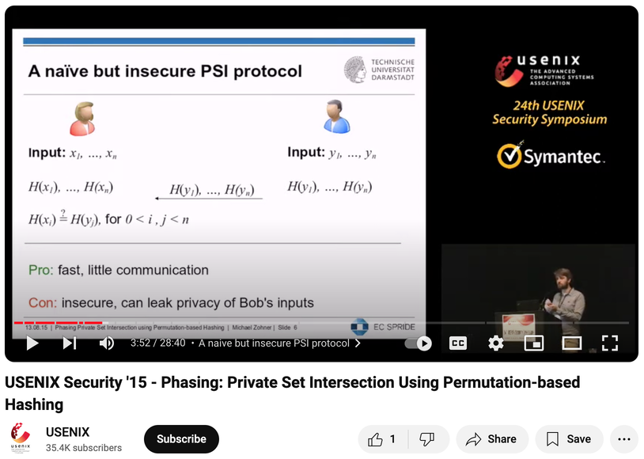

# PRF / OPRF / PSI

## Function

Function 可以用公式表達, 也可以用 table 表達.

以 2 個 input 的 boolean function 為例:

```
XOR
0 0 0
0 1 1
1 0 1
1 1 0
```

我們有 2 * 2 個 input, 每個 input 都有恰一個 output.

那, 有多少個 "2 個 input 的 boolean function" 呢?

每個 row 的 output 有 2 種填法, 所以有 2^4 個這樣的 function.

## Random Function

### 定義 1

我們填好 2^4 張表格, 從中 random 挑一張, 也就是挑了一個 function.

### 定義 2

我們拿一張 4 個 row 的空白表格. 在每個 row randomly 挑一個 output. 填滿全部 4 個 row.

### 定義 3

我們拿一張 4 個 row 的空白表格. 先不填.<br>
有人問某個 input 時, 如果 output 是空的, 就 randomly 填一個 output.
如果不是空的, 就回先前填過的 output.

以上三個定義是等價的.

## Pseudorandom Function (PRF)

當 input output 的範圍很大時, random function 的表格會很大. (exponential)

定義 1 2 都超花空間. 就算用定義 3, 也是要花空間來記載.

在 1986 年, Goldreich - Goldwasser - Micali 提出了 "Pseudorandom Function" 的概念.

F(key, x)

給定 key, 可以得到一個只有單一 argument 的 function, 這個 function 和 random funciton 的行為幾乎一樣, 很難分辨出差異.

F(1, x) 很像 random function. 是個 pseudorandom function.<br>
F(2, x) 很像 random function. 是個 pseudorandom function.<br>
...<br>
(F 是個 pseudorandom function ensemble indexed by key)

我們只要用一個 key 的空間, 就好像得到了一整張填滿 random value 的 table. 儲存/傳送都很方便.

### Collision

因為每個 output 都是各自 random 選取的, 所以是有可能 f(x) = f(y) 但 x != y . (for a fixed key)

但如果 f 的 output bits 夠長, 這種情況的機率就小到可以忽略.<br>
我們幾乎可以說 f(x) = f(y) => x = y .

### One-way function

固定 key. 給一個 value v, 能找出 x 使得 f(x) = v 的機率也小到可以忽略. (前提是 output 夠長, input 夠多)

## Oblivious Pseudorandom Function (OPRF)

這裡進入 MPC 的範圍.

Sender 知道 key.<br>
Receiver 知道 x.<br>
想在不洩漏 key 和 x 的情況下, 計算 F(key, x)<br>
最後 Receiver 得到 F(key, x). Sender 沒有得到什麼.

這可以用 generic 的 MPC protocol 來算. 不過 custom 的 protocol 應該比較快.

## Private Set Intersection (PSI)

一個 party Sender 有 set X = {x1, x2, ... xn}<br>
一個 party Receiver 有 set Y = {y1, y2, ... yn}

兩個人想知道 X 和 Y 有哪些共同的 elements (X ∩ Y). 而不在 X ∩ Y 中的 elements 不會被洩漏.

## 用 OPRF 實作 PSI

和 OPRF 一樣, PSI 有很多種實作方法. 這裡介紹 2008 年由 [Hazay 和 Lindell](https://eprint.iacr.org/2009/045.pdf) 提出的, 基於 OPRF 的作法:

1. Sender 用同一個 key, 和 Receiver 用 OPRF 算出 F(key, y1), F(key, y2) ... , F(key, yn).
2. Sender 用同一個 key, 自己算出 F(key, x1), F(key, x2) ..., F(key, xn), 通通送給 Receiver.
3. Receiver 判斷: 如果有 F(key, y) = F(key, x), 則 y = x. 代表 y 也在 X 裡面. 公布這些 y. (collision 機率很小的話)

因為 oblivious, 所以 key 和 y 不會洩漏. 因為 one way 且有 key, 所以 x 也不會洩漏.


----
## 後記

1. 我們不但假裝 PRF 是 RF, 我們還假裝 PRF 存在. (目前沒有理論證明 PRF 存在)
2. 書中和 Lindell 的[文章](https://dl.acm.org/doi/pdf/10.1145/3387108)都沒有強調 collision 機會低. 我一開始看的時候想: 這樣不會有 false positive 嗎? (困惑)
3. PSI 和 OPRF 的作法都非常多. 可以參考 "Private set intersection: A systematic literature review" 和 "SoK: Oblivious Pseudorandom Functions".
4. 如果這邊不是用 OPRF 而是用單純的 hash function, 讓 Sender 送所有的 hash(a) 給 Receiver 去比呢? 雖然 hash 是 one-way, 但應該還是會 leak information.<br>
所以這邊像 commitment scheme 一樣, 除了 input 還搭配了一個 secret value (key). 而 key 不傳給對方, 改用 OPRF.

<a href="https://www.youtube.com/watch?v=1k4HRtJhOOc#t=3m">

</a>
