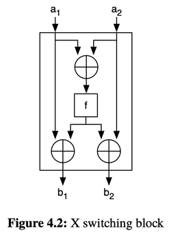
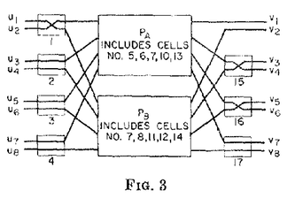

# Permutation Network

## Conditional Swapper (X Switching Block)

Some common functionalities can be optimized through handwritten circuits. The conditional swapper is one such example.

The desired functionality is as follows: use a control bit p to determine whether to swap a1 and a2:
```
if (p) {
    b1 = a2  // swap
    b2 = a1
} else {
    b1 = a1  // do nothing
    b2 = a2
}
```

The swap branch can be thought of as canceling out the original and adding the desired:
```
b1 = a1 XOR a1 XOR a2   // b1 = a1 - a1 + a2
b2 = a2 XOR a2 XOR a1   // b2 = a2 - a2 + a1
```

However, circuits don't have "if" statements, so we need to merge the two branches.<br>
Only modify when p = true. Otherwise, let the original value XOR with 0, which doesn't change it.
```
b1 = a1 XOR   (p AND (a1 XOR a2))
b2 = a2 XOR   (p AND (a2 XOR a1))
```
The last two terms are the same, so they can be shared.

So we arrive at Figure 4.2 in the book. Use p to control whether to swap. (f = p AND (a1 XOR a2))



### Garbled Circuit

Let's look at this swapper from a Garbled Circuit perspective.<br>
If we apply FreeXOR, then this circuit only has the cost of one AND gate.<br>
If in certain scenarios the control bit p is known, we can apply half gate, requiring only one ciphertext.

## Waksman Network

We can also look at the swapper above from the perspective of a permutation network.<br>
If we have inputs a1 a2, the possible permutations are a1 a2 and a2 a1.<br>
Can we have a circuit that arranges the inputs into any permutation we want?<br>
Yes, we can.<br>
If we set the Swapper's control bit to 0, it will produce the permutation a1 a2.<br>
If we set the Swapper's control bit to 1, it will produce the permutation a2 a1.

What if we have more than 2 inputs?

The [Waksman Network](https://dl.acm.org/doi/pdf/10.1145/321439.321449) is a type of permutation network.<br>
For n inputs, it only needs O(n log n) swappers to create any specified permutation.

Here we'll look at the case where n is a power of 2. How to go from 2 to 4, from 4 to 8, and so on.

For example, suppose we have a Waksman network with 4 inputs that can handle all 4! permutations.
Using this 4-input network as a base, how can we expand it to handle 8 inputs?

The method is as shown in [the original paper](https://dl.acm.org/doi/pdf/10.1145/321439.321449)'s Fig. 3:



Place two 4-input networks in the middle, and put 2-input networks for every two inputs and every two outputs on the sides. The top right one can be omitted.<br>
Connect the top of the side 2-input networks to the top of the middle 4-input networks, and the bottom to the bottom.<br>
Then start from the top right, move from right to left, from left to right, until a cycle is formed.<br>
Repeat the above steps until all cycles are completed.<br>
It's recommended to manually calculate using the example from the original paper. (The "constructive proof" section)
```
1 2 3 4 5 6 7 8
2 7 6 8 4 3 1 5
```

I made a [short video](https://www.youtube.com/watch?v=9mdrYD_ZBvY) that you can refer to.

<a href="https://www.youtube.com/watch?v=9mdrYD_ZBvY">

</a>