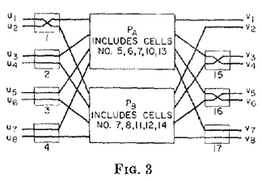

# Permutation Network

## Conditional Swapper (X Switching Block)

有些常用的功能可以透過手寫的 circuit 來 optimize. Conditional swapper 是其中一個例子.

想要的功能像這樣: 用一個 control bit p 來控制要不要 swap a1 a2:
```
if (p) {
    b1 = a2  // swap
    b2 = a1
} else {
    b1 = a1  // do nothing
    b2 = a2
}
```

Swap 的 branch 可以想成消掉原來的再加上想要的:
```
b1 = a1 XOR a1 XOR a2   // b1 = a1 - a1 + a2
b2 = a2 XOR a2 XOR a1   // b2 = a2 - a2 + a1
```

但 circuit 沒有 "if", 所以要把兩個 branch 合併.<br>
p = true 才修正. 否則就讓原來的 value 去 XOR 0, 不動.
```
b1 = a1 XOR   (p AND (a1 XOR a2))
b2 = a2 XOR   (p AND (a2 XOR a1))
```
後面兩個 term 是一樣的, 可以共用.

所以我們得到了書中的 Figure 4.2. 透過 p 來控制要不要 swap. (f = p AND (a1 XOR a2))


### Garbled Circuit

從 Garbled Circuit 觀點來看這個 swapper.<br>
如果套用 FreeXOR, 則這個 circuit 只有一個 AND gate 的成本.<br>
如果某些場景 control bit p 是已知的, 則還可以套用 half gate, 只要一個 ciphertext.


## Waksman Network

我們也可以從 permutation network 的角度來看上面的 swapper.<br>
如果有 input a1 a2, 則可能的 permutation 有 a1 a2 和 a2 a1.<br>
我們能不能有一個 circuit, 把 input 排成任何一個我們想要的 permutation?<br>
可以.<br>
如果設定 Swapper 的 control bit 為 0, 就會產出 a1 a2 這個 permutation.<br>
如果設定 Swapper 的 control bit 為 1, 就會產出 a2 a1 這個 permutation.

那如果 input 不只 2 個呢?

[Waksman Network](https://dl.acm.org/doi/pdf/10.1145/321439.321449) 是一種 permutation network.<br>
對於 n 個 input, 只要用 O(n log n) 個 swapper 就能做出任意指定的 permutation.

這邊我們看 n 為 power of 2 的情況. 怎麼從 2 的做出 4 的, 從 4 的做出 8 的, ...

舉例來說, 假設我們有 input 為 4 的 Waksman network, 能處理所有 4! 的 permutation.
利用這個 4 個的為基礎, 要如何擴展到 8 個 input 的呢?

作法如[原 paper](https://dl.acm.org/doi/pdf/10.1145/321439.321449) 的 Fig. 3:



中間放兩個 4 的 network, 旁邊每兩個 input 和每兩個 output 放一個 2 的. 最右上角的可以省.<br>
旁邊 2 的和中間 4 的上面接上面, 下面接下面.<br>
然後開始從右上的開始, 從右走到左, 從左走到右, 直到形成 cycle.<br>
重複上面的步驟, 直到所有 cycles 都走完.<br>
建議用原 paper 的例子手算一遍. ("constructive proof" 那段)
```
1 2 3 4 5 6 7 8
2 7 6 8 4 3 1 5
```

我做了一個[短片](https://www.youtube.com/watch?v=9mdrYD_ZBvY), 可以參考看看.

<a href="https://www.youtube.com/watch?v=9mdrYD_ZBvY">

</a>
