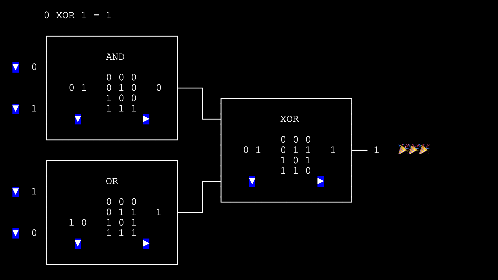

# MPC-Notes

(English)

These are my notes from reading [A Pragmatic Introduction to Secure Multi-Party Computation](https://securecomputation.org/). Most viewpoints come from the book or original papers, supplemented with some personal insights. For some topics, I wrote programs to demonstrate the concepts. If there are any errors, please feel free to point them out. Thank you.

Thanks to the Ethereum Foundation's Learning Grant and to Nam Ngo for reviewing this work.

(Chinese)

Thanks to the Ethereum Foundation's Learning Grant.
這裡是我在讀 [A Pragmatic Introduction to Secure Multi-Party Computation](https://securecomputation.org/) 這本書時的筆記. 主要觀點都來自書中或原 paper, 再補充一些心得. 部分主題另外寫了程式來展示概念. 如有錯誤, 還請不吝指正, 謝謝.

感謝 Ethereum Foundation 的 Learning Grant. 感謝 Nam Ngo 的審閱. 

## Programs

<a href="https://lcamel.github.io/MPC-Notes/boolean-circuit.html">
Boolean Circuit 

</a>
 
 

<a href="https://lcamel.github.io/MPC-Notes/garbled-circuit.html?startFrom=evaluator&w0=0&w3=1">
Garbled Circuit - Evaluator 

</a>
 

<a href="https://lcamel.github.io/MPC-Notes/garbled-circuit.html">
Garbled Circuit - Generator 

</a>
 
 

<a href="https://lcamel.github.io/MPC-Notes/garbled-circuit.html?startFrom=evaluator&w0=0&w3=1&pointAndPermute=1">
Garbled Circuit - Point-and-Permute - Evaluator 

</a>
 

<a href="https://lcamel.github.io/MPC-Notes/garbled-circuit.html?pointAndPermute=1">
Garbled Circuit - Point-and-Permute - Generator 

</a>
 
 

<a href="images/debug.png">
(Learning the inner works) 

</a>
 
 

<a href="https://lcamel.github.io/MPC-Notes/OT3D/">
OT Extension (IKNP) 

</a>
 
 

<a href="https://lcamel.github.io/MPC-Notes/Path-ORAM/Path-ORAM.html">
Path-ORAM 

</a>
 
 

## Study Notes

- [Introduction](./MPC-Intro-en-US.md)
- [Garbled Circuit](./Garbled-Circuit-en-US.md)
  - [Garbled Circuit and Oblivious Transfer (story)](./story-en-US.md)
- [Garbled Circuit Optimization: Point-and-Permute](./Garbled-Circuit-Point-and-Permute-en-US.md)
  - [Point-and-Permute (story)](./story-point-and-permute-en-US.md)
- [Garbled Circuit Optimization: Garbled Row Reduction (GRR3)](./Garbled-Circuit-Garbled-Row-Reduction-GRR3-en-US.md)
- [Garbled Circuit Optimization: FreeXOR](./Garbled-Circuit-FreeXOR-en-US.md)
- [Garbled Circuit Optimization: Half Gates](./Garbled-Circuit-Half-Gates-en-US.md)
- [Oblivious Transfer](./Oblivious-Transfer-en-US.md)
- [IKNP OT Extension](./Oblivious-Transfer-IKNP-en-US.md)
  - [IKNP OT Extension (story)](./OT3D/story-OT-Extension-en-US.md)
- [From Two to Three](./Two-to-Three-en-US.md)
- [GMW / GMW87](./GMW-en-US.md)
- [BGW](./BGW-en-US.md)
- [Shamir's Secret Sharing](./Shamir-Secret-Sharing-en-US.md)
- [Beaver Triple](./Beaver-Triple-en-US.md)
- (draft) [Beaver Triple Generation: The MASCOT Way](./Beaver-Triple-Generation-MASCOT-en-US.md)
- [BMR](./BMR-en-US.md)
- [PRF / OPRF / PSI](./PRF-OPRF-PSI-en-US.md)
- [PSI by PSSZ](./PSI-PSSZ-en-US.md)
- [Permutation Network](./Permutation-Network-en-US.md)
- [Tailored Oblivious Data Structures](./Tailored-Oblivious-Data-Structures-en-US.md)
- [Oblivious RAM (ORAM) / Path ORAM](./ORAM-en-US.md)
- [ORAM and MPC](./ORAM-MPC-en-US.md)
- [Circuit ORAM / Square-Root ORAM](./Circuit-ORAM-Square-Root-ORAM-en-US.md)
- [Point Function / Distributed Point Function](./Point-Function-Distributed-Point-Function-en-US.md)
- [Function Secret Sharing / Distributed Point Function](./Function-Secret-Sharing-Distributed-Point-Function-en-US.md)
- [Malicious Security - Cut-and-Choose](./Malicious-Security-Cut-And-Choose-en-US.md)
- [Malicious Security - Zero-knowledge Proofs](./Malicious-Security-Zero-Knowledge-Proofs-en-US.md)
- [Malicious Secret Sharing - Authenticated Secret Sharing](./Malicious-Security-Authenticated-Secret-Sharing-en-US.md)
- [Authenticated Garbling](./Malicious-Security-Authenticated-Garbling-en-US.md)