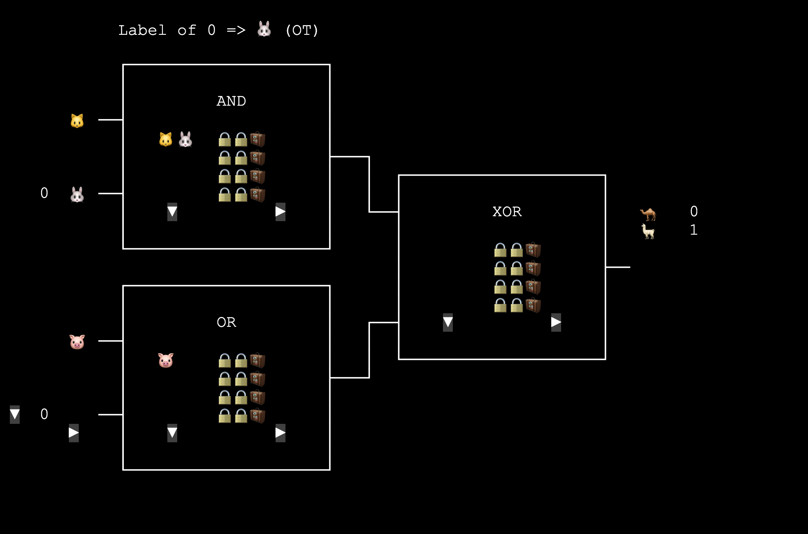

# MPC-Notes

## Programs

<a href="https://lcamel.github.io/MPC-Notes/boolean-circuit.html">
Boolean Circuit 

</a>
 

<a href="https://lcamel.github.io/MPC-Notes/garbled-circuit.html?startFrom=evaluator&w0=0&w3=1">
Garbled Circuit - Evaluator 

</a>
 

<a href="https://lcamel.github.io/MPC-Notes/garbled-circuit.html">
Garbled Circuit - Generator 

</a>
 

<a href="https://lcamel.github.io/MPC-Notes/garbled-circuit.html?pointAndPermute=1">
Garbled Circuit - Point-and-Permute 

</a>
 

<a href="debug.png">
(Learning the inner works) 

</a>
 

## Articles

In English:

[An Introduction to Garbled Circuit and Oblivious Transfer](story-en-US.md)

In Chinese:

[淺談 Garbled Circult 與 Oblivious Transfer](story-zh-TW.md)