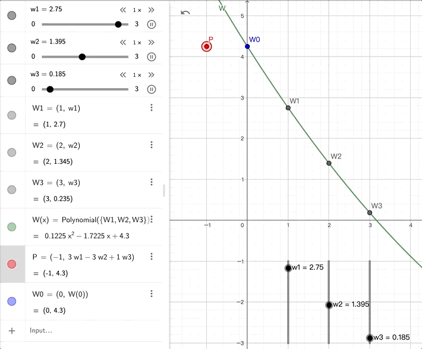

<script>
MathJax = {
  tex: {
    inlineMath: [['$', '$'], ['\\(', '\\)']]
  }
};
</script>
<script type="text/javascript" id="MathJax-script" async src="https://cdn.jsdelivr.net/npm/mathjax@3/es5/tex-mml-chtml.js">
</script>

# Shamir Secret Sharing

There are three parties: A, B, and C.

Previously, we've seen other additive secret sharing schemes, such as:
```
secret = a1 + a2 + a3

secret = a1 ⊕ a2 ⊕ a3
```

Shamir secret sharing, however, uses points on a polynomial that passes through (0, secret) to represent the secret.

## Splitting

First, we assign a fixed x value to each party. For example, A: 1, B: 2, C: 3.

If the secret is p, we find a polynomial P that passes through (0, p), and then substitute 1, 2, 3:
```
p = P(0)   let p1 = P(1)   let p2 = P(2)   let p3 = P(3)

           for party A     for party B     for party C
```

We use the `[]` notation to represent a set of shares. Here, [p] = (p1, p2, p3).

## Combining

We first use Lagrange polynomial interpolation to reconstruct P from p1, p2, p3:

$$P(x) = \frac{(x - 2)(x - 3)}{(1 - 2)(1 - 3)} p1 + \frac{(x - 3)(x - 1)}{(2 - 3)(2 - 1)} p2 + \frac{(x - 1)(x - 2)}{(3 - 1)(3 - 2)} p3$$

Then we substitute x = 0 to get:

$$p = P(0) = 3 p1 + (-3) p2 + 1 p3$$

Because we're only interested in P(x) when x = 0, we can calculate (3, -3, 1) in advance. This only depends on our chosen x values (1, 2, 3) and is independent of p1, p2, p3.

<mark>In other words, reconstructing the secret p from p1, p2, p3 can be a simple weighted sum calculation. (Or a linear combination)</mark>



## A Property That May Not Always Be Used

Since we choose the secret to be at x = 0, p = P(0) = the constant term coefficient of the polynomial P.

## Degree

Unlike the previous additive sharing, Shamir secret sharing requires considering an additional parameter, which is the degree of the polynomial.

Taking a curve with deg() = 2 as an example. Three points can determine a quadratic curve. So leaking 2 points is fine, but leaking 3 points would reveal the secret.

If we use a threshold t to represent "the secret remains safe even with up to t malicious parties", then in the above example, t would be 2. The same as the degree.

That said, a higher degree makes it harder to leak the secret, so shouldn't we make the degree as high as possible?

However, the degree cannot be arbitrarily high. Because each person can only hold one share (i.e., one point), the degree of the polynomial is limited by this constraint throughout the process.

For instance, with 3 parties, we can only determine a quadratic curve. A cubic curve wouldn't work.

Next, let's look at some operations we'll use when designing protocols.

## From c, [p] to [c * p]

If A, B, and C currently have shares of [p], and they all receive a constant c.

Can we let A, B, and C obtain shares of [c * p]?

Yes, we can.

Each party just needs to multiply their share by c, and this new set of shares (c * p1, c * p2, c * p3) becomes a set of shares for [c * p].
(Please prove this yourself using the polynomial c * P)

During this process, A, B, and C don't need to communicate with each other. They also don't need to know the value of p.

## From [p] [q] to [p + q]

Now A, B, and C have shares of [p] and [q].

Can we let A, B, and C obtain shares of [p + q]?

Yes, we can.

Each party just needs to add their two numbers together, and this new set of shares (p1 + q1, p2 + q2, p3 + q3) becomes a set of shares for [p + q].
(Please prove this yourself using the polynomial P + Q)

During this process, A, B, and C don't need to communicate with each other. They also don't need to know the values of p and q.

## From a b c d [p] [q] [r] [s] to [ap + bq + cr + ds]

Now A, B, and C have shares of [p] [q] [r] [s], and they all receive numbers a, b, c, d.

Can we let A, B, and C obtain shares of [ap + bq + cr + ds]?

Yes, we can.

We can achieve this by repeatedly using the two properties mentioned above.
(Or consider the polynomial aP + bQ + cR + dS)

During this process, A, B, and C don't need to communicate with each other. They also don't need to know the values of p, q, r, s.

<mark>In other words, when designing protocols, we can require parties to calculate the weighted sum of shares. (Or a linear combination)</mark>

And because they don't need to communicate with each other, this calculation is very cheap.

Next, let's look at how the BGW protocol utilizes Shamir secret sharing.

----
## Postscript

Originally, the Lagrange interpolation formula was complex, but after setting x = 0, 1, 2, 3, it suddenly became a simple weighted sum. This is similar to the Chinese Remainder Theorem. (The two methods are inherently similar)
