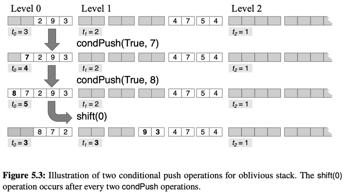

# Tailored Oblivious Data Structures

## Oblivious Data Structure

如果 memory access pattern 受到 private data 的影響, 則 advasary 從 memory access pattern 有機會得到 private data 的資訊.

比方說:
```
access array[i]
```
假設 `i` 是 private value. 如果 advarsary 可以觀察到我們存取哪個 address 的話, `i` 就洩漏了.

或者說:
```
if (b) {
    push(v)
}
```
假設 `b` 是 private value. 如果執行完這段程式, advarsary 觀察到沒有 memory access, 那 `b` 就洩漏了.

借用 [Oblivious Data Structures](https://eprint.iacr.org/2014/185.pdf) 這篇的講法:
>A data structure D is a collection of data supporting certain types of operations such as insert, del, or lookup.
Every operation is parameterized by some operands (e.g., the key to look up). Intuitively, the goal of
oblivious data structures is to ensure that for any two sequences each containing k operations, their resulting
access patterns must be indistinguishable. This implies that the access patterns, including the number of
accesses, should not leak information about both the op-code and the operand.

也就是說, 只要操作的個數一樣, 那光從 access pattern 來看, advasary 會分不出我做的是 `insert(3, 4) delete(5) insert(6, 7)` 和 `delete(1) lookup(2) delete(3)`. 裡面的參數也都不會洩漏.

## Tailored Oblivious Data Structures

如果用一個長度 N 的 array 來實作有 push pop 的 stack, 那最 naive 的方法是每次有操作, 就把 N 個 memory address 都 access 一遍. 但是 N 大一點就會太貴了.

所以書中 5.1 介紹了一種 oblivious stack 的作法. (本書作者有參與)<br>
希望能從 naive 的 linear 個操作降到 sublinear 個操作.<br>
這邊提供比一般 push 更進階一點的 conditional push.<br>
所以上面的 `if (b) push(v)` 就變成了 `condPush(b, v)`.<br>
不管 b 是 true 還是 false, 都產生一樣的 memory access pattern.

由於 stack 的操作集中在 top, 不會突然想要中間的 element.<br>
所以這邊利用 stack access pattern 的 locality 來降低成本. (tailored)

這邊用了如圖中的設計. 分 level. 2 倍的用意是, 我們可以從 level i 一次 shift 2 個 blocks 到 level i+1 .
```
1 1 1 1 1    2 2 2 2 2    4 4 4 4 4    8 8 8 8 8 ...
```

<br>
(圖出自 [The Book](./The-Book-zh-TW.md))

每個 level 保持兩次修改不會出問題. 然後每兩次修改安排一次跨 level 的 shift.<br>
如果兩次修改後 level 0 的個數大於 3, 會無法再接受兩次 push. 所以會用 shift 把資料 right shift 到 level 1.<br>
如果兩次修改後 level 0 的個數小於 2, 會無法再接受兩次 pop. 所以會用 shift 把資料 left shift 到 level 0.<br>

一個 level 用 5 而不用 4 的理由是:<br>
想像現在是 4 個 block 裝了兩個. 再來兩次 condPush, 一次 true 一次 false. 現在 4 個 block 裝了 3 個.<br>
這樣無法再接受兩次 push, 所以要 right shift.<br>
但要 right shift 到上層一次只能 shift 2 個, 這樣會從 3 降到 1. 不能接受兩次 pop.<br>
所以 5 這個數字是這樣來的.

shift 由 programmer 手動加入, 或由 compiler 自動加入.

level 0 在每 2 次 operation 後需要一次 shift, 每次整理的 cost 為 1.<br>
level 1 在每 4 次 operation 後需要一次 shift, 每次整理的 cost 為 2.<br>
level 2 在每 8 次 operation 後需要一次 shift, 每次整理的 cost 為 4.<br>
level 3 在每 16 次 operation 後需要一次 shift, 每次整理的 cost 為 8.

每次 operation 在每個 level 的 amortized cost 是 O(1).<br>
而有 O(log N) 個 level.<br>
所以每次 operation 的 amortized cost 是 O(log N). 比 naive 的 O(N) 好.

Queue 可以用兩個 stack 做. 也是 O(log N).

這樣我們得到了 access pattern 只和操作次數有關, 和資料內容無關的 data structure.

----
## 後記

1. [原 paper](https://uvasrg.github.io/2013/circuit-structures-for-improving-efficiency-of-security-and-privacy-tools.html) 還提到用 symbolic execution 分析程式的 use case. 在被分析的程式可以用 stack 來 model 的時候, 如果用 O(log N) 的 circuit 也比 O(N) 的 circuit 好.
2. 我自己做的 LazyTower 剛好也有利用 level 的 frequency 遞減來降低 amortized cost 的設計. 看到這段的時候覺得有一點相似.


