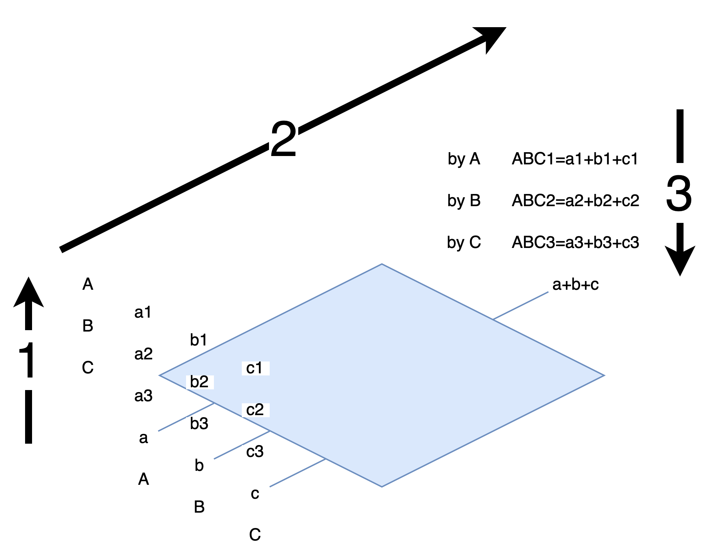

# From Two to Three

In the previous Garbled Circuit, we saw how to allow two parties to compute any function without leaking information. (2PC)

If we have 3 parties, how do we compute?

Let's look at an example: A, B, and C each have private inputs a, b, and c. How can we calculate a + b + c without leaking information?

## Custom protocol

One approach is: A secretly chooses a random number r, adds it to their own number, and secretly sends RA = r + a to B.

B receives RA, adds their own number, and secretly sends RAB = RA + b to C.

C receives RAB, adds their own number, and secretly sends RABC = RAB + c to A.

A receives RABC and calculates RABC - r
```
RABC - r
= (RAB + c) - r
= (RA + b) + c - r
= (r + a) + b + c - r
= a + b + c
```


## Another custom protocol

Let's try using additive secret sharing.

Each person secretly splits their input into three parts, such that
```
a = a1 + a2 + a3
b = b1 + b2 + b3
c = c1 + c2 + c3
```
A secretly distributes a2 and a3 to B and C.<br>
B secretly distributes b1 and b3 to A and C.<br>
C secretly distributes c1 and c2 to A and B.

A receives b1 and c1, calculates ABC1 = a1 + b1 + c1, and makes it public.<br>
B receives a2 and c2, calculates ABC2 = a2 + b2 + c2, and makes it public.<br>
C receives a3 and b3, calculates ABC3 = a3 + b3 + c3, and makes it public.

Everyone calculates ABC1 + ABC2 + ABC3 to "reconstruct" a + b + c.

(Think about it: if you were A, what information would you have? Is there any way to deduce others' information?)



In this example, we saw two types of addition.<br>
One is the function to be calculated, which is the addition of a + b + c in the problem itself.<br>
The other is the addition used when splitting/merging during secret sharing.<br>
Later, we'll see other methods of secret sharing. We'll also repeatedly see this "split/compute/merge" 3-step approach.

Next, let's look at a protocol that can handle general problems with more than two parties: GMW.

----
References:

<a href="https://www.youtube.com/watch?v=XA_4dzs1Zys#t=11m22s">
Secure Multi Party Computation part 1- The BGW Protocol - Gilad Asharov<br>

</a>

<a href="https://www.youtube.com/watch?v=Li2QJ8yImoY#t=2m20s">
January 2021 CACM, Secure Mulitparty Computation<br>

</a>

<script>
function resizeImg(i) { i.style.width = (i.naturalWidth * 0.25) + "px"; }
function resizeAllImg() { document.querySelectorAll(".to-be-resized").forEach(resizeImg); }
window.addEventListener("load", resizeAllImg);
</script>
