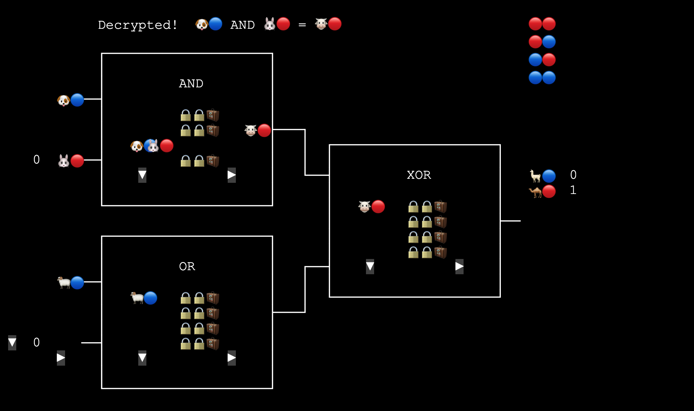
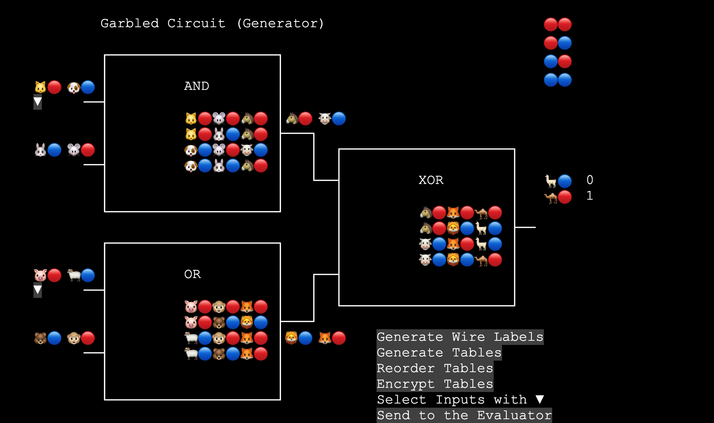
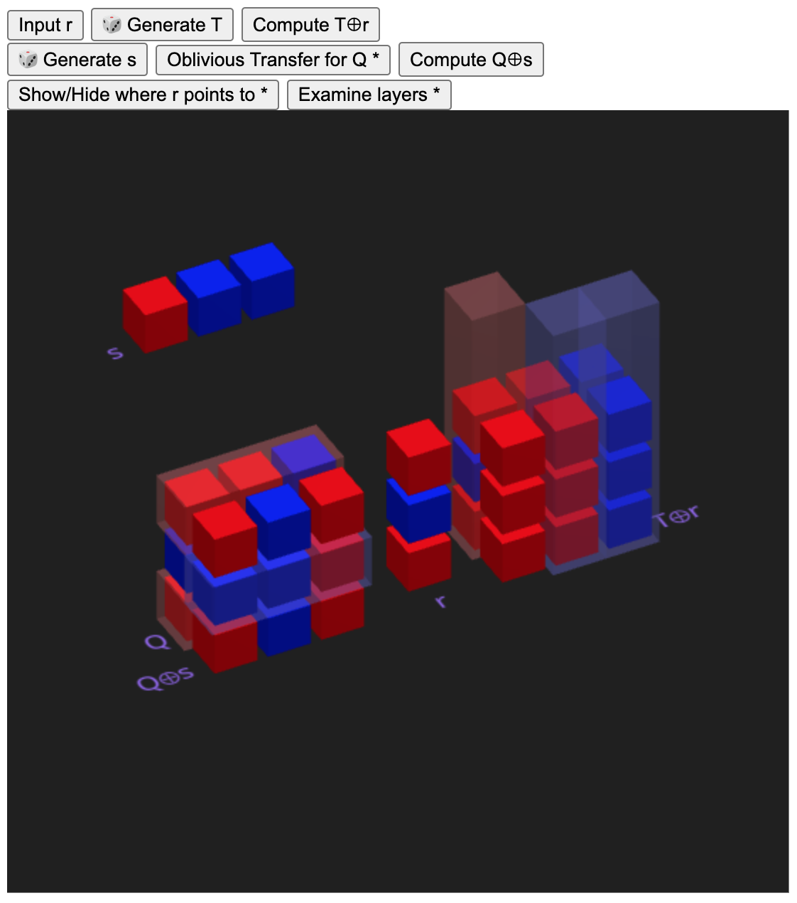
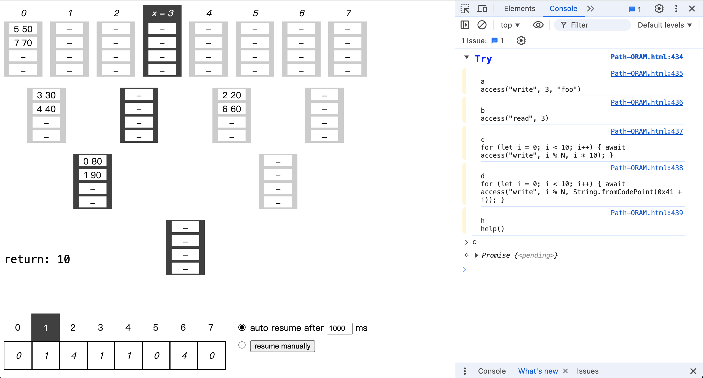

## Milestone 1

Estimated Duration: 1 month

Estimated delivery date: 2024-07-10

I have read most of Chapters 1 to 3 of Pragmatic MPC.

- Yao's Garbled Circuit
  - point-and-permute (Beaver)
- GMW
  - the 2PC case
  - I don't understand the general case.
- BGW
  - the original method for degree reduction (from the paper)
  - the enhanced method for degree reduction (from the book)
- Beaver Triple (preprocessing)
- BMR
- GESS
  - only the general idea
  - I don't know how to exactly reduce share growth.
- Oblivious Transfer
  - Rabin's classic OT (from the paper)
  - public key based OT (from the book)
  - Beaver's OT extension (from the paper)
  - IKNP's OT extension (from the book)
- PSI
  - with cuckoo hashing (partially)

The main output is an article
(
[English](https://github.com/LCamel/MPC-Notes/blob/main/story-en-US.md) /
[Chinese](https://github.com/LCamel/MPC-Notes/blob/main/story-zh-TW.md)
)
introducing Yao's Garbled Circuit and Oblivious Transfer. I spent about 8 days creating an interactive web-based tutorial, hoping it can be useful for other teachers when teaching Garbled Circuit.

<a href="https://lcamel.github.io/MPC-Notes/garbled-circuit.html?startFrom=evaluator&w0=0&w3=1">
Garbled Circuit - Evaluator 

</a>  
 
<a href="https://lcamel.github.io/MPC-Notes/garbled-circuit.html">
Garbled Circuit - Generator 

</a>

## Milestone 2

Estimated Duration: 1 month

Estimated delivery date: 2024-08-10

I have read most of Chapters 4 to 5 of Pragmatic MPC.

- GRR3
- FreeXOR
- Half Gates
- Oblivioius Stack
- Random Access Machine + ORAM (partially)
- Path ORAM

### My Articles:

Point-and-Permute: [English](story-point-and-permute-en-US.md) / [Chinese](story-point-and-permute-zh-TW.md)

OT Extension (IKNP): [English](OT3D/story-OT-Extension-en-US.md) / [Chinese](OT3D/story-OT-Extension-zh-TW.md)

### My Programs:

The feature "Point-and-Permute" has been integrated into the original program. 

<a href="https://lcamel.github.io/MPC-Notes/garbled-circuit.html?startFrom=evaluator&w0=0&w3=1&pointAndPermute=1">
Garbled Circuit - Point-and-Permute - Evaluator 

</a>
 

<a href="https://lcamel.github.io/MPC-Notes/garbled-circuit.html?pointAndPermute=1">
Garbled Circuit - Point-and-Permute - Generator 

</a>
 
 

<a href="https://lcamel.github.io/MPC-Notes/OT3D/">
OT Extension (IKNP) 

</a>
 
 

<a href="https://lcamel.github.io/MPC-Notes/Path-ORAM/Path-ORAM.html">
Path-ORAM (no article) 

</a>
 
 
I hope these programs provide the best visualization for these algorithms.

## Study Notes
- [Introduction](./MPC-Intro-en-US.md)
- [Garbled Circuit](./Garbled-Circuit-en-US.md)
  - [Garbled Circuit and Oblivious Transfer (story)](./story-en-US.md)
- [Garbled Circuit Optimization: Point-and-Permute](./Garbled-Circuit-Point-and-Permute-en-US.md)
  - [Point-and-Permute (story)](./story-point-and-permute-en-US.md)
- [Garbled Circuit Optimization: Garbled Row Reduction (GRR3)](./Garbled-Circuit-Garbled-Row-Reduction-GRR3-en-US.md)
- [Garbled Circuit Optimization: FreeXOR](./Garbled-Circuit-FreeXOR-en-US.md)
- [Garbled Circuit Optimization: Half Gates](./Garbled-Circuit-Half-Gates-en-US.md)
- [Oblivious Transfer](./Oblivious-Transfer-en-US.md)
- [IKNP OT Extension](./Oblivious-Transfer-IKNP-en-US.md)
  - [IKNP OT Extension (story)](./OT3D/story-OT-Extension-en-US.md)
- [From Two to Three](./Two-to-Three-en-US.md)
- [GMW / GMW87](./GMW-en-US.md)
- [BGW](./BGW-en-US.md)
- [Shamir's Secret Sharing](./Shamir-Secret-Sharing-en-US.md)
- [Beaver Triple](./Beaver-Triple-en-US.md)
- (draft) [Beaver Triple Generation: The MASCOT Way](./Beaver-Triple-Generation-MASCOT-en-US.md)
- [BMR](./BMR-en-US.md)
- [PRF / OPRF / PSI](./PRF-OPRF-PSI-en-US.md)
- [PSI by PSSZ](./PSI-PSSZ-en-US.md)
- [Permutation Network](./Permutation-Network-en-US.md)
