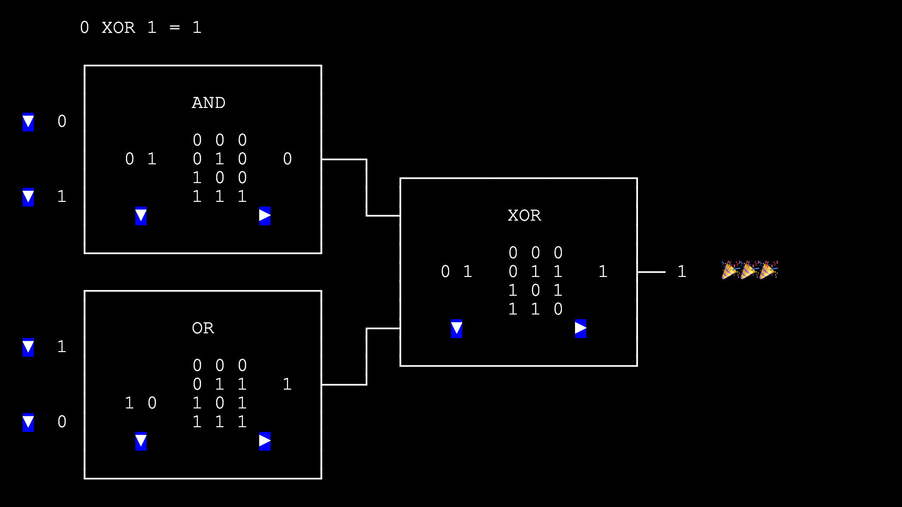
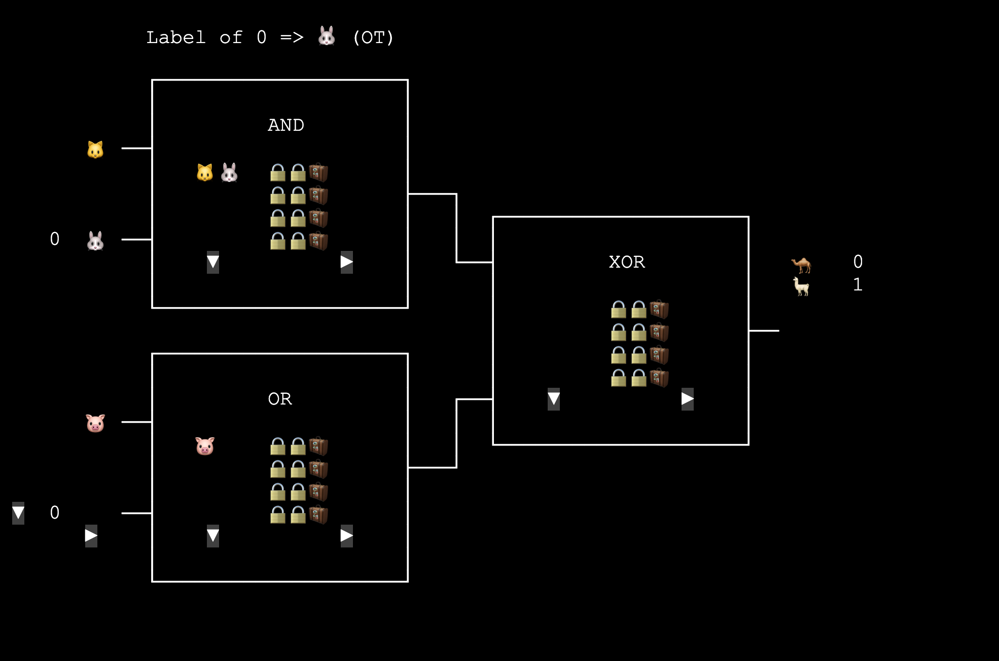
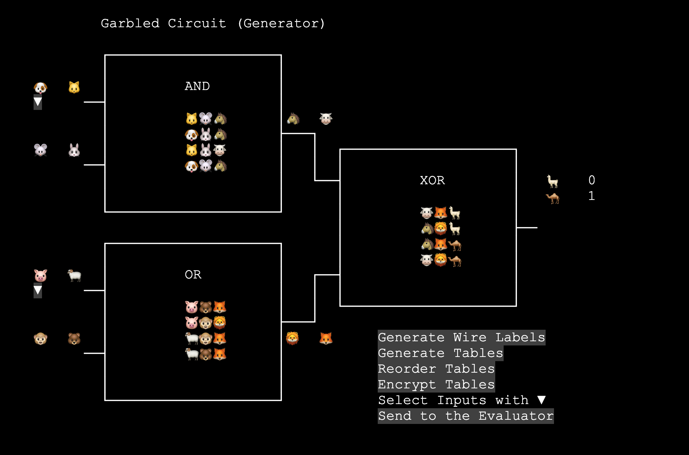
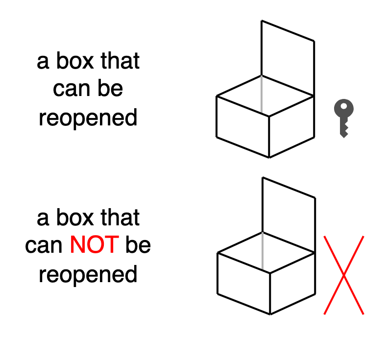
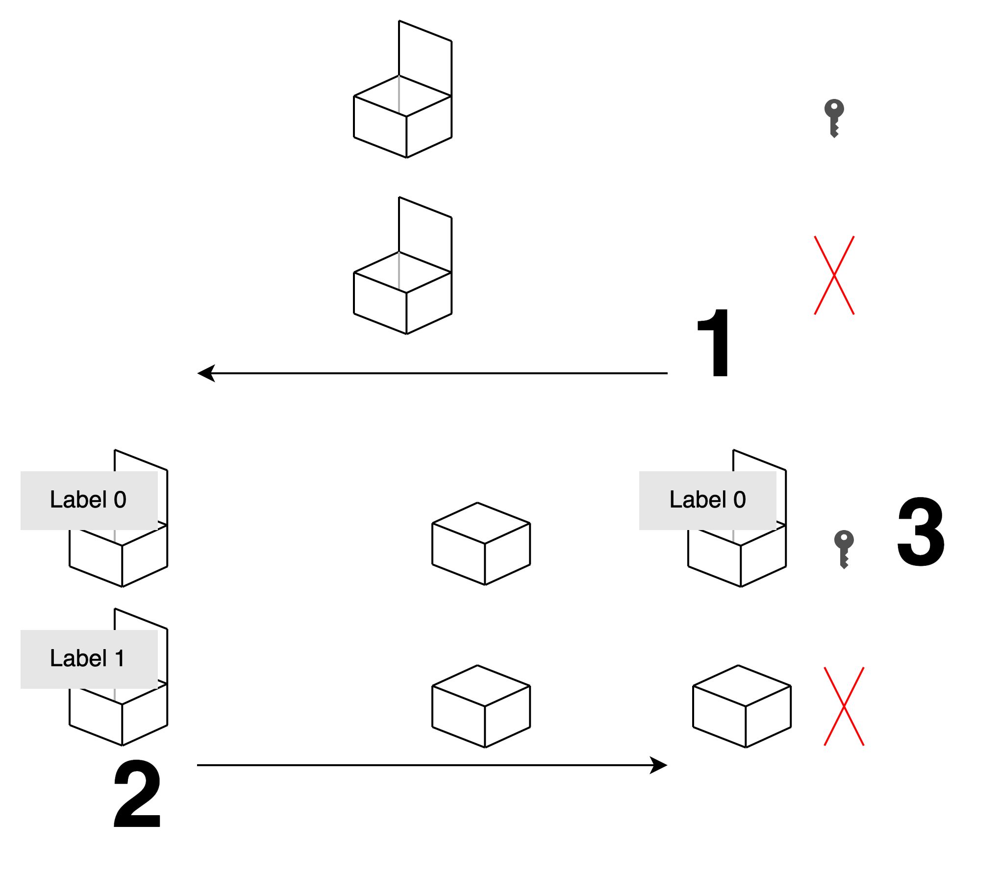
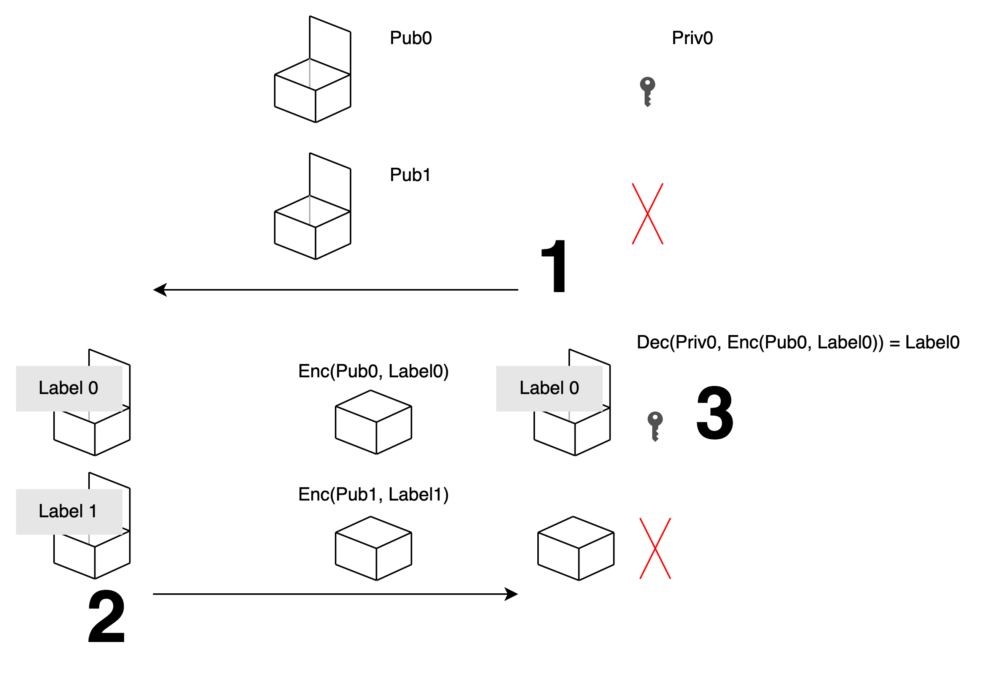

# An Introduction to Garbled Circuit and Oblivious Transfer

Alice, Bob: Hi TBot.

TBot: Hi Alice, Bob.

Alice: Bob and I each have a secret number. Can you compare them for us? But don't reveal the numbers.

TBot: Alright. Alice, what's your number?

Alice: My number is xx (whispers in TBot's ear)

TBot: Got it. How about you, Bob?

Bob: My number is yy (whispers in TBot's ear)

TBot: Understood. After my comparison, the one with the larger number is... Alice!

Alice: Yay!


(A few days later)

Bob: Hi TBot.

TBot: Hi Bob, Alice.

Bob: I heard you might be away for a while? Who should we ask to help us compare numbers then?

TBot: Let me check the records...

TBot: Got it. About 40 years ago, someone called "Yao" invented <mark>"Garbled Circuit"</mark>. Not just for comparison, as long as you express the function you want to calculate as a boolean circuit, you can use the garbled circuit method to calculate it.

First, let's look at a regular boolean circuit. Bob, instead of mental calculation, can you use this webpage to evaluate `(0 AND 1) XOR (1 OR 0)`?


<a href="https://lcamel.github.io/MPC-Notes/boolean-circuit.html">
Boolean Circuit (try it)<br>

</a>


Bob: The answer is 1. What's next?

TBot: The idea of the Garbled Circuit is that if each wire carries a label instead of a 0 or 1, you can compute without knowing each other's secrets.


For example, if we change the first AND Gate to this, can you tell what values the labels represent?
```
AND gate

a b c  a  b  c
0 0 0  🐱 🐭 🐮
0 1 0  🐱 🐰 🐮
1 0 0  🐶 🐭 🐮
1 1 1  🐶 🐰 🐴
```
Bob: Hmm... Although it's not 0 and 1 on the surface now, this is just text substitution, right? Judging from the positions, 🐱 🐶 should be 0 1 for wire a, and 🐭 🐰 should be 0 1 for wire b, right? Is this secure?

TBot: Indeed, it's not secure. What if we shuffle the four rows? Can you still figure it out?
```
AND gate

a  b  c
🐱 🐰 🐮
🐶 🐰 🐴
🐶 🐭 🐮
🐱 🐭 🐮
```
Alice: We can't tell from a and b. But since this is an AND gate, looking at c, the 🐴 that appears only once should be 1. So 🐶 🐰 must be 1 for a and b.

TBot: Correct! What if we only show the row for a given input?
```
AND gate

a  b  c
x  x  x
x  x  x
🐶 🐭 🐮
x  x  x
```
Alice: This should be secure now, we can't guess if these labels are 0 or 1.

Bob: Yes. And knowing more than one output could be dangerous. Since an AND gate only has one output as 1, something like this would reveal that 🐮 is 0.
```
AND gate

a b c
x x x
x x x
x x 🐮
x x 🐮
```
TBot: Your observations are very insightful! When we get the input labels for two wires, we must be able to calculate the correct and unique output label. All other output labels must be hidden.

Bob, can you be the Evaluator again and calculate `(? AND 1) XOR (? OR 0)`?

Bob: Are these "?" Alice's inputs?

TBot: Yes. Alice will send you her two inputs using labels. And 1 and 0 are your two inputs.


<a href="https://lcamel.github.io/MPC-Notes/garbled-circuit.html?startFrom=evaluator&w0=0&w3=1">
Garbled Circuit - Evaluator<br>

</a>


Bob: I've finished the calculation, the answer is 1. Is this what you mentioned earlier: calculating with secure labels?

TBot: Yes! Although you don't know whether each label represents 0 or 1, you calculated the correct label at each step.

Bob: The original truth table has also become four locked boxes here.

TBot: In a regular boolean circuit, we have a plaintext truth table for calculation.

In a garbled circuit, to calculate a unique output label and hide other labels, Yao used a technique, which is <mark>using two input labels as keys to encrypt the corresponding output label</mark>.

During the calculation, the two input labels are used to attempt to decrypt each ciphertext. The one that can be successfully decrypted contains the correct output label.

So the gate's table becomes four values
```
🔒🔒🧳 = Encrypt(input label, input label, output label)
🔒🔒🧳 = Encrypt(input label, input label, output label)
🔒🔒🧳 = Encrypt(input label, input label, output label)
🔒🔒🧳 = Encrypt(input label, input label, output label)
```
For example, if the shuffled table looks like this:
```
AND gate

a  b  c
🐱 🐰 🐮
🐶 🐰 🐴
🐶 🐭 🐮
🐱 🐭 🐮
```
Then the encrypted table would only have these four values:
```
                i   i   o
🔒🔒🧳 = Encrypt(🐱, 🐰, 🐮)
🔒🔒🧳 = Encrypt(🐶, 🐰, 🐴)
🔒🔒🧳 = Encrypt(🐶, 🐭, 🐮)
🔒🔒🧳 = Encrypt(🐱, 🐭, 🐮)
```

Bob: So if I have the inputs 🐶 and 🐭 for this gate, I can only uniquely decrypt 🐮 from the third row, and I can't see 🐴, right?

TBot: Exactly! So you can only obtain the unique output 🐮. You can't deduce whether 🐮 is 0 or 1, nor can you deduce whether 🐶 and 🐭 are 0 or 1.

Bob: I see. After operating the circuit above, I roughly know how to calculate. But when you're not around, where can we get this kind of circuit?

TBot: That's the Generator's job. The Generator will encode the 0 and 1 of each wire into corresponding labels. Then transmit the encrypted tables and input labels to you for calculation. Alice, can you try it?

Alice: Okay. But can we wait a bit longer?

TBot: OK.

(Twelve Seconds Later)

Alice: Based on our previous discussion, I modified the webpage TBot gave. As a Generator, I think I should
- Pick a label for both 0 and 1 of each wire
- Replace the 0 and 1 in the truth table with labels
- Shuffle the four rows of the tables
- Encrypt the four outputs using the corresponding two inputs, so Bob can decrypt only one output to proceed
- Give the encrypted tables to Bob
- Convert my inputs to labels and give them to Bob
- Also give Bob the labels for the final result wire


<a href="https://lcamel.github.io/MPC-Notes/garbled-circuit.html">
Garbled Circuit - Generator<br>

</a>


Alice: That should be about it. But if TBot isn't here, we're still missing a feature...

Bob: I've received the labels for your input. But you haven't given me the labels for my input yet.

Alice: Yes. I don't know if your input is 0 or 1, so I don't know which label to give you. But I can't give you both 0 and 1 labels for you to choose from, because then you'd have information to decrypt more than one output.

Bob: But I also can't tell you "my input is 1, please give me the label for 1", because that would directly leak the secret.

Alice: So we need to find a way for you to get only one of the two labels you choose, while I don't know which one you actually chose.

TBot: This problem is interesting, it's called...

Alice, Bob: Wait a moment!

(A period of discussion)

Bob: Perhaps you could put the two labels in two boxes and send them to me, allowing me to open only one of the boxes.

Alice: But I don't know which one you want to open, so the boxes should be prepared by you, with you deciding which one can be opened.



Bob: Then I'll prepare two boxes, one that can be opened after closing, and one that can't be opened after closing. I'll send you the two open boxes.

Alice: I can't tell from the appearance which of these two boxes can be reopened, so I don't know which one you want to open. I'll put the 0 and 1 labels in order, close them, and send them to you.

Bob: If I originally wanted to get label 0, I would have put the box that can be reopened in front. This way, when you send them back, I can only open and get label 0.

Alice: I also believe you're honest. You wouldn't give me two boxes that can both be reopened.



Bob: It seems this could work. But using physical boxes is a bit inconvenient, can we do it digitally?

TBot: There's a solution to this problem, it's...

Alice, Bob: Wait a moment again!

(A period of discussion)

Alice: If we think of boxing as encryption, and opening as decryption. You can generate a pair of public key and private key to represent the box that can be reopened.

Bob: I'll send you that public key. You use it to encrypt the label and send it to me, then I can decrypt it with the private key.

Alice: We still need a box that can't be opened.

Bob: Then I'll randomly pick another number from the public key space, for which I don't know the corresponding private key, so it can't be decrypted.

Alice: That's good. Even if someone is peeking next to you, since you didn't generate a private key, they can't decrypt what I encrypted with this public key.

Bob: So at the very beginning, I generate two numbers that look like public keys and send them to you, one of which I know the private key for.

Alice: I use these two numbers that look like public keys to encrypt two labels separately and send them to you, but I won't know which one you can decrypt.

Bob: I decrypt the label that corresponds to the private key I have, and I can't decrypt the other one, so it won't leak information. That's it.



TBot: It seems you have a solution. To make it easier to find information, I'll still mention the name. Bob, do you remember what message the system displayed when you were the Evaluator getting your own input label?

Bob: A message like "Label of 0 => 🐰 (OT)" appeared.

TBot: This kind of "not knowing what the other party received" transmission method is called <mark>"Oblivious Transfer" (OT)</mark>.

OT has many variants, the one you just described is sometimes called "chosen one-out-of-two OT": the Receiver chooses 0 or 1, and the Sender provides two pieces of data. The Sender won't know whether the Receiver chose 0 or 1, and the Receiver can't read the other piece of data they didn't choose.

If there's no risk of confusion with other OTs, people often write it as "one-out-of-two OT", "$\binom{2}{1}$ OT", or simply "OT".

Bob: If you, TBot, were always here, we could just give you both pieces of data and 0 1, and you could give me the one I chose.

Alice: If TBot were always here, we wouldn't need Garbled Circuit either.

TBot: The version of me that you can always trust probably only exists in an ideal world, right? Hahaha.

Alice: Hahaha

Bob: Hahaha

(Fin)

<br>
<br>
<br>

---

#### References

[A Pragmatic Introduction to Secure Multi-Party Computation](https://securecomputation.org/)
