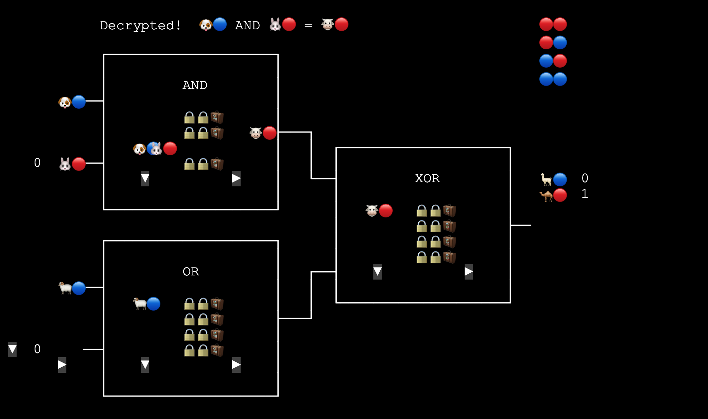

# Point-and-Permute

Bob: Hi Alice.

Alice: Hi Bob.

Bob: 最近有看到 TBot 嗎?

Alice: 沒有耶, 怎麼了嗎?

Bob: 記不記得上次我們討論 Garbled Circuit 的時候, 我當 Evaluator, 不是每個 gate 都要在那邊硬 try 嗎?

Alice: 對啊. 每個 gate 你平均要 try 2.5 次, 很不方便.

Bob: 後來我看到有個改進的方法, 叫做 "point-and-permute", 想和你討論看看.

Alice: 喔! 我也來看一下資料! 等我一下.

(Twelve Seconds Later)

Alice: 我大概看完了. 對了, 你該不會把程式也改過了吧?

Bob: 你真了解我! 我想說有程式互動比較好懂, 就拿你上次寫的來改了一下 😅

剛剛不是說本來要每個 row 在那邊一個一個 try 嗎? 有個叫 Beaver 的人和幾個朋友想到, 如果在原來的 label 最後面多加一個 pointer bit, 那這樣在 evaluate 的時候, 就用可以用兩個 input label 尾巴的兩個 pointer bit 直接跳到對的那個 row 了!

Alice: 這有點抽象. 我操作看看...

<a href="https://lcamel.github.io/MPC-Notes/garbled-circuit.html?startFrom=evaluator&w0=0&w1=1&point-and-permute=1">
Garbled Circuit: Point-and-Permute (Evaluator)<br>

</a>

Alice: 可以耶! 只要對照右上角的顏色, 一次就解開了!

所以現在 table 和以前不一樣? 以前是隨機 shuffle 的, 現在應該是照著右上角的顏色來排的囉?

Bob: 沒錯. 🔴 就是 pointer bit = 0, 🔵 就是 pointer bit = 1.

我們把 input labels 照後面的 pointer bit 00 01 10 11 排序, 再拿來加密對應的 output label. 這切去 Generator 模式看會比較清楚.

<a href="https://lcamel.github.io/MPC-Notes/garbled-circuit.html?pointAndPermute=1">
Garbled Circuit: Point-and-Permute (Generator)<br>

</a>

Alice: 我按了好幾次 "Generate Wire Labels", 以前第一個 wire 只有 🐱🐶 或 🐶🐱, 現在後面還可以接 🔴🔵 或 🔵🔴 , 所以應該有這四種組合:
```
0   1
🐱🔴🐶🔵 🐱=0 🐶=1
🐱🔵🐶🔴 🐱=0 🐶=1
🐶🔴🐱🔵 🐶=0 🐱=1
🐶🔵🐱🔴 🐶=0 🐱=1
```

Bob: 嗯嗯. 如果我是 Evaluator, 假設我拿到 🐱🔴, 雖然我比以前多看到了 🔴, 但因為 🐱🐶 和 🔴🔵 怎麼搭配是完全隨機的, 所以我還是看不出 🐱 到底是 0 還是 1, 畢竟下面這兩種 case 都有可能.
```
0   1
🐱🔴 _ _  🐱 = 0
_ _ _ _
_ _ _ _
_ _ 🐱🔴  🐱 = 1
```

Alice: 我又按了 "Generate Tables", 這邊把顏色遮起來只看動物的話, 就只是普通的 truth table. AND gate 的 output 還是 "3 個 ~ 1 個", 而 OR gate 的 output 還是 "1 個 ~ 3 個".

Bob: 主要是差在下一步 "Reorder Tables". 就像你前面說的, 以前是隨機 shuffle rows, 而現在是照 input label 的顏色來 sort rows. 所以顏色順序就是和右上角的一樣.
```
🔴🔴
🔴🔵
🔵🔴
🔵🔵
```

Alice: 好像可以這樣想: 以前我們丟銅板決定兩個東西要排成 AB 還是 BA. 現在則是我們先丟銅板決定顏色的排列, 把顏色貼在 A B 上面, 再用顏色來排序 A B, 等於是間接 shuffle 了 A 和 B.

Bob: 的確, 這些顏色只是單純 sort 用的. 而且因為顏色貼在什麼東西上是隨機決定的, 所以即便照著顏色排了, 也還是不會洩漏原本的資訊.

Alice: 再來就和原本很像了吧? 用兩個 input labels 加密 output label. 四個 output 只有一個會被解開.

不同的地方就是現在 table 是照 input label 的顏色 sort 過的, 所以到時候 evaluator 可以直接到兩個 input label 的顏色指到的那個 row, 一次就解開了! 真好!

Bob: 然後解開的 output label 也有顏色, 所以到下一個 gate 也還是可以一次就解開來.

Alice: 下下一個也可以一次就解開來.

Bob: 下下下一個... 好啦, 今天先這樣! 很謝謝你和我討論!

Alice: 也謝謝你. 下次見!


(Fin)

<br>
<br>
<br>

---

#### 參考資料

[A Pragmatic Introduction to Secure Multi-Party Computation](https://securecomputation.org/)

[A Brief History of Practical Garbled Circuit Optimizations](https://youtu.be/FTxh908u9y8?t=828)<br>
<a href="https://youtu.be/FTxh908u9y8?t=828">

</a>
