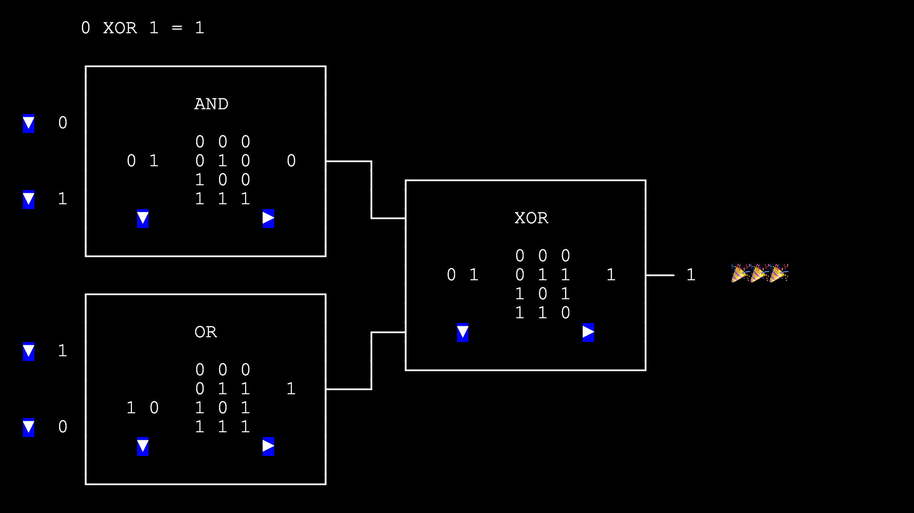
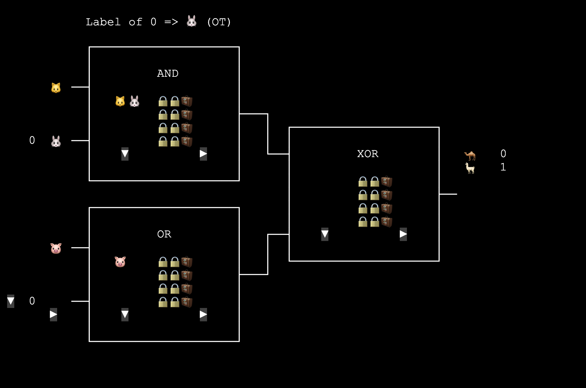
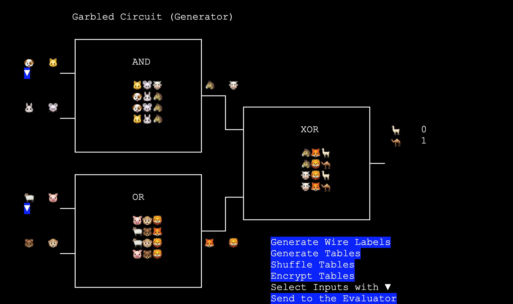

# 淺談 Garbled Circult 與 Oblivious Transfer

Alice, Bob: Hi TBot.

TBot: Hi Alice, Bob.

Alice: Bob 和我手上各有一個秘密的數字. 你可以我們比大小嗎? 不可以把數字洩漏出去喔.

TBot: 好的. 那 Alice 你的數字是多少?

Alice: 我的數字是 xx (在 TBot 耳邊說)

TBot: 收到. 那 Bob 你呢?

Bob: 我的數字是 yy (在 TBot 耳邊說)

TBot: 收到. 經過我的比較, 數字比較大的是... Alice!

Alice: 耶!


(幾天後)

Bob: Hi TBot.

TBot: Hi Bob, Alice.

Bob: 聽說你可能有一陣子會不在? 這樣我們要找誰幫忙比大小呢?

TBot: 讓我查一下資料...

TBot: 有了. 大概快 40 年前, 有一個叫 "Yao" 的人, 發明了 <mark>"Garbled Circuit"</mark>. 不光是比大小, 只要你們把想計算的 function 表達成 boolean circuit, 就可以用 garbled circuit 的方式來計算了.

先看一下普通的 boolean circuit. Bob, 你可以不要用心算, 而是用這個網頁來 evaluate `(0 AND 1) XOR (1 OR 0)` 嗎?


<a href="https://lcamel.github.io/MPC-Notes/boolean-circuit.html">
Boolean Circuit (try it)<br>

<p>
</a>


Bob: 答案是 1. 然後呢?

TBot: Garbled circuit 的想法是, 每一條 wire 上面如果傳的不是 0 或 1, 而是看不懂的 label 的話, 那就可以在不知道對方秘密的狀況下做計算了.

比方說, 如果把第一個 AND Gate 先換成這樣, 能看得出 label 代表的值嗎?
```
AND gate

a b c  a  b  c
0 0 0  🐱 🐭 🐮
0 1 0  🐱 🐰 🐮
1 0 0  🐶 🐭 🐮
1 1 1  🐶 🐰 🐴
```
Bob: 嗯... 雖然現在表面上不是 0 1 了, 但這只是文字代換吧? 從位置來看, 🐱 🐶 應該是 wire a 的 0 1, 🐭 🐰 應該是 wire b 的 0 1 吧? 這樣有保密嗎?

TBot: 的確沒有保密. 那如果把四個 row shuffle 過呢? 你們還看得出來嗎?
```
AND gate

a  b  c
🐱 🐰 🐮
🐶 🐰 🐴
🐶 🐭 🐮
🐱 🐭 🐮
```
Alice: 從 a b 的確看不出來. 但因為這是個 AND gate, 所以從 c 來看, 只出現一次的 🐴 應該是 1. 那 🐶 🐰 就是 a b 的 1 了.

TBot: 沒錯! 那如果只顯示給定 input 的那個 row 呢?
```
AND gate

a  b  c
x  x  x
x  x  x
🐶 🐭 🐮
x  x  x
```
Alice: 這樣應該保密了, 沒辦法猜出這些 label 是 0 還是 1.

Bob: 嗯嗯. 而且知道超過一個 output 可能就危險了. 因為 AND gate 只有一個 output 是 1, 像下面這樣就會被看出 🐮 是 0 了.
```
AND gate

a b c
x x x
x x x
x x 🐮
x x 🐮
```
TBot: 你們的觀察很深入! 當拿到兩個 wire 的 input label 的時候, 我們必須能算出正確且唯一的 output label. 其他 output label 都必須隱藏起來.

Bob, 你可以再當一次 Evaluator 來算看看 `(? AND 1) XOR (? OR 0)` 嗎?

Bob: 這兩個 "?" 是 Alice 的 input 嗎?

TBot: 是的. Alice 會用 label 把她的兩個 input 傳給你. 而 1 和 0 是你的兩個 input.


<a href="https://lcamel.github.io/MPC-Notes/garbled-circuit.html?startFrom=evaluator&w0=0&w3=1">
Garbled Circuit - Evaluator<br>

<p>
</a>


Bob: 算完了, 答案是 1. 這就是稍早說的: 用保密的 label 來計算嗎?

TBot: 是的! 雖然你不知道每個 label 代表的是 0 還是 1, 但是每一步你都算出了正確的 label.

Bob: 原本的 truth table 在這邊也變成四個上鎖的箱子了.

TBot: 普通的 boolean circuit 有一個明文的 truth table 讓我們做計算.

而 garbled circuit 中, 為了算出唯一一個 output label 且隱藏其他的 labels, Yao 用了一個技巧,
也就是 <mark>用兩個 input labels 當成 keys 去 encrypt 對應的 output label</mark>.

而計算時則用兩個 input labels 去逐一試著 decrypt, 唯一能 decrypt 出來的那個就是對的 output label.

所以 gate 的 table 變成四個值
```
🔒🔒🧳 = Encrypt(input label, input label, output label)
🔒🔒🧳 = Encrypt(input label, input label, output label)
🔒🔒🧳 = Encrypt(input label, input label, output label)
🔒🔒🧳 = Encrypt(input label, input label, output label)
```
舉例來說, 如果 shuffle 後的 table 長成這樣:
```
AND gate

a  b  c
🐱 🐰 🐮
🐶 🐰 🐴
🐶 🐭 🐮
🐱 🐭 🐮
```
那加密後的 table 就只有下面四個值:
```
                i   i   o
🔒🔒🧳 = Encrypt(🐱, 🐰, 🐮)
🔒🔒🧳 = Encrypt(🐶, 🐰, 🐴)
🔒🔒🧳 = Encrypt(🐶, 🐭, 🐮)
🔒🔒🧳 = Encrypt(🐱, 🐭, 🐮)
```

Bob: 也就是說, 如果我有這個 gate 的 input 🐶 和 🐭, 那我只能唯一 decrypt 出第三個 row 的 🐮, 而且也看不到 🐴 是嗎?

TBot: 沒錯! 所以你只能取得唯一的 output 🐮. 無法推測出 🐮 到底是 0 還是 1, 也推測不出 🐶 和 🐭 是 0 還是 1.

Bob: 了解. 操作過上面的 circuit 後, 我大概知道怎麼算了. 但是你不在的時候, 我們要去哪裡取得這種編碼過的 circuit 呢?

TBot: 這就是 Generator 的工作了. Generator 會把每個 wire 的 0 和 1 編成對應的 labels. 再把加密過的 tables 和 input labels 傳給你計算. Alice 你可以試看看嗎?

Alice: 好. 不過可以等久一點嗎?

TBot: OK.

(Twelve Seconds Later)

Alice: 從前面的討論來看, 我把 TBot 給的網頁改了一下. 做為 Generator, 我想我應該要
- 把每個 wire 的 0 1 都各取一個 label
- 把 truth table 的 0 1 也都換成 label
- 把 table 的四個 row shuffle 過
- 把四個 output 用對應的兩個 input 加密, 這樣才能讓 Bob 解出唯一一個 output 來往下走
- 把加密過的結果給 Bob
- 我的輸入換成 labels 也給 Bob
- 最後結果的 wire 的 labels 也給 Bob


<a href="https://lcamel.github.io/MPC-Notes/garbled-circuit.html">
Garbled Circuit - Generator<br>

<p>
</a>


Alice: 大概是這些吧. 但如果 TBot 不在的話, 還少了個功能...

Bob: 我拿到你的 input 的 label 了. 可是你還沒給我我的 input 的 label.

Alice: 嗯嗯. 我不知道你的 input 是 0 還是 1, 所以不知道要拿哪個 label 給你. 但我又不能把 0 1 兩個 label 都給你讓你自己挑, 因為這樣你手上的資訊就能解開不只一個 output 了.

Bob: 但我也不能和你說 "我的 input 是 1, 請給我代表 1 的 label", 這樣直接就洩密了.

Alice: 所以我們要想個方法, 讓你只拿到兩個 label 中你挑的那一個, 而我卻不知道你實際上挑了哪個.

TBot: 這個問題很有趣, 它就叫...

Alice, Bob: 等一下!

(一陣討論)

Bob: 或許你可以把兩個 label 裝兩箱送給我, 而讓我只開的了其中一個箱子.

Alice: 但我不知道你想開哪個, 所以箱子應該由你準備, 由你決定哪個是可以開的.

Bob: 那由我準備兩個箱子, 一個是關起來以後打的開的, 一個是關起來以後打不開的. 把兩個箱子開著送給你.

Alice: 這兩個箱子從外觀我看不出哪個能再開, 所以我不知道你想開的是哪個. 我把 0 1 兩個 label 依序放進去, 再關起來送給你.

Bob: 如果當初我想拿 label 0, 我就會在前面放可以再打開的箱子. 這樣你送來我也只能開出 label 0.

Alice: 我也相信你是誠實的. 不會拿兩個都能再開的箱子給我.

Bob: 看來這樣可行. 不過用實體的箱子比較麻煩, 能不能用數位的方式呢?

TBot: 這個問題有個解法, 就是...

Alice, Bob: 再等一下!

(一陣討論)

Alice: 如果裝箱想成是加密, 打開想成是解密. 你可以生成一對 public key 和 private key 來代表可以再開的箱子.

Bob: 我把那個 public key 送給你. 你用它來加密 label 以後送給我, 我就能用 private key 解開.

Alice: 我們還需要一個打不開的箱子.

Bob: 那我再單獨在 public key 的數字中亂挑一個出來, 而我不知道它對應的 private key, 這樣就解不開了.

Alice: 這樣很好. 就算有人在你旁邊偷看, 因為你沒有產出 private key, 所以我用這個 public key 加密以後, 偷看的人也解不開.

Bob: 也就是最一開始, 我生兩個像 public key 的數字送給你, 其中一個我知道 private key.

Alice: 我用這兩個看起來是 public key 的數字分別加密兩個 label 送給你, 但我不會知道哪一個你解的開.

Bob: 我解開有 private key 對應的的那個 label, 另外一個我解不開, 不會洩密. 就這樣.

TBot: 看起來你們有解法了. 為了方便找資料, 我還是講一下名字好了. Bob, 還記得之前你當 Evaluator 取得自己 input label 的時候, 系統顯示什麼訊息嗎?

Bob: 有出現 "Label of 0 => 🐰 (OT)" 這樣的訊息.

TBot: 這種 "不知道對方收到什麼" 的傳送方式就叫做 <mark>"Oblivious Transfer" (OT)</mark>.

OT 有很多變種, 剛剛這種有人叫他 "chosen one-out-of-two OT": 由 Receiver 選 0 或 1, 而由 Sender 提供兩筆資料. Sender 不會知道 Receiver 選的是 0 還是 1, Receiver 也無法讀到另一筆沒選的資料.

如果不會和其他 OT 弄混的話, 也常有人寫成 "one-out-of-two OT", "$\binom{2}{1}$ OT", 或直接只寫 "OT".

Bob: 要是 TBot 你一直都在, 我們就把兩筆資料和 0 1 都給你, 你再把選到那筆給我就好了.

Alice: 要是 TBot 一直都在, 我們也不需要 Garbled Circuit 了.

TBot: 那個能讓你們一直 trust, 又永遠存在的我, 大概只存在理想世界中吧? 啊哈哈哈哈.

Alice: 啊哈哈哈哈

Bob: 啊哈哈哈哈

(Fin)


